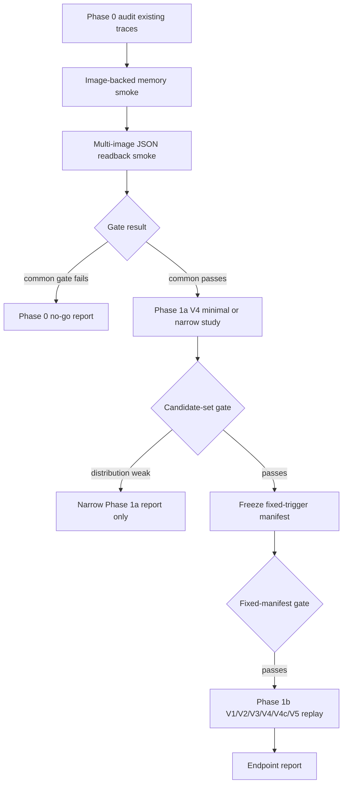
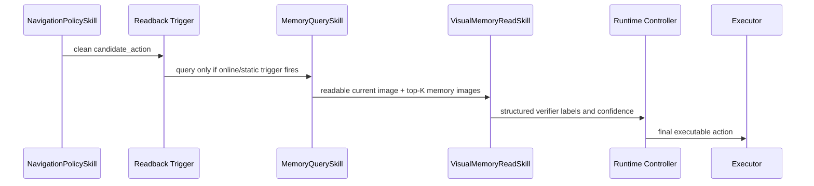

# On-Demand Visual Memory Readback Controller Implementation Plan

> **For agentic workers:** REQUIRED SUB-SKILL: Use superpowers:subagent-driven-development or superpowers:executing-plans to implement this plan task-by-task. Steps are grouped by implementation unit and must be executed with the source spec open.

**Goal:** Implement the Phase 0 through Phase 1b slice of on-demand visual memory readback under the 2026-06-13 controller-arbitration spec.

**Architecture:** Keep JanusVLN / `NavigationPolicySkill` as the clean candidate-action producer, run memory-image readback after the candidate action, and let a controller record or apply only the Phase-allowed downstream effect. Phase 1a validates readback and controller-level evidence; Phase 1b adds fixed-trigger replay across the source-spec V-modes.

**Tech Stack:** Python harness code, OpenClaw runtime/skills, Qwen/OpenClaw image capability, pytest, JSON/Markdown trace summaries.

---

## Summary

Implement the Phase 0 through Phase 1b slice of on-demand visual memory readback:

- Phase 0: audit existing traces, validate image-backed memory, validate multi-image JSON readback, and produce a `candidate_case_set` plus go/downscope/no-go report.
- Phase 1a: run `V4_image_read_controller` as a clean-policy, control-only readback loop with shadow STOP-block / log-only replan evidence by default. Executed STOP fallback is a separately reported pilot with its own denominator.
- Phase 1b: run the fixed-trigger `V1/V2/V3/V4/V4c/V5` control matrix and report only the pre-registered mechanism endpoints from the source spec.

This plan intentionally stops before Phase 2 replanner execution, Phase 3 broad recovery/controller arbitration, and Phase 4 `direct_policy_images`.

This plan treats `docs/plans/2026-06-13-on-demand-visual-memory-readback-controller-arbitration.md` as the source of truth. If the source spec later adds a `V4t_summary_only_controller` baseline, renames `V4 > V3` to `V4 >= V3`, or changes `route_uncertainty` eligibility, update this implementation plan before coding Phase 1b.

## Problem Frame

The current OpenClaw runtime already has several memory paths, but they are not isolated enough for the V4 mechanism claim.

- `src/harness/openclaw/runtime.py` can auto-recall memory before planner execution and can merge `MemoryQuerySkill` output into planner/runtime payloads.
- `MemoryAwareContextEngine.prepare_plan_context(...)` can inject `memory_context_text` into planner context before `NavigationPolicySkill` payload construction.
- `src/harness/skills/memory_query.py` returns both `policy_context` and `control_context`, and `policy_context` can contain `memory_context_text` and `memory_images`.
- `src/harness/openclaw/openclaw_cli_plan_gateway.py` and `src/harness/openclaw/visual_analyzer.py` already provide reusable Qwen/OpenClaw image capability surfaces.
- `scripts/run_openclaw_vln_ablation_matrix.py` is an older A0-A7 runner, not a fixed-trigger `V1/V2/V3/V4/V4c/V5` visual-readback matrix.
- `scripts/run_memory_guided_fast_large_eval.py` has a useful smoke/audit/report pattern, but its metrics target memory-guided-fast validity rather than readback mechanism endpoints.

The implementation must prove that V4 changes controller-side decisions without letting retrieved memory text or images contaminate `NavigationPolicySkill`. Therefore the final policy payload audit is the source of truth for `used_by_policy=false`.

## Requirements

| ID | Requirement |
|---|---|
| R1 | Add explicit visual readback configuration with CLI flag > environment variable > `HarnessConfig` default precedence. |
| R2 | Fail fast for unknown modes, invalid confidence thresholds, controller modes with `control_only=false`, missing fixed manifest for Phase 1b, shuffled mode without seed, and `direct_policy_images` in Phase 0/1. |
| R3 | Keep Phase 0/1 supported modes limited to `off`, `text_only_prompt`, `path_only`, `image_read_prompt`, `image_read_controller`, `current_only_controller`, and `shuffled_image_read_controller`. |
| R4 | Block the `V1/V2/V3/V4/V4c/V5` matrix unless image-backed memory smoke passes with a real readable `image_path`. |
| R5 | Implement `VisualMemoryReadSkill` as a readback wrapper over existing OpenClaw/Qwen image capability unless multi-image JSON or per-image trace is impossible. |
| R6 | Ensure V4 readback evidence is control-only: no `active_subgoal`, `memory_context_text`, or `memory_images` in the final `NavigationPolicySkill` payload. |
| R7 | Include `MemoryAwareContextEngine` in the V4 clean-policy audit, not only `MemoryQuerySkill.policy_context`. |
| R8 | Trigger readback only after clean candidate action is available. Skip V4 arbitration when planner action override skipped `NavigationPolicySkill`. |
| R9 | Phase 1a primary runs default to `OPENCLAW_VISUAL_READBACK_STOP_FALLBACK_POLICY=log_only`; executed STOP fallback is allowed only as a separate pilot. Phase 1a must not execute a real replanner or alter turn actions. |
| R10 | STOP fallback state is owned by `OpenClawVLNRuntime`, reset on `(scene_id, episode_id)` changes, and updated after final executable action. |
| R11 | Record current-view STOP verification separately from historical-memory STOP causality. |
| R12 | Implement fixed-trigger replay for Phase 1b. V1/V3 must recompute `NavigationPolicySkill` at frozen state; V4 uses the V0 clean candidate action; V4c uses the same controller with current image only and no retrieved memory images. |
| R13 | V5 must attach deterministic wrong/unrelated replacement images and record `original_retrieved_memory_ids`, `attached_memory_ids`, and `matched_memory_ids_from_attached_only`. |
| R14 | Add verifier-label adjudication before V-mode results are used for claims. Grounded-but-wrong labels are counted separately. |
| R15 | Report pre-registered endpoints only: `adjudicated_controller_support_rate`, `visual_grounded_readback_rate`, `paired_adjudicated_support_rate`, `historical_memory_incremental_effect_rate`, and `historical_memory_dependent_effect_rate`. |
| R16 | Never use oracle metrics, future observations, success, OS, distance-to-goal, or oracle paths for online trigger or controller decisions. |
| R17 | Limit Phase 1 claims to mechanism validation. Do not claim SR/SPL/NE/nDTW improvement from this phase. |
| R18 | Keep Candidate-set and Fixed-manifest gates separate from Phase 1a startup. Phase 1a can run a STOP-only or turn-only narrow study after the Common gate and Phase 1a minimal-loop gate pass. |
| R19 | Every Phase 1b endpoint row must report denominator, pass rule, failure handling, `minimum_effect_size`, paired test or confidence interval, and downgrade-to-descriptive rule. |

## Scope Boundaries

In scope:

- Visual readback config and validation.
- Phase 0 trace audit, image-backed memory smoke, multi-image readback smoke, and `candidate_case_set` generation.
- V4 clean-policy runtime path and trace schema.
- STOP-only shadow/log-only controller evidence, optional separately reported executed STOP fallback pilot, and turn-conflict log-only intervention.
- Fixed-trigger `V1/V2/V3/V4/V4c/V5` replay and endpoint summary.
- Unit tests and lightweight integration tests using fake planners, fake VLM adapters, and fixture traces.

Out of scope:

- Executed replanner integration after readback.
- Broad stuck/loop recovery.
- Directly passing retrieved images to JanusVLN policy as `direct_policy_images`.
- Any paper claim about full online SR/SPL superiority.

## Key Technical Decisions

1. Final policy payload audit is authoritative.

   V4 can receive raw recall output containing `policy_context`, but the final payload passed to `NavigationPolicySkill` must be audited after all merge sources, including context engine output. `used_by_policy` is derived from that final payload, not from raw recall availability.

2. Visual readback is a skill wrapper, not a new planner.

   `VisualMemoryReadSkill` should use `OpenClawVisualAnalyzer`, `QwenApiModelClient`, or the existing `openclaw capability image describe-many` path first. A new adapter is justified only if the existing capability cannot support multi-image JSON-only readback and traceable image attachment.

3. Phase 0 decides whether Phase 1b is allowed.

   If image-backed memory or multi-image JSON readback fails, the output is a Phase 0 audit/no-go report. If common gates pass but full-matrix distribution is weak, only the narrower STOP-only or turn-only Phase 1a study can proceed.

4. Fixed-trigger replay is same-state counterfactual.

   V0 freezes candidate action, trigger, query, and ordered top-K hits. V1/V3 prompt modes rerun `NavigationPolicySkill` on the frozen state with their prompt payloads. V4 checks V0's candidate action through the controller.

5. The V5 denominator is attached-image based.

   In shuffled mode, `matched_memory_ids` can only refer to images actually attached to the VLM. Original retrieved IDs are recorded only to prove the same query and slot order.

6. Metrics are mechanism endpoints, not cherry-picked readback counters.

   Each `V4 > V*` comparison uses the endpoint table from the source spec, including `V4 > V4c`. Extra counters can diagnose failures, but cannot become post-hoc primary claims.

## High-Level Flow

## Data Contracts

### Visual Readback Config

Add final effective config to every trace and summary as `visual_readback_config`:

| Field | Default | Notes |
|---|---:|---|
| `visual_readback_mode` | `off` | Supported Phase 0/1 values only. |
| `visual_readback_top_k` | `3` | Top-K memory images for readback. |
| `visual_readback_timeout_ms` | `90000` | Phase 0/1 timeout budget. |
| `visual_readback_low_confidence` | `0.6` | Log-only threshold. |
| `visual_readback_high_confidence` | `0.8` | Controller effect threshold. |
| `visual_readback_shuffle_scope` | `same_scene_other_episode` | V5 replacement policy. |
| `visual_readback_shuffle_seed` | unset | Required for shuffled mode. |
| `visual_readback_control_only` | `true` | Required for `image_read_controller` and `current_only_controller`. |
| `visual_readback_fixed_case_manifest_path` | unset | Required for Phase 1b replay. |
| `visual_readback_stop_fallback_policy` | `log_only` | `previous_non_stop_else_move_forward` is an explicit executed pilot mode. |

Supported Phase 0/1 mode values are exactly:

- `off`
- `text_only_prompt`
- `path_only`
- `image_read_prompt`
- `image_read_controller`
- `current_only_controller`
- `shuffled_image_read_controller`

### Runtime Trace Fields

Add a `visual_readback` block per step when readback is evaluated or skipped:

- `mode`
- `trigger_source`
- `trigger_rule`
- `skip_reason`
- `candidate_action`
- `final_action`
- `retrieved_image_paths`
- `actually_read_image_paths`
- `model_image_count`
- `read_status`
- `original_retrieved_memory_ids`
- `attached_memory_ids`
- `matched_memory_ids`
- `matched_memory_ids_from_attached_only`
- `required_images`
- `verifier_labels`
- `visual_evidence`
- `readback_confidence`
- `retrieval_confidence`
- `verifier_confidence`
- `visual_grounding_status`
- `adjudication_status`
- `controller_decision`
- `controller_decision_changed_after_visual_read`
- `executed_action_changed_after_visual_read`
- `stop_blocked_after_visual_read`
- `current_view_stop_verification`
- `historical_memory_stop_causal`
- `replan_request_logged_after_visual_read`
- `last_executed_non_stop_action`
- `last_executed_non_stop_action_age`
- `fallback_policy`
- `fallback_source`
- `fallback_denominator`
- `stop_block_reason`
- `policy_context_available`
- `context_engine_context_available`
- `actual_policy_payload_merge`
- `used_by_policy`
- `readback_state_used_by_policy`
- `final_policy_payload_has_memory`

### Fixed-Case Manifest

Create a dedicated visual-readback manifest module rather than extending `src/harness/memory/manifest.py`, because this manifest freezes replay cases and negative controls, not memory-source provenance.

Required schema properties:

- `manifest_version = visual_readback_fixed_v1`
- `generation_run_id`
- `primary_set_name`
- `selection_basis`
- `oracle_selection_fields`
- `shuffle_scope`
- `shuffle_seed`
- `cases`

Each case includes `scene_id`, `episode_id`, `step_id`, `trigger_rule`, `trigger_source`, `candidate_action_from_v0`, `current_image_path`, `query_text`, ordered `memory_hits`, frozen `frozen_policy_inputs`, required verifier labels, `required_images`, optional `v5_attached_memory_hits`, verifier-label adjudication, and `negative_control_label` where relevant. V4c consumes the same frozen case with current image only and no retrieved memory image attachment.

## Implementation Units

### U1: Configuration and Fail-Fast Mode Contract

Files:

- Modify `src/harness/config.py`
- Modify `src/evaluation_harness.py`
- Add tests under `tests/test_visual_readback_config.py` or extend `tests/test_evaluation_harness_openclaw_runtime.py`

Goal:

Add the visual readback config surface and make invalid experiment states fail before any Habitat evaluation starts.

Work:

- Add `HarnessConfig` fields for the visual readback config contract.
- Add argparse flags matching the config fields.
- Add environment fallback parsing for `OPENCLAW_VISUAL_READBACK_*`.
- Centralize validation in a helper that `build_harness_config(...)` calls.
- Record the final config in `HarnessConfig` so runtime, runner, and summaries use the same values.

Verification:

- Default config is mode `off`.
- CLI values override environment values.
- Environment values override dataclass defaults.
- Unknown mode fails.
- `low_confidence >= high_confidence` fails.
- `image_read_controller` or `current_only_controller` with `control_only=false` fails.
- `shuffled_image_read_controller` without a seed fails.
- Phase 1b replay mode without a manifest fails.
- Any non-`off` mode fails when the memory backend cannot write and recall a non-empty readable `image_path`.
- `direct_policy_images` is rejected in Phase 0/1.

Dependencies: none.

### U2: Phase 0 Audit and Image-Backed Memory Capability

Files:

- Add `src/harness/visual_readback/audit.py`
- Add `src/harness/visual_readback/memory_smoke.py`
- Modify `src/evaluation_harness.py` only if a reusable image-backed local client is needed
- Add tests under `tests/test_visual_readback_phase0.py`
- Add or extend a script beside `scripts/run_memory_guided_fast_large_eval.py`

Goal:

Produce a Phase 0 report that either authorizes Phase 1a/1b, narrows the study, or stops with a no-go reason.

Work:

- Read existing A0/A1/A2/A5 trace rows and count parent pool fields from the source spec.
- Separate `primary_quantitative_set` from `offline_stress_set`.
- Reject any primary case with non-empty `oracle_selection_fields`.
- Add image-backed memory smoke:
  - write an episode-local memory record with `image_path`;
  - query the same namespace;
  - verify the retrieved hit has a non-empty, readable `image_path`.
- If current fake memory cannot round-trip written image paths, add a small episode-local image-backed test client for Phase 0 smoke and local tests, while still treating synthetic text-only backends as no-go for real `V1/V2/V3/V4/V4c/V5` matrix execution.
- Output go/downscope/no-go status and gate counters.
- Keep `candidate_case_set` distinct from `fixed_replay_manifest`; Phase 0 can propose candidate cases but cannot claim Phase 1b readiness until the Fixed-manifest gate passes.

Verification:

- Fixture traces produce expected parent pool counts and trigger distribution.
- Offline stress cases never enter primary denominators.
- Image-backed smoke fails on text-only fake hits without `image_path`.
- Image-backed smoke passes when write/query round-trips a readable file.
- Phase 0 report records the exact failed gate and does not silently continue.

Dependencies: U1.

### U3: VisualMemoryReadSkill and VLM Readback Adapter

Files:

- Add `src/harness/skills/visual_memory_read.py`
- Add `src/harness/visual_readback/readback.py`
- Reuse `src/harness/openclaw/visual_analyzer.py`
- Reuse `src/harness/openclaw/openclaw_cli_plan_gateway.py` image/model client code where practical
- Modify `src/evaluation_harness.py` to register `VisualMemoryReadSkill` when mode is not `off`
- Add tests under `tests/test_visual_memory_read_skill.py`

Goal:

Expose a stable skill contract that compares the current image with retrieved memory images and returns structured verifier evidence.

Work:

- Define input/output schema aligned with the source spec.
- Accept current image, ordered memory hits, candidate action, instruction, and `trigger_rule`.
- Attach exactly the images recorded in the trace.
- Produce JSON-only structured output with verifier labels, confidence values, and attached-image provenance.
- Add conservative fallbacks for timeout, parse failure, missing image, and low confidence.
- Add falsification-arm support as reusable inputs, not as controller logic.
- Record `grounding_eval_protocol` for evidence-bearing cases.

Verification:

- Fake adapter returning valid JSON is normalized into stable payload fields.
- Non-JSON output falls back to no action change and `read_status=failed`.
- `actually_read_image_paths` matches attached paths.
- `model_image_count` equals current image plus memory images.
- `matched_memory_ids` cannot include IDs absent from attached memory hits.
- Confidence values are kept separate: retrieval, readback, verifier.
- `audit_action_hint` is present only as audit data, never as a controller command.

Dependencies: U1.

### U4: V4 Runtime Insertion and Clean-Policy Audit

Files:

- Modify `src/harness/openclaw/runtime.py`
- Add helper module `src/harness/visual_readback/controller.py`
- Add tests under `tests/test_visual_readback_runtime.py`

Goal:

Place V4 readback after clean `NavigationPolicySkill` candidate action and before executor command generation.

Work:

- Build a final navigation payload audit immediately before calling `NavigationPolicySkill`.
- In `image_read_controller`, strip or bypass all memory prompt fields before the policy call.
- Include context engine output in the audit.
- Skip readback arbitration when `policy_skipped=true` from planner action override.
- Add trigger gates for `risky_stop`, `decision_point`, `route_uncertainty`, and `stuck_or_loop` using only online/static information. `route_uncertainty` must be encoded as frozen detector fields before it enters a primary denominator; otherwise record it as skipped or diagnostic-only.
- Ensure route/action conflict is computed only after readback, not as a pre-query trigger.
- Add `visual_readback` trace fields for no-hit, no-readable-image, parse-failure, low-confidence, and skipped-policy cases.
- Add `current_only_controller` support that runs the same controller evidence path with current image only and no retrieved memory image attachment.
- Add an explicit smoke-only controlled seed switch that writes an episode-local
  image memory after the clean candidate action, queries it through
  `MemoryQuerySkill`, and labels the trace `trigger_source=controlled_smoke_seed`.
  This switch is only for runtime integration proof and must not enter Phase 1b
  denominators.

Verification:

- `MemoryQuerySkill` returns non-empty `policy_context.memory_context_text`, but V4 final `NavigationPolicySkill` payload has no memory fields.
- `MemoryAwareContextEngine` returns `memory_context_text`, but V4 final policy payload still has no memory fields.
- V4 records `policy_context_available=true`, `actual_policy_payload_merge=false`, and `used_by_policy=false`.
- Prompt modes can still merge the fields they are supposed to merge.
- `current_only_controller` records no attached historical memory images and can be compared against V4 for historical-memory incremental effect.
- Readback is skipped when planner action override bypasses policy.
- No trace row marks `used_by_policy=false` merely because raw recall was empty.
- Controlled smoke can prove
  `NavigationPolicySkill -> MemoryWriteSkill -> MemoryQuerySkill ->
  VisualMemoryReadSkill` with `read_status=completed`, current plus memory image
  paths, and non-empty `matched_memory_ids`.

Dependencies: U1, U3.

### U5: Controller Arbitration and STOP Fallback State

Files:

- Modify `src/harness/openclaw/runtime.py`
- Extend `src/harness/visual_readback/controller.py`
- Add tests under `tests/test_visual_readback_controller.py`

Goal:

Implement Phase 1a's bounded controller effects while keeping turn/replan behavior log-only.

Work:

- Add runtime-owned state for `last_executed_non_stop_action`, age, and `(scene_id, episode_id)`.
- Reset state on episode identity changes.
- Update state after final executable action is selected.
- Implement `log_only`.
- Implement `previous_non_stop_else_move_forward` only as an explicit executed STOP fallback pilot.
- Permit only:
  - risky STOP block as `block_stop_shadow` in the Phase 1a primary report;
  - risky STOP block into executable fallback action only in the separate executed pilot denominator;
  - high-confidence turn conflict as `replan_request_logged=true`;
  - agreement/disagreement logging.
- Block use of `audit_action_hint`, `audit_relative_direction_hint`, or free-form reason as controller inputs.
- Split current-view STOP verification from historical-memory STOP causality.

Verification:

- Phase 1a default `log_only` records `controller_decision=block_stop_shadow`, `fallback_denominator=shadow_primary`, and `executed_action_changed_after_visual_read=false`.
- In explicit executed pilot mode, STOP with high-confidence `goal_not_visible` blocks into previous non-STOP action when age is valid.
- In explicit executed pilot mode, missing previous non-STOP action falls back to `MOVE_FORWARD`.
- `log_only` never changes the executed action and cannot feed executed-action causality counters.
- Turn conflict logs replan request but does not execute replanner or change turn action.
- Habitat executor receives only `STOP`, `MOVE_FORWARD`, `TURN_LEFT`, or `TURN_RIGHT`.
- Historical-memory STOP causality requires grounded readback plus current-only falsification loss plus adjudicated memory label.

Dependencies: U4.

### U6: Fixed-Case Manifest and Replay Semantics

Files:

- Add `src/harness/visual_readback/manifest.py`
- Add `src/harness/visual_readback/replay.py`
- Add tests under `tests/test_visual_readback_manifest.py`

Goal:

Freeze V0 trigger points and make `V1/V2/V3/V4/V4c/V5` consume the same case manifest.

Work:

- Validate `visual_readback_fixed_v1` manifest schema.
- Store V0 candidate action, trigger, query text, current image, ordered top-K hits, and adjudication labels.
- Implement deterministic V5 replacement selection using configured scope and seed.
- Mark missing wrong/unrelated replacements as `negative_control_unjudgeable`.
- Assert live ordered hits match the manifest when a live query path is used.
- Mark `replay_mismatch` cases out of primary denominators.
- Provide frozen-state inputs for V1/V3 policy recomputation, V4 controller checking, and V4c current-only controller checking.
- Preserve required verifier labels and per-label adjudication before any V-mode result can be used in a claim.

Verification:

- Valid manifest loads and preserves case order.
- Missing required fields fail with actionable errors.
- V5 replacement selection is deterministic for a seed.
- `matched_memory_ids_from_attached_only` is enforced.
- Live-query mismatch is counted as `replay_mismatch` and excluded from claim denominators.
- V1/V3 replay path cannot reuse V0 action as their policy result.
- V4c replay attaches only the current image and reports current-only-sufficient cases separately from memory-dependent denominators.

Dependencies: U2, U4.

### U7: V-Mode Runner

Files:

- Add `scripts/run_openclaw_visual_readback_matrix.py`
- Optionally share utilities with `scripts/run_openclaw_vln_ablation_matrix.py`
- Add tests under `tests/test_visual_readback_matrix_runner.py`

Goal:

Run Phase 0, Phase 1a, and Phase 1b modes through explicit configuration rather than ad hoc script branches.

Work:

- Add Phase 0 audit-only mode.
- Add Phase 1a V4-only mode.
- Add Phase 1b fixed-manifest `V1/V2/V3/V4/V4c/V5` matrix mode.
- Reuse gateway health and smoke-gating patterns from `scripts/run_memory_guided_fast_large_eval.py`.
- Write per-mode output directories with effective visual readback config.
- Prevent full `V1/V2/V3/V4/V4c/V5` matrix launch when Candidate-set or Fixed-manifest gates fail.
- Keep STOP-only or turn-only downscope separate from full-matrix report naming.

Verification:

- Dry-run prints only supported modes.
- Runner refuses `direct_policy_images`.
- Runner refuses matrix without Phase 0 gate artifact or manifest.
- Runner records output paths and effective configs per mode.
- Downscope mode cannot emit full `V4 > V1/V2/V3/V4c/V5` claim labels.

Dependencies: U1, U2, U6.

### U8: Summary Parser and Endpoint Report

Files:

- Add `scripts/summarize_openclaw_visual_readback.py`
- Add `src/harness/visual_readback/metrics.py`
- Add tests under `tests/test_visual_readback_summary.py`

Goal:

Convert traces and fixed-manifest replay results into the Phase 0/1 endpoint report.

Work:

- Count parent pool, primary set, offline stress set, trigger distribution, and online/static split.
- Count readback-specific metrics from the source spec.
- Compute fixed-label correctness and verifier-label confusion table.
- Compute endpoint denominators, failure handling, `minimum_effect_size`, paired test or confidence interval, and downgrade-to-descriptive rule for each source-spec `V4 > V*` row.
- Exclude `unjudgeable`, `negative_control_unjudgeable`, `replay_mismatch`, and missing-image cases from the specific denominators where required while still reporting their counts.
- Render JSON and markdown reports.
- Label all Phase 1 interpretation as mechanism validation.

Verification:

- Fixture trace computes endpoint denominators exactly.
- Offline stress rows are visible but excluded from primary claims.
- `grounded_but_wrong_label_count` is reported separately.
- V4c current-only-sufficient cases are counted and excluded from historical-memory incremental denominators where the source spec requires it.
- V5 unjudgeable replacements are counted and excluded from `historical_memory_dependent_effect_rate`.
- Reports do not promote SR/SPL/NE/nDTW to primary Phase 1 claims.
- Reports include `visual_readback_config`.

Dependencies: U6, U7.

### U9: Test Integration and Runbook

Files:

- Add focused tests listed in U1-U8
- Add a short runbook under `docs/` or append an implementation note near this plan after code lands

Goal:

Make the workflow reproducible without relying on informal command history.

Work:

- Group fast unit tests around config, skill, runtime, manifest, runner dry-run, and summary.
- Keep real Qwen/OpenClaw smoke as an explicit integration gate that can be skipped in unit test environments.
- Document Phase 0 no-go/downscope, Candidate-set gate, and Fixed-manifest gate interpretation.
- Document which outputs are allowed in paper/report language.

Verification:

- Fast tests pass without GPU, Habitat, or real Qwen.
- Integration smoke records parse success, image attach rate, latency, and timeout rate.
- Runbook states that Phase 1 is not an SR/SPL improvement claim.

Dependencies: U1-U8.

## Delivery Phases

### Phase A: Contract and Audit Foundation

Complete U1, U2, and the minimal test scaffolding for U3.

Exit criteria:

- Config validation works.
- Phase 0 audit report can be generated from fixture traces.
- Image-backed memory smoke can fail or pass with an explicit reason.

### Phase B: V4 Minimal Loop

Complete U3, U4, and U5.

Exit criteria:

- V4 readback can run on synthetic/fake skill fixtures.
- Final policy payload audit proves no prompt memory merge.
- Phase 1a primary `log_only` STOP behavior is traceable, and any executed STOP fallback pilot is separately denominated.

### Phase C: Fixed Replay Matrix

Complete U6, U7, and U8.

Exit criteria:

- Fixed manifest validates.
- `V1/V2/V3/V4/V4c/V5` dry-run and fixture replay work.
- Endpoint report uses pre-registered denominators.

### Phase D: Integration Smoke and Documentation

Complete U9 and run the first real Phase 0 smoke with the available backend.

Exit criteria:

- Phase 0 report says no-go, downscope, or candidate-set-ready with explicit gate evidence.
- No Phase 1b matrix is launched unless the Fixed-manifest gate passes.

## Validation Strategy

Fast local tests:

- Config and env precedence tests.
- `VisualMemoryReadSkill` fake-adapter tests.
- Runtime clean-policy audit tests.
- STOP fallback state tests.
- Manifest validation and V5 shuffle determinism tests.
- Summary denominator tests.
- Runner dry-run tests.

Integration gates:

- Phase 0 image-backed memory smoke.
- Multi-image JSON readback smoke with at least 20 calls.
- Controlled runtime smoke with
  `OPENCLAW_VISUAL_READBACK_SMOKE_SEED_MEMORY=true` to force a real
  `MemoryQuerySkill` image hit before readback when organic gateway memory hits
  are absent.
- Readback timeout and parse-success report.
- One small V4 trace run only after common gate passes.
- `V1/V2/V3/V4/V4c/V5` matrix only after Candidate-set and Fixed-manifest gates pass.

Non-goals for validation:

- Do not require GPU/Habitat for fast unit tests.
- Do not use SR/SPL as a Phase 1 pass condition.
- Do not use oracle success, OS, distance, or future frames for online decisions.

## Risks and Mitigations

| Risk | Mitigation |
|---|---|
| Current fake memory cannot round-trip image paths. | Treat as Phase 0 no-go for the `V1/V2/V3/V4/V4c/V5` matrix, and add a local image-backed test client only for smoke/unit validation. |
| Existing context engine reintroduces memory text into V4 policy payload. | Audit final `NavigationPolicySkill` payload and add regression tests covering context engine output. |
| VLM returns free-form or malformed output. | Parse conservatively, do not change action on failure, and count parse failures in Phase 0/1 summaries. |
| STOP block could send a meta decision to Habitat. | Controller returns only action-space commands and tests assert executor command shape. |
| Fixed replay accidentally mixes online-trigger and fixed-trigger results. | Summary parser separates protocols and denies aggregate endpoint rows from mixed denominators. |
| V5 shuffled images are not pre-labeled wrong/unrelated. | Mark `negative_control_unjudgeable`, exclude from V4 > V5 denominator, and report count. |
| Results are interpreted as navigation metric gains. | Report renderer hard-codes Phase 1 allowed interpretation and leaves SR/SPL as secondary diagnostics only. |

## Review Checkpoints

After U2:

- Confirm Phase 0 report contains parent pool, `candidate_case_set` proposal, and explicit gate state.
- Confirm no primary case uses oracle selection fields.

After U5:

- Confirm V4 trace proves `used_by_policy=false` by final payload audit.
- Confirm STOP fallback state owner is `OpenClawVLNRuntime`.
- Confirm primary Phase 1a STOP handling is `log_only` / `shadow_primary`, and executed fallback appears only in a separately labeled pilot denominator.

After U8:

- Confirm each `V4 > V*` row uses the source-spec endpoint table, denominator, failure handling, `minimum_effect_size`, paired test or confidence interval, and downgrade rule.
- Confirm the `V4 > V4c` endpoint excludes current-only-sufficient cases from the historical-memory denominator and reports them separately.
- Confirm unjudgeable, replay mismatch, and offline stress counts are visible but excluded correctly.

## Handoff Options

Recommended next step: implement Phase A first. It is the smallest unit that can expose whether the current backend supports image-backed memory or whether the project must stop at Phase 0 until backend support is added.

Options:

1. Start Phase A implementation.
2. Deepen this plan with a reviewer pass before coding.
3. Convert this plan into a shorter task checklist.
4. Stop here and keep the plan as design documentation only.
