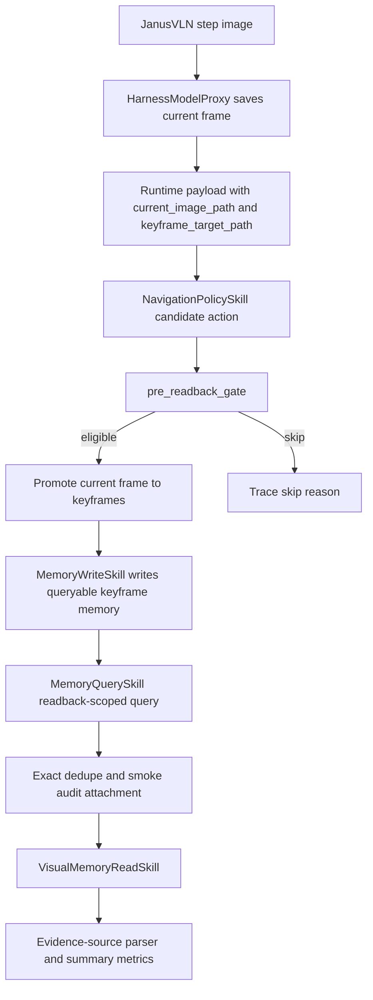
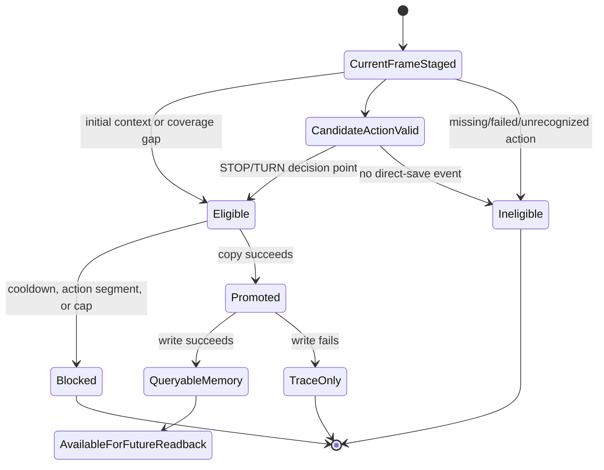
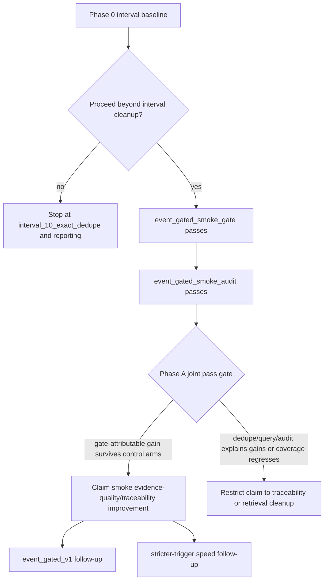

# feat: Implement Event-Gated Keyframe Memory Smoke

## Summary

Implement a Phase 0 stop/go baseline for ClawNav OpenClaw visual readback, then implement the event-gated keyframe memory smoke path only if Phase 0 justifies moving beyond interval cleanup. The plan turns the current interval-only keyframe policy into either a lower-cost interval dedupe/reporting path or a validated, traceable smoke path with action-gated keyframe promotion, queryable memory writes, exact readback dedupe, evidence-use diagnostics, and strict claim boundaries.

---

## Problem Frame

Current visual readback retrieves historical memory from `keyframes/`, but those keyframes are selected mechanically by step interval. That can miss STOP/turn moments, save redundant straight-line views, and attach nearby keyframes that waste expensive `VisualMemoryReadSkill` calls. The design intentionally validates evidence quality, not navigation success or speed: faster readback requires a separate stricter-trigger or cost-reduction experiment.

---

## Requirements

**Baseline and claim safety**

- R1. Phase 0 must use a fixed manifest with predeclared episode keys, route-event labels, accepted step tolerance, and shared readback trigger keys before any event-gated implementation claims value.
- R1a. Phase 0 manifest generation must declare its input contract: checked-in seed file or explicit CLI inputs, route-event label row schema, trigger-key source, tolerance defaults, `phase0_stop_go_thresholds`, selection seed, source dataset/run identifiers, source file hashes, and failure behavior when any required input is absent.
- R1b. Phase 0 outputs must be immutable enough for later comparison: the manifest builder must emit `manifest_schema_version`, selection rules, source hashes, and a manifest SHA256 that Phase A runners and summaries record and compare against the Phase 0 baseline. The SHA256 must be computed over canonical JSONL rows with stable key ordering and must exclude the `manifest_sha256` field if that field is embedded in the manifest.
- R1c. Phase 0 stop/go decisions must use predeclared thresholds before result inspection. At minimum, `phase0_stop_go_thresholds` must name route-event miss tolerance, exact-duplicate and adjacent-triplet thresholds, evidence-auditability thresholds, comparison direction, and invalid-comparison behavior; summaries must echo the threshold values and mark comparisons invalid when thresholds are missing, untracked, or changed after manifest generation.
- R2. The implementation must preserve `interval` as the default keyframe policy until smoke and regression checks pass.
- R3. Phase A must compare `interval_10`, `interval_10_exact_dedupe`, `interval_10_smoke_audit_control`, and validated `event_gated_smoke` on shared readback trigger keys so gate-attributable effects are separated from dedupe/query/audit effects.
- R4. Smoke may claim traceability and exact-dedupe improvements, but it must not claim diverse retrieval, readback-value improvement, speedup, SR/SPL improvement, or executed-policy improvement.

**Event-gated smoke behavior**

- R5. The `event_gated_smoke` gate checkpoint must save only initial context, valid normalized `STOP`, `TURN_LEFT`, `TURN_RIGHT`, and configured coverage-gap keyframes.
- R6. Failed, empty, or unrecognized policy actions must not become fallback STOP keyframes or trigger visual readback.
- R7. Candidate-only STOP/TURN saves must be represented separately from confirmed executed route events.
- R8. Cooldown, one-save-per-action-segment, cap validation, and cap failure reporting must be enforced before Phase A claims.

**Trace, memory, and retrieval**

- R9. Every step must emit a `keyframe_gate` trace block with save/skip reason, gate phase, action contract, candidate/confirmed event identity, cap/cooldown status, promotion/write status, memory-id link status, and failure reason fields.
- R10. Queryable smoke memory writes must include `metadata.keyframe_gate`, `run_id`, `scene_id`, `episode_id`, `step_id`, `image_path`, `memory_namespace`, `source_image_role`, and non-oracle `retrieval_text` or `action_context`.
- R11. `MemoryWriteSkill` failures must not abort navigation or add failed writes to queryable memory.
- R12a. Interval cleanup must never attach duplicate image paths in the same readback analysis and must report exact-duplicate and adjacent-triplet rates from legacy trace/readback fields without requiring smoke query/write metadata.
- R12b. Smoke readback retrieval must filter to eligible prior keyframe memories for the current run/episode namespace and record query unavailable, failed, timed-out, and empty-pool cases deterministically.
- R13a. Interval cleanup attachment traces must distinguish requested count, retrieved/attached count, exact duplicate drops, and unmatched trigger counts using available legacy trace/readback fields; they must not require backend metadata filters or a gate-approved write ledger.
- R13b. Smoke candidate-pool traces must distinguish requested count, backend returned count, exact duplicate drops, attached count, and total eligible prior-keyframe count. The eligible count must come from a metadata-first backend filter or a local write ledger that enumerates all current-run/current-episode gate-approved prior keyframes before ranking.
- R14a. Phase 0 and interval-cleanup evidence-use metrics may use legacy trace/readback fields, but only stable attached memory IDs or attached image paths may be credited; missing or vague sources must be counted as ambiguous/invalid.
- R14b. New smoke visual readback evidence-use metrics must rely on stable evidence source identities, not vague prose references. Parser-facing output must keep legacy string fields compatible while adding an `evidence_sources` array for auditable counters.
- R15. Smoke config must use `keyframe_policy_mode="event_gated_smoke"`; `event_gated_smoke_gate` and `event_gated_smoke_audit` are validation checkpoints and report labels, not separate accepted policy-mode strings.

---

## Scope Boundaries

### In Scope

- Phase 0 manifest generation and baseline audit support.
- A Phase 0b interval-only stop path that delivers `interval_10_exact_dedupe` and baseline reporting when Phase 0 does not justify event-gated implementation.
- `event_gated_smoke_gate` and `event_gated_smoke_audit` validation checkpoints under `keyframe_policy_mode="event_gated_smoke"`.
- Runtime trace and summary metrics required to validate the smoke claim boundary.
- Exact duplicate readback image-path dedupe and adjacent-triplet measurement.
- Evidence-source parsing and summary counts for `VisualMemoryReadSkill` outputs.

### Deferred to Follow-Up Work

- `event_gated_v1_candidate_pool`, event-type-aware reranking, visual novelty, and text-derived transition scoring.
- Priority replacement under cap pressure.
- Spatial HTTP metadata round-trip hardening, including HTTP-backend smoke compatibility.
- Stricter readback trigger policy or per-call cost reduction for speed claims.
- Navigation intervention experiments that would claim SR/SPL or executed-policy improvement.

### Out of Scope

- New Qwen calls for deciding whether to save keyframes.
- Oracle fields, future frames, distance-to-goal, success, SPL, or future path information for online keyframe decisions.
- Cross-episode or long-term memory selection.
- JanusVLN model internals.

---

## Key Technical Decisions

- KTD1. **Split smoke into gate and audit checkpoints:** `event_gated_smoke_gate` proves the online keyframe policy and write contract; `event_gated_smoke_audit` adds query-failure traces, exact dedupe, adjacent measurement, evidence diagnostics, and summary counts before Phase A claims.
- KTD1a. **Gate implementation after Phase 0 evidence:** Phase 0 gates whether U2-U8 should proceed at all. If `interval_10_exact_dedupe` and baseline auditability satisfy the predeclared stop/go thresholds, the next slice stays limited to interval dedupe/reporting instead of building event-gated runtime paths.
- KTD1b. **Make the no-go path deliverable:** A no-go Phase 0 decision is not just a report. It must still produce the interval-only cleanup artifact, shared-trigger summary, exact-dedupe attachment audit, and stop/go verification output needed to justify not building U2-U8.
- KTD1c. **Treat manifests as comparison contracts:** Phase 0 and Phase A must record the same manifest SHA256. Compute that hash from canonical JSONL rows with stable key ordering, excluding `manifest_sha256` itself when embedded; if a Phase A runner receives a different hash or an untracked manifest, the summary must fail or mark the comparison invalid instead of silently comparing changed cases.
- KTD1d. **Use one smoke policy mode:** `event_gated_smoke` is the only accepted event-gated smoke `keyframe_policy_mode`. `event_gated_smoke_gate` and `event_gated_smoke_audit` name validation checkpoints inside that mode.
- KTD2. **Stage current frames before runtime promotion:** `HarnessModelProxy` should keep writing current views under `openclaw_current_frames/...` and pass a deterministic `keyframe_target_path`; `OpenClawVLNRuntime` owns action-dependent promotion after the candidate action is known.
- KTD3. **Use candidate-vs-confirmed event identity:** Pre-controller STOP/TURN saves are useful evidence candidates, but route-event coverage and v1 preferred slots must distinguish `candidate_decision_point`, `executed_decision_point`, and `blocked_stop_shadow`.
- KTD4. **Use eager promotion for smoke audit:** `MemoryQuerySkill` retrieves memory records, not arbitrary trace-labeled current-frame artifacts, so frames that pass the gate must be promoted and written before they can count as retrievable memory.
- KTD4a. **Query only prior-step smoke keyframes:** Readback-scoped queries must filter to the current run/episode namespace, gate-approved keyframe role, `step_id < current_step`, and `image_path != current_image_path`. Same-step, wrong-namespace, non-keyframe, and failed-write records are not eligible historical memories.
- KTD4b. **Count eligibility before ranking:** Candidate-pool summaries must know the full eligible prior-keyframe population, not just the backend top-k result. The smoke path may satisfy this through backend metadata filters or a local write ledger; either way, the trace must expose total eligible, backend returned, duplicate dropped, and attached counts separately.
- KTD4c. **Keep Phase A on the local image-backed backend:** Smoke validation targets the local image-backed memory path. Spatial HTTP metadata round-trip hardening remains follow-up work unless a later plan explicitly upgrades the backend contract and tests.
- KTD5. **Keep `_auto_recall_memory(...)` separate from readback recall:** Policy recall remains the pre-planner path. Visual readback gets its own scoped query path so candidate-pool recall and final image attachment do not pollute `policy_context`.
- KTD6. **Treat cap pressure as validation failure in smoke:** Smoke does not silently evict memories. Late cap-blocked STOP/turn/coverage events force a new cap and full rerun, or a later v1 replacement arm.
- KTD7. **Evidence quality is not speed:** The plan records latency and call-count metrics, but no speed claim is valid unless a separate trigger or cost arm reduces `VisualMemoryReadSkill` calls or wall time.
- KTD8. **Legacy memory writes do not satisfy smoke:** Existing automatic visual-memory write and smoke-seed write paths remain valid for current modes, but they are bypassed for the smoke readback namespace when `keyframe_policy_mode="event_gated_smoke"`. Only gate-approved promotions may enter queryable smoke memory and smoke candidate-pool counts.

---

## High-Level Technical Design

### Smoke Data Flow

### Keyframe Gate State

### Claim Boundary

---

## Implementation Units

### U1. Phase 0 Manifest And Baseline Audit

- **Goal:** Create the fixed manifest and baseline reporting needed before event-gated implementation claims value.
- **Requirements:** R1, R1a, R1b, R1c, R3, R4, R14a.
- **Dependencies:** None.
- **Files:**
  - `scripts/build_event_gated_phase0_manifest.py`
  - `src/harness/visual_readback/manifest.py`
  - `src/harness/visual_readback/audit.py`
  - `tests/test_event_gated_phase0_manifest.py`
  - `tests/test_visual_readback_phase0.py`
- **Approach:** Add a manifest builder that produces `docs/plans/manifests/2026-06-18-event-gated-phase0-manifest.jsonl` with the design's required fields plus `manifest_schema_version`, `selection_rules`, `selection_seed`, `phase0_stop_go_thresholds`, source dataset/run identifiers, source trace/result file hashes, and a sidecar or embedded manifest SHA256 that downstream scripts must record. The canonical digest is computed from newline-joined JSONL rows serialized with stable key ordering; if the hash is embedded, the `manifest_sha256` field is excluded before hashing so builders and validators can reproduce the same value. The builder must consume either a checked-in seed file or explicit CLI inputs for episode keys, route-event labels, shared trigger keys, accepted tolerance, and stop/go thresholds; it must fail fast when labels, tolerances, thresholds, source paths, or trigger-key inputs are missing. Keep the existing fixed-case JSON manifest loader unchanged, and add `load_event_gated_phase0_manifest_jsonl(...)` plus a schema validator in `src/harness/visual_readback/manifest.py` for this JSONL contract. The audit should call the new JSONL loader and report missed STOP/TURN opportunities, adjacent-triplet rate, exact duplicate image-path rate, provisional legacy memory-evidence-use counts, shared trigger keys, unmatched trigger counts, and threshold pass/fail inputs for `interval_10`. For Phase 0 only, evidence-use counts come from existing trace/readback fields: rows with stable attached memory IDs or attached image paths can be credited, while rows without stable source identity are classified as ambiguous/invalid and not credited. U7 later hardens new visual readback outputs.
- **Patterns to follow:** `src/harness/visual_readback/manifest.py` validation style; `tests/test_visual_readback_phase0.py` trace fixture style.
- **Test scenarios:**
  - Given a manifest missing `scene_id`, `episode_id`, route-event labels, or tolerance fields, validation fails with the missing field names.
  - Given a builder invocation without a seed file and without explicit episode, label, tolerance, threshold, source, or trigger-key inputs, generation fails before writing a partial manifest.
  - Given missing `phase0_stop_go_thresholds`, unknown threshold names, missing comparison directions, or invalid threshold values, manifest validation fails before audit runs.
  - Given source trace/result files, the builder records their SHA256 values and the audit report echoes the manifest SHA256.
  - Given an embedded `manifest_sha256`, the validator recomputes the same hash by excluding that field; changing any canonical manifest row changes the recomputed SHA256.
  - Given an existing fixed-case JSON manifest, `load_visual_readback_manifest(...)` continues to validate the object-with-`cases` contract unchanged.
  - Given an event-gated Phase 0 JSONL manifest, `load_event_gated_phase0_manifest_jsonl(...)` validates each row and reports row-level errors without using the fixed-case JSON loader.
  - Given a trace with interval keyframes around STOP/TURN labels, Phase 0 reports matched and missed opportunities using the accepted tolerance.
  - Given readback rows with repeated retrieved image paths, Phase 0 reports exact duplicate and adjacent-triplet rates separately.
  - Given legacy readback rows without stable evidence identities, Phase 0 reports ambiguous/invalid evidence-use counts and does not credit them as memory-evidence-used.
  - Given trigger keys present in one arm and missing in another, the audit reports unmatched trigger counts instead of dropping them silently.
- **Verification:** A checked manifest can be loaded by the audit utilities, and the baseline report contains all Phase 0 fields required by the design, including source hashes, stop/go thresholds, and the manifest SHA256 used by later phases.

### U1b. Interval Cleanup Stop Path

- **Goal:** Make the Phase 0 no-go branch executable by delivering the interval-only cleanup/reporting path before any event-gated runtime work.
- **Requirements:** R1, R1a, R1b, R1c, R3, R4, R12a, R13a, R14a.
- **Dependencies:** U1.
- **Files:**
  - `src/harness/visual_readback/audit.py`
  - `src/harness/visual_readback/metrics.py`
  - `scripts/summarize_openclaw_visual_readback.py`
  - `scripts/run_openclaw_visual_readback_matrix.py`
  - `tests/test_visual_readback_phase0.py`
  - `tests/test_visual_readback_summary.py`
- **Approach:** Add an interval-only arm named `interval_10_exact_dedupe` that reuses interval keyframes, runs on the Phase 0 shared trigger keys, removes repeated retrieved image paths before attachment analysis, reports adjacent-triplet and exact-duplicate rates, and emits the same manifest SHA256 as U1. This arm must not require U2-U8, smoke query/write metadata, backend eligibility filters, or event-gated runtime behavior. The stop/go report compares `interval_10` against `interval_10_exact_dedupe` using the predeclared `phase0_stop_go_thresholds`, records whether remaining problems are route-event misses, dedupe-only failures, or auditability gaps, and marks the decision invalid if thresholds differ from the manifest contract. If dedupe/reporting satisfies the predeclared no-go thresholds, this unit is the deliverable and the plan stops before U2.
- **Patterns to follow:** Existing visual readback summary aggregation and matrix-runner arm naming.
- **Test scenarios:**
  - Given repeated retrieved image paths in `interval_10`, `interval_10_exact_dedupe` drops duplicates and records duplicate-drop counts without changing the underlying saved keyframe set.
  - Given Phase 0 shared trigger keys, both interval arms report matched and unmatched triggers instead of comparing different readback moments.
  - Given a manifest hash mismatch or threshold mismatch between U1 and an interval cleanup summary, the stop/go report marks the comparison invalid.
  - Given route-event coverage and duplicate/evidence-auditability metrics satisfy the predeclared no-go thresholds, the report emits a no-go decision for U2-U8 and identifies interval cleanup/reporting as the delivered scope.
  - Given route-event misses, duplicate/adjacent-triplet failures, or evidence-auditability gaps remain outside predeclared thresholds after exact dedupe, the report emits a go decision for the event-gated smoke units.
- **Verification:** A no-go Phase 0 run produces a complete interval-only summary artifact with predeclared threshold evidence and does not depend on `keyframe_policy_mode="event_gated_smoke"`.

### U2. Keyframe Policy Configuration Surface

- **Goal:** Add the smoke config surface while preserving interval mode as the default.
- **Requirements:** R2, R5, R8, R15.
- **Dependencies:** None.
- **Files:**
  - `src/harness/config.py`
  - `src/evaluation_harness.py`
  - `tests/test_visual_readback_config.py`
  - `tests/test_evaluation_harness_imports.py`
- **Approach:** Extend `HarnessConfig` with `keyframe_policy_mode`, `keyframe_min_gap_steps`, `keyframe_episode_cap`, `keyframe_coverage_gap_steps`, and `keyframe_debug_save_all_eligible`. For this plan, accepted `keyframe_policy_mode` values are `interval` and `event_gated_smoke`; `event_gated_smoke_gate` and `event_gated_smoke_audit` are validation checkpoints/report labels under `event_gated_smoke`, not accepted mode strings. Add CLI and environment variable plumbing in `evaluation_harness.py` using the existing visual-readback config pattern. Validation should reject unknown policy modes and invalid non-positive gaps/caps.
- **Patterns to follow:** `visual_readback_*` parser/config precedence in `src/evaluation_harness.py`; `validate_visual_readback_config(...)` style in `src/harness/config.py`.
- **Test scenarios:**
  - With no new flags or env vars, config resolves to `keyframe_policy_mode="interval"`.
  - CLI flags override environment variables, and environment variables override defaults for keyframe gap/cap values.
  - Invalid policy modes and non-positive cap/gap values raise configuration errors.
  - `keyframe_policy_mode="event_gated_smoke_gate"` and `"event_gated_smoke_audit"` are rejected with a message pointing to `"event_gated_smoke"`.
  - V1-only config fields are not required for `event_gated_smoke`.
- **Verification:** Existing visual readback config tests still pass, and new config tests prove default compatibility.

### U3. Current-Frame Staging And Promotion Ownership

- **Goal:** Move from interval-time keyframe writes to runtime-owned promotion after the candidate action is known.
- **Requirements:** R5, R8, R9.
- **Dependencies:** U2.
- **Files:**
  - `src/evaluation_harness.py`
  - `src/harness/memory/working_memory.py`
  - `tests/test_evaluation_harness_openclaw_runtime.py`
  - `tests/test_working_memory.py`
- **Approach:** Keep `openclaw_current_frames/...` as the first artifact for each step and add a deterministic `keyframe_target_path` to the runtime payload. For interval mode, preserve current behavior. For event-gated mode, let runtime metadata report whether promotion happened and let `HarnessModelProxy` update `recent_keyframe_paths` only after a successful promoted/writeable keyframe result.
- **Patterns to follow:** `_runtime_payload(...)`, `_save_image_artifact(...)`, and `_remember_keyframe_path(...)` in `src/evaluation_harness.py`.
- **Test scenarios:**
  - In interval mode, step 0 and every 10th step still produce keyframe candidates as before.
  - In smoke mode, the current frame is staged under `openclaw_current_frames/...` before runtime decides promotion.
  - Runtime metadata with a promoted keyframe updates `recent_keyframe_paths`; skipped or failed writes do not.
  - Missing current image records the missing-image error without creating a placeholder keyframe.
- **Verification:** Harness runtime tests show current-frame artifacts and promoted keyframes land in their distinct directories.

### U4. Pre-Readback Keyframe Gate

- **Goal:** Implement `event_gated_smoke_gate` direct-save behavior, action-status handling, cooldown, action-segment guard, cap validation, and candidate/confirmed event identity.
- **Requirements:** R5, R6, R7, R8, R9.
- **Dependencies:** U2, U3.
- **Files:**
  - `src/harness/openclaw/runtime.py`
  - `src/harness/openclaw/keyframe_gate.py`
  - `tests/test_event_gated_keyframe_gate.py`
  - `tests/test_evaluation_harness_openclaw_runtime.py`
- **Approach:** Add a small keyframe gate helper owned by the runtime layer. It should normalize the candidate action, reject failed/empty/unrecognized actions, identify direct-save events, enforce cooldown and action-segment limits, apply cap policy, and emit a complete `keyframe_gate` block for every step. Derive `candidate_action_status` from the `NavigationPolicySkill` tool result before any STOP fallback is applied: `ok=false`, tool/runtime error, or missing payload is `failed`; missing or blank `action_text` is `empty`; normalized text outside the accepted action set is `unrecognized`; accepted normalized actions are `ok`. Runtime must preserve `raw_candidate_action`, `normalized_candidate_action`, and `candidate_action_status` in `keyframe_gate` and pass the same fields to U6. The one-save-per-action-segment guard follows the normalized candidate action before readback: a segment starts when an `ok` STOP/TURN candidate appears, continues while the same normalized candidate repeats, and resets when the next step has a different normalized candidate, a non-decision action, or failed/invalid action status. Post-controller `final_action_after_controller` populates `confirmed_event_type`, `controller_event_status`, and optional confirmed segment metrics, but it does not retroactively reopen the pre-readback candidate segment. Keep v1 novelty and transition scoring out of this unit.
- **Compatibility rule:** When `keyframe_policy_mode="event_gated_smoke"`, existing automatic visual-memory write and controlled smoke-seed write paths must be bypassed for the smoke readback namespace. Only keyframe-gate-approved promoted frames may enter queryable smoke memory, `recent_visual_memories`, and smoke candidate-pool counts.
- **Execution note:** Start with gate-helper tests before wiring it into runtime, because the helper is mostly deterministic state transition logic.
- **Patterns to follow:** `_visual_readback_trigger_rule(...)` action normalization boundary; existing runtime trace metadata construction in `_metadata(...)`.
- **Test scenarios:**
  - Step 0 produces an `initial_context` decision unless the image artifact is missing or cap blocks it.
  - Valid `TURN_LEFT`, `TURN_RIGHT`, and `STOP` candidates produce `candidate_decision_point` eligibility.
  - Failed, empty, and unrecognized candidate actions are ineligible and cannot trigger fallback STOP saves.
  - A failed `NavigationPolicySkill` result with no action payload records `candidate_action_status="failed"` and does not derive STOP from the runtime fallback.
  - A blank `action_text` records `candidate_action_status="empty"`; an unrecognized normalized action records `candidate_action_status="unrecognized"`.
  - Consecutive repeated STOP or turn actions save at most one keyframe per action segment.
  - A STOP blocked by visual readback followed by another STOP without an intervening candidate-action change remains the same candidate segment and does not save a second keyframe.
  - A failed or unrecognized action resets the candidate segment and cannot create a direct-save event.
  - A readback-changed final action updates controller/confirmed metadata without changing the already-recorded pre-readback candidate segment ID.
  - Cap-blocked direct-save events mark `keyframe_cap_validation_failed` when a late STOP/turn/coverage event is blocked.
  - Candidate-only saves do not count as confirmed executed events until controller metadata confirms them.
- **Verification:** Runtime traces contain a `keyframe_gate` block on every step and no oracle fields are needed for decisions.

### U5. Queryable Memory Write Contract

- **Goal:** Make promoted smoke keyframes queryable, auditable, and safe under write failure.
- **Requirements:** R9, R10, R11.
- **Dependencies:** U3, U4.
- **Files:**
  - `src/harness/skills/memory_write.py`
  - `src/harness/visual_readback/memory_smoke.py`
  - `src/harness/types.py`
  - `tests/test_memory_skills.py`
  - `tests/test_visual_readback_phase0.py`
- **Approach:** Preserve `metadata.keyframe_gate`, `run_id`, `scene_id`, `episode_id`, `step_id`, `image_path`, `source_image_role`, `memory_scope`, `memory_namespace`, and non-oracle retrieval text in write records for the local image-backed memory path. Gate-approved smoke writes must use `source_image_role="event_gated_keyframe"` or an equivalent smoke keyframe role that U6 can filter on. Capture backend-returned memory IDs when available. Convert ingest exceptions and failed backend responses into structured failed-write payloads instead of raising through navigation. Ensure failed writes and legacy auto-write records do not enter recent visual memory or retrievable-memory counts for the smoke namespace. Do not add spatial HTTP metadata round-trip hardening in this unit; a future backend-hardening plan must cover that explicitly.
- **Patterns to follow:** Existing `MemoryWriteSkill._build_record(...)` and `ImageBackedLocalMemoryClient.ingest_semantic(...)` memory-id behavior.
- **Test scenarios:**
  - A smoke write with keyframe metadata round-trips through local image-backed memory with `metadata.keyframe_gate` preserved.
  - A write without explicit `retrieval_text` builds non-empty text from allowed non-oracle fields.
  - A smoke write missing `step_id`, `scene_id`, `episode_id`, `image_path`, `memory_namespace`, or keyframe-gate metadata is rejected or marked non-queryable.
  - A backend exception returns `written=false`, `error_type=memory_write_failed`, and does not abort the runtime step.
  - A backend-provided memory ID is copied into the write result and trace; missing IDs fall back to deterministic path-only linkage.
  - Smoke tests pass with the local image-backed backend and do not require `spatial_memory_client.py` metadata round-trip changes.
- **Verification:** Memory write tests prove queryable records carry gate metadata and failed writes are excluded from queryable memory.

### U6. Smoke Readback Query And Attachment Audit

- **Goal:** Add `event_gated_smoke_audit` retrieval behavior without implementing v1 diversity reranking.
- **Requirements:** R6, R12b, R13b.
- **Dependencies:** U4, U5.
- **Files:**
  - `src/harness/openclaw/runtime.py`
  - `src/harness/skills/memory_query.py`
  - `src/harness/memory/memory_manager.py`
  - `src/harness/visual_readback/memory_smoke.py`
  - `tests/test_visual_memory_read_skill.py`
  - `tests/test_memory_manager.py`
  - `tests/test_evaluation_harness_openclaw_runtime.py`
- **Approach:** Add a readback-scoped query path for `image_read_controller` after a trigger is selected. The trigger decision must consume the keyframe gate's `candidate_action_status` and `normalized_candidate_action`, not a fallback `STOP` from planner or runtime error handling. Failed, empty, or unrecognized actions emit a deterministic skipped-readback trace and must not derive `risky_stop`. Keep `_auto_recall_memory(...)` as the policy recall path. For smoke, construct the eligible pool with a predicate equivalent to current run/episode namespace, smoke keyframe role, `step_id < current_step`, and `image_path != current_image_path`. Update the local image-backed memory path so `MemoryHit.metadata` or the local smoke write ledger exposes the fields required for that predicate: `run_id`, `scene_id`, `episode_id`, `step_id`, `image_path`, `source_image_role`, `memory_namespace`, and `metadata.keyframe_gate`. If the backend cannot return a complete pre-ranked eligible count, maintain a local smoke write ledger and compute `eligible_prior_keyframe_count` from that ledger before ranking. Then request backend hits, drop duplicate image paths, attach up to `visual_readback_top_k`, and record requested count, eligible prior count, backend returned count, duplicate dropped count, and attached count. Do not merge this query into `policy_context`.
- **Patterns to follow:** `_run_visual_readback(...)`, `_latest_memory_hits(...)`, and current `MemoryQuerySkill` payload shape.
- **Test scenarios:**
  - Missing `MemoryQuerySkill` records `memory_query_unavailable` and skips `VisualMemoryReadSkill`.
  - Failed, empty, and unrecognized candidate actions record skipped readback and never become fallback `risky_stop`.
  - Query timeout or failure records `memory_query_failed` and preserves the candidate action.
  - Same-step records, current-image records, cross-episode records, wrong-namespace records, legacy auto-write records, and records missing step IDs are excluded from eligible prior keyframes.
  - Local image-backed `MemoryHit.metadata` or the smoke write ledger carries `step_id`, `scene_id`, `episode_id`, `source_image_role`, `image_path`, and gate metadata so U6 can apply the readback predicate without parsing retrieval text.
  - An eligible prior keyframe outside backend top-k still contributes to `eligible_prior_keyframe_count` through the metadata filter or local write ledger.
  - Returned duplicate image paths are dropped before attachment.
  - Zero eligible prior keyframes preserves `candidate_pool_returned_count` and sets `eligible_prior_keyframe_count=0`.
  - Trace output distinguishes total eligible, backend returned, duplicate dropped, and attached counts for every readback attempt.
  - Readback query results are not merged into planner policy payload or `policy_context`.
- **Verification:** Trace rows distinguish skipped, failed, and empty retrieval while preserving control-only readback boundaries.

### U7. Visual Readback Evidence Source Contract

- **Goal:** Make memory-evidence-use metrics auditable by requiring stable source identities in visual readback output.
- **Requirements:** R14b.
- **Dependencies:** U6.
- **Files:**
  - `src/harness/skills/visual_memory_read.py`
  - `src/harness/visual_readback/readback.py`
  - `src/harness/visual_readback/metrics.py`
  - `tests/test_visual_memory_read_skill.py`
  - `tests/test_visual_readback_summary.py`
- **Approach:** Update the prompt/schema so each `visual_evidence`, `audit_action_hint`, verifier label, and controller rationale item keeps the existing legacy string value but may also attach an `evidence_sources` array. Each source item must include `field_name`, `item_index`, `evidence_source_type`, and at least one stable identity among `memory_id`, `retrieved_image_path`, `step_id`, or `readback_slot_id`; when available it should also include the attached readback slot index. `normalize_visual_readback_response(...)` should derive counters from this array and only credit memory use when the source identity maps to an attached memory/readback item. Missing, malformed, duplicate, or unattached identities must increment explicit ambiguous/invalid counters rather than crediting memory use.
- **Patterns to follow:** `normalize_visual_readback_response(...)` filters `matched_memory_ids` to attached IDs; visual readback summary currently computes matched-memory and grounding counts from trace blocks.
- **Test scenarios:**
  - Valid memory evidence with attached memory ID increments memory-evidence-used counts.
  - Current-frame-only evidence increments current-only counts, not memory-evidence counts.
  - Vague evidence without source identity increments ambiguous counts.
  - Invalid or duplicate source IDs increment invalid-source counts and do not get credited as memory use.
  - Legacy string-only fields remain parseable, but they are counted as ambiguous unless accompanied by a valid `evidence_sources` entry.
- **Verification:** Summary output includes memory-evidence, current-only, ambiguous, no-evidence, and invalid-source counters.

### U8. Summary Metrics, Phase A Gates, And Evaluation Scripts

- **Goal:** Produce the smoke summary fields and Phase A pass/fail gates needed to decide whether event-gated keyframes are worth continuing.
- **Requirements:** R1, R1a, R1b, R1c, R3, R4, R8, R12a, R12b, R13a, R13b, R14a, R14b.
- **Dependencies:** U1, U1b, U4, U5, U6, U7.
- **Files:**
  - `src/harness/visual_readback/metrics.py`
  - `scripts/summarize_openclaw_visual_readback.py`
  - `scripts/run_openclaw_visual_readback_matrix.py`
  - `tests/test_visual_readback_summary.py`
  - `tests/test_visual_readback_matrix_runner.py`
  - `tests/test_evaluation_scripts.py`
- **Approach:** Extend summary aggregation with keyframe policy mode, save counts by reason, initial-context count, direct-save segment count, cooldown/action-segment/cap skips, cap failure, write failure, memory-id link status, retrieval text failures, candidate/confirmed decision counts, retrieval failure counts, eligible/backend-returned/duplicate-dropped/attached candidate-pool counts, adjacent-triplet metrics, and evidence-use diagnostics. Add Phase A gate output that compares `interval_10`, `interval_10_exact_dedupe`, `interval_10_smoke_audit_control`, and validated `event_gated_smoke` on shared trigger keys, the same manifest SHA256, and the same `phase0_stop_go_thresholds` contract. The control arm must run with `keyframe_policy_mode="interval"`, interval step 10, a distinct namespace/role such as `interval_smoke_audit_keyframe`, the smoke-compatible queryable write contract, the readback-scoped query predicate, exact dedupe, attachment audit, evidence diagnostics, and legacy auto-write bypass rules for the audit namespace. It keeps interval keyframes but uses the same audit/query mechanics as event-gated smoke, so reports can separate gate-attributable deltas from retrieval/audit deltas.
- **Patterns to follow:** `summarize_visual_readback_run(...)` output shape and `scripts/run_openclaw_visual_readback_matrix.py` matrix orchestration.
- **Test scenarios:**
  - A trace with mixed save reasons produces correct `keyframe_saved_by_reason` and skip counts.
  - Cap validation failure is reported when a late STOP/turn/coverage event is blocked.
  - Exact duplicate image-path drops and adjacent-triplet denominators are reported separately.
  - A Phase A runner with a manifest SHA256 or `phase0_stop_go_thresholds` contract different from Phase 0 marks the comparison invalid.
  - `interval_10_smoke_audit_control` saves interval keyframes but uses the smoke-compatible query/write/audit namespace and emits the same candidate-pool/evidence diagnostics as `event_gated_smoke`.
  - Phase A reports "traceability only" when dedupe/query/audit controls explain gains or route-event coverage regresses.
  - Phase A reports gate-attributable deltas separately from retrieval/audit deltas.
  - Latency metrics are reported without attributing speedup to keyframe policy.
- **Verification:** Summary reports contain every smoke acceptance field and explicitly state the allowed interpretation.

---

## Acceptance Examples

- AE1. Given interval keyframes miss labeled turns outside the interval tolerance and the miss rate exceeds the predeclared `phase0_stop_go_thresholds`, Phase 0 records missed route-event opportunities and allows proceeding to the `event_gated_smoke` gate checkpoint.
- AE2. Given a valid `TURN_RIGHT` candidate with no keyframe saved in the current action segment, smoke promotes the current frame, writes metadata with `candidate_decision_point`, and records it as available from the next step.
- AE3. Given a STOP candidate later blocked by visual readback, the saved frame remains candidate evidence and does not count as executed STOP route-event coverage unless a controller label confirms its value.
- AE4. Given two memory hits with the same image path, smoke attaches only one and records the duplicate drop.
- AE5. Given Qwen output that says "a previous view" without a valid source identity, the run increments ambiguous evidence counts rather than memory-evidence-used counts.
- AE6. Given Phase 0 shows interval keyframes cover route events and `interval_10_exact_dedupe` removes redundant attachment failures within the predeclared no-go thresholds, U1b produces the interval cleanup/reporting artifact and the implementation stops before U2-U8.
- AE7. Given `event_gated_smoke` readback queries at step 70, records from step 70, current-image paths, wrong namespaces, and legacy auto-write roles are excluded before candidate-pool counts are computed.
- AE8. Given a Phase A summary was generated with a manifest SHA256 or `phase0_stop_go_thresholds` contract different from Phase 0, the comparison is marked invalid and no event-gated claim is made.
- AE9. Given five eligible prior smoke keyframes but only two backend hits returned before top-k ranking, the trace records `eligible_prior_keyframe_count=5` separately from backend returned and attached counts.
- AE10. Given `interval_10_smoke_audit_control`, interval keyframes are saved mechanically while queryable writes, readback-scoped retrieval, exact dedupe, attachment audit, and evidence diagnostics use the same smoke audit contract as `event_gated_smoke`.

---

## Phased Delivery

1. **Phase 0 baseline:** U1.
2. **Interval cleanup stop path:** U1b. This always creates the no-go deliverable and the `interval_10_exact_dedupe` comparison before event-gated work starts.
3. **Stop/go checkpoint:** Proceed to U2-U8 only if U1/U1b report missed STOP/TURN opportunities, redundant attachments not explained by `interval_10_exact_dedupe`, or auditability gaps that exceed the predeclared `phase0_stop_go_thresholds`. Otherwise stop at interval dedupe/reporting.
4. **Gate-only smoke:** U2, U3, U4, U5.
5. **Smoke audit and claims:** U6, U7, U8.
6. **Follow-up v1:** candidate-pool diversity, spatial HTTP metadata round-trip hardening, visual novelty, fresh text transition scoring, and stricter readback triggers.

---

## Risks And Mitigations

| Risk | Mitigation |
|---|---|
| Smoke scope expands into v1 work | Keep novelty, text transition scoring, and event-type-aware reranking out of U1-U8. |
| Phase 0 manifest changes after results are known | Emit and compare manifest SHA256, source hashes, selection rules, stop/go thresholds, and seed in Phase 0 and Phase A summaries. |
| Phase 0 labels, trigger keys, or thresholds are implicit | Require a seed file or explicit CLI inputs and fail manifest generation when labels, tolerances, thresholds, source paths, or trigger-key inputs are missing. |
| No-go branch becomes only a report | Make U1b a required interval cleanup deliverable with exact dedupe, shared-trigger reporting, and stop/go output. |
| Candidate actions inflate route-event coverage | Require candidate/confirmed event identity and count candidate-only evidence separately. |
| Memory write failures silently pollute retrieval | Convert failed writes into structured trace-only records and exclude them from queryable memory. |
| Legacy memory writes bypass the smoke gate | Bypass automatic visual-memory write and smoke-seed paths for the smoke namespace; only gate-approved promoted frames count as queryable smoke memory. |
| Retrieval-only dedupe or audit/query changes explain the improvement | Keep `interval_10_exact_dedupe` and `interval_10_smoke_audit_control` as Phase A arms and restrict claims when they explain the gain. |
| Candidate-pool counts reflect backend top-k rather than true eligibility | Use metadata-first filters or a local write ledger to compute total eligible prior keyframes before ranking. |
| Spatial HTTP backend assumptions enter smoke accidentally | Validate smoke on the local image-backed backend and defer spatial HTTP metadata round-trip hardening to follow-up work. |
| Cap defaults hide late important evidence | Treat late high-value cap blocks as validation failure and rerun with a changed cap or separate replacement arm. |
| Evidence-use metrics depend on vague Qwen prose | Require stable evidence source identities and count ambiguous/invalid references separately. |
| Same-step or wrong-scope memories contaminate readback | Require readback queries to filter by current run/episode namespace, keyframe role, `step_id < current_step`, and non-current image path. |
| Speed expectations drift into this plan | Record readback call count and wall time, but defer speed claims to a stricter-trigger or cost-reduction plan. |

---

## System-Wide Impact

The change affects the evaluation harness artifact lifecycle, OpenClaw runtime metadata, memory write/query contracts, visual readback output parsing, summary scripts, and evaluation matrices. It does not change JanusVLN model internals or default benchmark behavior while `keyframe_policy_mode` remains `interval`.

---

## Documentation And Operational Notes

- Update visual-readback runbook material if smoke introduces new required summary fields or result-directory evidence checks.
- Keep launchers defaulting to interval behavior until smoke is validated.
- Surface the new Phase A interpretation in generated reports so downstream readers do not treat memory-quality metrics as navigation-success claims.

---

## Sources And Research

- Origin design: `docs/plans/2026-06-18-event-gated-keyframe-memory-design.md`.
- Existing harness artifact path: `src/evaluation_harness.py`.
- Runtime recall/readback path: `src/harness/openclaw/runtime.py`.
- Memory write/query contracts: `src/harness/skills/memory_write.py`, `src/harness/skills/memory_query.py`, `src/harness/memory/memory_manager.py`.
- Visual readback parser and metrics: `src/harness/visual_readback/readback.py`, `src/harness/visual_readback/metrics.py`.
- Existing tests and patterns: `tests/test_visual_readback_phase0.py`, `tests/test_visual_readback_summary.py`, `tests/test_visual_memory_read_skill.py`, `tests/test_memory_skills.py`.
