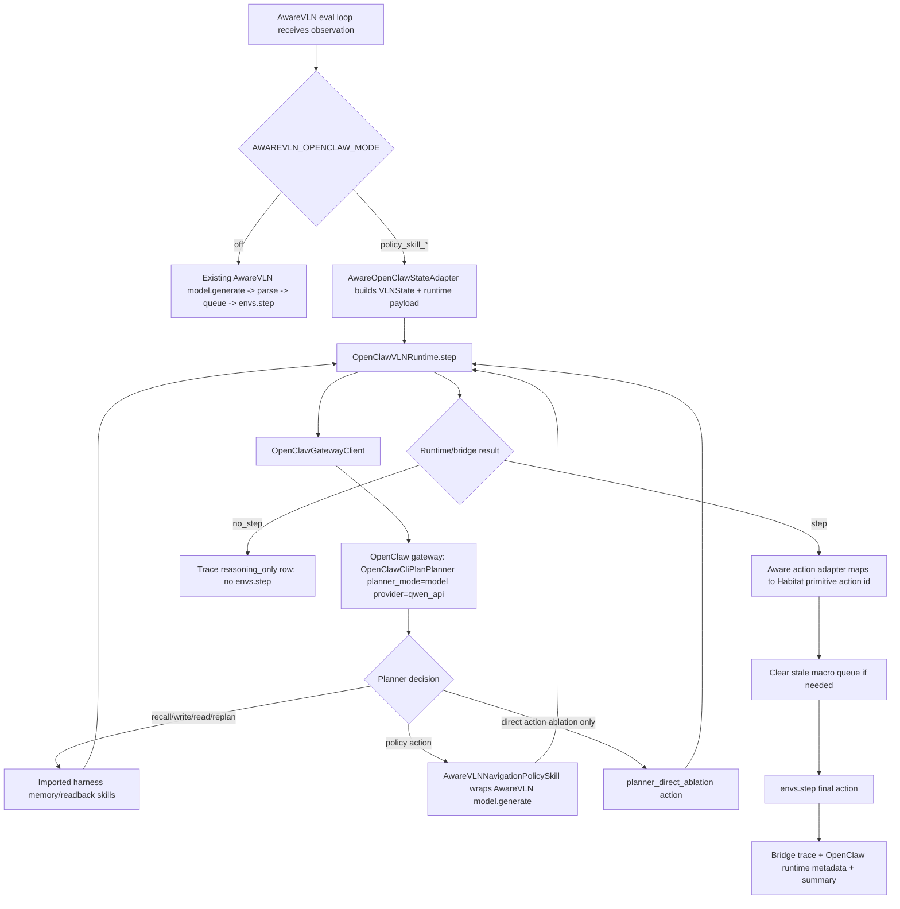

# feat: Integrate OpenClaw+Qwen harness memory into AwareVLN

## Goal Capsule

Import ClawNav's OpenClaw planner/runtime path into AwareVLN and make OpenClaw+Qwen the eval-time harness for memory-aware VLN control. In the primary research mode, AwareVLN remains the policy that proposes the candidate action through a registered `NavigationPolicySkill` on every primitive decision; OpenClaw owns the dynamic control around that policy call: task-state interpretation, memory recall/write, keyframe promotion, Qwen visual readback, replan/abstain decisions, strict action arbitration, and runtime trace metadata.

This intentionally supersedes the earlier Phase 2/3-only plan that kept AwareVLN as the sole candidate-action producer and forbade ClawNav runtime imports. The new target is:

```text
AwareVLN eval loop + adapters
  -> imported ClawNav OpenClawVLNRuntime
  -> OpenClawGatewayClient / OpenClawCliPlanPlanner
  -> policy-mediated AwareVLN NavigationPolicySkill
  -> Qwen planner/readback + harness-owned memory policy
  -> final primitive Habitat action
```

The first implementation must still be baseline-preserving when disabled, traceable when enabled, and conservative around AwareVLN's macro-action queue.

---

## Problem Frame

ClawNav already has the desired control architecture:

- `OpenClawVLNRuntime.step(...)` calls a planner and routes tool calls through `SkillRegistry`.
- `OpenClawGatewayClient` can delegate planning to an OpenClaw gateway.
- `OpenClawCliPlanPlanner(planner_mode="model", openclaw_model_provider="qwen_api")` is the Qwen-backed planner/gateway implementation.
- `MemoryQuerySkill`, `MemoryWriteSkill`, `VisualMemoryReadSkill`, `VisualMemoryCuratorSkill`, and the runtime keyframe gate manage memory and readback outside the navigation policy.
- `NavigationPolicySkill` is the primary action-producing skill in the contribution modes; it should become an AwareVLN adapter instead of a JanusVLN-only dependency.

AwareVLN's current eval loop is different. It calls `model.generate(...)` inside `evaluation/vlnce_baselines/awarevln_trainer.py`, parses text into Habitat primitive actions, and may expand one output into queued macro primitives before `envs.step(...)`. To make harness memory causal, the OpenClaw-enabled path must intercept before AwareVLN directly steps its own candidate action. In the primary contribution modes, OpenClaw calls the AwareVLN-backed `NavigationPolicySkill` to obtain the candidate action, then dynamically decides which memory, readback, replan, abstain, or override skills to call before returning the final primitive action. Direct planner-produced actions are retained only as an explicit ablation mode.

---

## Scope Boundaries

### In Scope

- Add an AwareVLN OpenClaw bridge mode that is off by default and isolated from the current baseline launcher.
- Import ClawNav OpenClaw/harness modules from a configured source checkout instead of reimplementing the planner in AwareVLN.
- Build AwareVLN-side adapters for state construction, action mapping, current-frame artifacts, and `NavigationPolicySkill`.
- Instantiate `OpenClawVLNRuntime` inside the AwareVLN eval loop with a `SkillRegistry` containing harness memory/readback skills and the AwareVLN navigation-policy adapter.
- Support Qwen-backed planning through `OpenClawGatewayClient` pointed at an OpenClaw gateway running `OpenClawCliPlanPlanner(planner_mode="model", openclaw_model_provider="qwen_api")`.
- Keep `RuleOpenClawPlanner` for deterministic tests and the `openclaw_rule` smoke mode; real gateway/Qwen modes must not silently downgrade to rule planning.
- Make harness-owned memory the source of truth: memory recall/write, keyframe ledger, current-frame paths, visual readback, memory-policy decisions, and action arbitration live in the imported OpenClaw runtime/skills.
- Add exact `scene_id:episode_id` filtering for reproducible fixed subsets.
- Route model-produced, queued macro, reasoning-only, and forced-stop situations through an auditable OpenClaw bridge boundary in enabled mode.
- Add trace and summary artifacts proving planner authority, Qwen usage, memory state changes, readback decisions, and final executed actions.
- Add a dedicated launcher for the migrated OpenClaw+Qwen path without changing the original `evaluation/scripts/eval/r2r.sh`.

### Out of Scope

- Replacing the AwareVLN repository with the ClawNav or JanusVLN eval harness wholesale.
- Importing ClawNav's JanusVLN model adapter as the active AwareVLN policy.
- Training-time changes.
- Robot executor support in the first AwareVLN pass.
- Multi-env support beyond AwareVLN's current `envs.num_envs == 1` eval loop.
- A remote/shared memory backend before image-backed local harness memory is proven in AwareVLN.
- Treating `openclaw_planner_direct` as the primary research contribution path; it is an ablation for separating planner authority from memory-policy effects.

### Deferred to Follow-Up Work

- Embedded in-process Qwen planner mode if the gateway process boundary becomes too costly.
- Dense action-override experiments after sparse OpenClaw+Qwen mode is validated.
- Stage-aware instruction segmentation parity if the first fixed subset needs it.
- A separate package-management cleanup so ClawNav can be installed as a versioned dependency instead of imported by source path.

---

## Requirements

- **R1. Baseline preservation:** With `AWAREVLN_OPENCLAW_MODE=off`, AwareVLN eval behavior must match the current action parsing, queueing, stepping, result writing, and video behavior.
- **R2. Explicit ClawNav import contract:** Enabled OpenClaw modes must resolve `CLAWNAV_REPO_ROOT` or `AWAREVLN_CLAWNAV_SRC`, add the ClawNav `src` path in one controlled module, import required harness modules, and fail fast if imports or version checks fail. The bridge must validate the canonical source path, expected repo marker, pinned commit/version, non-world-writable permissions, resolved `harness.__file__`, and absence of a preloaded conflicting `harness` module. There must be no silent fallback to a partial local reimplementation.
- **R3. OpenClaw+Qwen planner contract:** The primary enabled mode must use `OpenClawGatewayClient` with `AWAREVLN_OPENCLAW_GATEWAY_URL` and gateway timeout settings. The gateway side must run `OpenClawCliPlanPlanner` with `planner_mode=model`, `openclaw_model_provider=qwen_api`, and Qwen credentials from ClawNav-supported env vars such as `OPENCLAW_QWEN_API_KEY`, `DASHSCOPE_API_KEY`, or `QWEN_API_KEY`. Gateway mode must bind to loopback by default; non-loopback URLs require explicit allowlist plus auth/TLS. Gateway health must validate service identity. Logs must print env variable names and config values, never secret values.
- **R4. AwareVLN state/action adapter:** The bridge must map AwareVLN episode, observation, instruction, current RGB image, recent frames, step id, last action, queue state, and available metrics into ClawNav `VLNState` plus runtime payload. It must map OpenClaw action text (`STOP`, `MOVE_FORWARD`, `TURN_LEFT`, `TURN_RIGHT`) back to AwareVLN/Habitat action ids.
- **R5. Harness-owned memory:** OpenClaw runtime/skills must own memory recall/write, keyframe promotion, selected image paths, readback state, and control-memory metadata. AwareVLN must not maintain a separate competing memory ledger in OpenClaw mode. Enabled OpenClaw modes must either refuse non-off `AWAREVLN_MEMORY_MODE` or bypass any AwareVLN-local memory controller, and tests must prove no competing `aware_memory_trace*.jsonl` artifacts are written.
- **R6. AwareVLN policy as a skill:** In primary contribution modes, the registered `NavigationPolicySkill` must call AwareVLN's existing model generation path on every primitive decision and return normalized candidate action text to OpenClaw. Direct trainer calls to `model.generate(...)` must be bypassed in OpenClaw-controlled steps except through this skill adapter. `openclaw_planner_direct` may bypass the policy skill only in an explicitly named ablation mode.
- **R7. Fixed subset reproducibility:** The migrated launcher must support exact episode keys in `scene_id:episode_id` format and preserve requested order. Exact-key filtering must run in the dataset-load path before `get_chunk(...)`, because post-chunk trainer filtering can silently drop requested episodes.
- **R8. Primitive-step control boundary:** In enabled OpenClaw modes, every action that can reach `envs.step(...)` must have an OpenClaw traceable decision source. If OpenClaw changes the immediate primitive action, stale queued macro actions must not execute afterward.
- **R9. Qwen visual readback and action arbitration:** Imported `VisualMemoryReadSkill` and runtime sparse trigger logic must support log-only and action-override modes. Free-text `audit_action_hint` is not executable by itself; action changes require structured fields such as `recommended_action`, `decision_scope`, `action_confidence`, `candidate_action_valid`, `should_override`, and current-view support booleans.
- **R10. Traceability:** Enabled OpenClaw modes must record planner backend, planner step mode, planner authority, Qwen call status, memory recall/write calls, keyframe gate outcome, visual readback outcome, override decision/failure reason, candidate policy action when present, final OpenClaw action, final Habitat action id, queue clearing, and executed-action changes.
- **R11. Launcher isolation:** The OpenClaw+Qwen run must use a new launcher so the original AwareVLN eval script remains a clean baseline.
- **R12. Testable fallback behavior:** Unit tests must run with fake/rule planners and mock skills without network credentials. `openclaw_rule` may use `RuleOpenClawPlanner`; real Qwen/gateway modes must retry/timeout and fail closed with clear config/readback/planner errors when credentials, gateway health, or image payload support is missing. Real Qwen/gateway modes must not silently downgrade to rule planning.
- **R13. Oracle manifest contract:** Fixed validation scenarios must load from a checked-in manifest or configured path. Oracle data is evaluation-only: it must never be passed into planner/runtime payloads, memory tools, policy skill prompts, or Qwen requests, and it may only be joined to a trace row after the row's decision has been written. Traces must record matched scenario id, expected memory ids or keyframe windows, `memory_oracle_hit`, and `memory_oracle_reason`.
- **R14. Dynamic control evidence:** Enabled modes must prove the Harness is dynamically scheduling existing modules rather than replaying a fixed workflow. Per-step traces must include `planner_intent_sequence`, `tool_call_order`, `tool_call_reason`, `subproblem_text`, `memory_recall_reason`, `replan_reason`, `call_count_per_step`, `policy_mode`, and `memory_policy_version`; summaries must report path diversity across steps and episodes.
- **R15. MemoryPolicy contract:** The plan must expose a versioned `MemoryPolicy` contract covering write gate, query trigger, Top-K/window selection, visual-readback trigger, override gate, abstain behavior, failure behavior, and trace fields. ClawNav's current policy may be the initial implementation, but hard-coded behavior without named policy knobs does not satisfy the contribution claim.
- **R16. Qwen payload and credential boundary:** The bridge must define an allowlisted Qwen payload contract for instructions, current/recent frames, memory text, memory images, diagnostics, and local paths. Diagnostics/oracle metrics are stripped by default, memory-image upload is separately gated, provider retention assumptions are documented, credentials are supplied only via secret-managed environment variables to the process that needs them, and launchers/tests must verify redaction.
- **R17. Planner/tool input validation:** Gateway responses and planner tool-call arguments must be treated as untrusted input. Enabled modes need per-mode skill allowlists, JSON-schema validation for tool arguments, path sandboxing under the run artifact root, payload size limits, fail-closed unknown-tool behavior, and restrictive permissions/retention defaults for trace and image artifacts.

---

## Key Technical Decisions

- **KTD1. OpenClaw owns enabled-mode harness control.** The previous "AwareVLN directly steps its own candidate action" boundary is removed for this plan. In the primary contribution modes, OpenClaw invokes the AwareVLN-backed `NavigationPolicySkill` for the candidate action on every primitive decision, then dynamically schedules memory/readback/replan/override skills around that candidate. Direct planner-produced actions are isolated to `planner_direct_ablation`.
- **KTD2. Import ClawNav runtime modules directly, but isolate the import.** Add a small AwareVLN module such as `evaluation/vlnce_baselines/openclaw_bridge/clawnav_imports.py` that resolves the ClawNav source root and imports `OpenClawVLNRuntime`, `OpenClawGatewayClient`, `RuleOpenClawPlanner`, `HarnessConfig`, `SkillRegistry`, and required skills. The rest of AwareVLN imports through this bridge.
- **KTD3. Use the gateway as the first Qwen boundary.** The least invasive Qwen integration is a local OpenClaw gateway process running ClawNav's `OpenClawCliPlanPlanner`. AwareVLN talks to it through `OpenClawGatewayClient`; embedded Qwen planner import is deferred until the gateway path is green. Gateway/Qwen validation must prove Qwen was actually called in the intended modes, not just that `planner_backend=gateway` appeared.
- **KTD4. Keep harness memory single-owner.** In OpenClaw mode, memory writes, reads, keyframes, readback, and action arbitration use ClawNav harness state. AwareVLN bridge code only supplies observations and persists bridge traces.
- **KTD5. Register an AwareVLN-backed `NavigationPolicySkill`.** This preserves AwareVLN's model as the low-level policy in the contribution modes, while still making OpenClaw responsible for whether memory context, Qwen analysis, abstention, replan, or action override is used.
- **KTD6. Disable cross-step macro queue authority in OpenClaw mode.** OpenClaw should be called once per primitive step. AwareVLN macro expansion can still be characterized in baseline/off mode, but enabled OpenClaw mode must clear stale queued actions after every OpenClaw decision that changes or supersedes the current primitive action.
- **KTD7. Treat executed-action change and memory ownership as proof.** A successful Qwen call is not enough. Acceptance requires traces showing that OpenClaw planner/runtime owned the step and whether the final executed action or harness memory changed.

---

## High-Level Technical Design



Mode behavior:

- `off`: existing AwareVLN path only; no ClawNav imports are required.
- `openclaw_rule`: import OpenClaw runtime with `RuleOpenClawPlanner` for deterministic smoke tests.
- `policy_skill_no_memory`: call AwareVLN through `NavigationPolicySkill` under OpenClaw control, with memory/readback disabled.
- `memory_log_only`: call AwareVLN through `NavigationPolicySkill` every primitive decision, allow dynamic harness memory recall/write/readback, and forbid action changes from readback.
- `memory_action_override`: same as `memory_log_only`, but allow strict structured readback/action arbitration to change the next primitive action.
- `planner_direct_ablation`: allow direct planner-produced actions without the AwareVLN policy skill, only to isolate planner authority from memory-policy effects.

Decision-source behavior:

- `planner_direct_ablation`: planner returns an executable action without calling AwareVLN policy.
- `openclaw_policy_skill`: planner calls `NavigationPolicySkill`, which invokes AwareVLN model generation and returns action text to OpenClaw.
- `openclaw_memory_tool`: planner/runtime calls memory or readback tools before final action.
- `reasoning_only`: AwareVLN policy adapter received reasoning text and no primitive action; bridge records a non-step row with `bridge_should_step=false`, `openclaw_action_text=null`, and `habitat_action_id=null`. Missing `action_text` must never silently become STOP unless a configured forced-stop policy fires.
- `forced_stop`: AwareVLN would have forced STOP after repeated reasoning; in enabled mode this becomes an OpenClaw risky-STOP decision before stepping.
- `queued_macro`: a leftover AwareVLN macro queue entry exists; enabled mode records it and clears or rebuilds it under OpenClaw authority before stepping.

---

## Output Structure

Expected target-repo layout:

```text
evaluation/
  scripts/eval/r2r_openclaw_qwen_memory.sh
  scripts/start_openclaw_qwen_gateway.sh
  scripts/summarize_openclaw_qwen_memory.py
  habitat_extensions/
    task.py
  vlnce_baselines/
    openclaw_bridge/
      __init__.py
      actions.py
      artifacts.py
      clawnav_imports.py
      config.py
      episode_filter.py
      gateway_health.py
      manifests/
        r2r_openclaw_qwen_fixed_cases.json
      memory_policy.py
      memory_oracle.py
      policy_skill.py
      runtime_builder.py
      security.py
      state_adapter.py
      trace_logger.py
    awarevln_trainer.py
  tests/
    fixtures/
      openclaw_qwen_oracle_manifest.json
    test_openclaw_bridge_actions.py
    test_openclaw_bridge_baseline_off.py
    test_openclaw_bridge_config.py
    test_openclaw_bridge_episode_filter.py
    test_openclaw_bridge_imports.py
    test_openclaw_bridge_memory_policy.py
    test_openclaw_bridge_policy_skill.py
    test_openclaw_bridge_runtime_builder.py
    test_openclaw_bridge_security.py
    test_openclaw_bridge_state_adapter.py
    test_openclaw_bridge_trace_logger.py
```

---

## Implementation Units

### Milestone Order

- **M0 import/runtime smoke:** U1 + U2 + U3 + minimal U4 + minimal U7 using `openclaw_rule`; prove one enabled-mode step reaches `envs.step(...)` through OpenClaw.
- **M1 policy-mediated baseline:** policy skill runs every primitive decision with memory/readback disabled; summary proves no direct trainer `model.generate(...)` path is used.
- **M2 gateway/Qwen health:** U5 adds gateway health, timeout-budget validation, Qwen credential checks, and `qwen_api_called_count > 0` smoke without memory overrides.
- **M3 harness memory policy:** U6 adds image-backed local memory, `MemoryPolicy`, write/query/readback smoke, and no competing AwareVLN-local memory artifacts.
- **M4 log-only readback:** U6 + U9 prove readback and oracle fields are post-hoc, with no executed-action changes.
- **M5 action override:** U7 + U9 enable strict override and queue-clearing evidence on fixed cases.

### U1. Add OpenClaw bridge config and ClawNav import boundary

**Goal:** Make ClawNav OpenClaw imports explicit, testable, and disabled in baseline mode.

**Requirements:** R1, R2, R3, R11, R12

**Dependencies:** None

**Files:**

- `evaluation/vlnce_baselines/openclaw_bridge/__init__.py`
- `evaluation/vlnce_baselines/openclaw_bridge/config.py`
- `evaluation/vlnce_baselines/openclaw_bridge/clawnav_imports.py`
- `evaluation/vlnce_baselines/openclaw_bridge/security.py`
- `evaluation/tests/test_openclaw_bridge_config.py`
- `evaluation/tests/test_openclaw_bridge_imports.py`
- `evaluation/tests/test_openclaw_bridge_security.py`

**Approach:** Define config values such as `AWAREVLN_OPENCLAW_MODE`, `AWAREVLN_CLAWNAV_SRC`, `CLAWNAV_REPO_ROOT`, `AWAREVLN_CLAWNAV_EXPECTED_SHA`, `AWAREVLN_OPENCLAW_GATEWAY_URL`, `AWAREVLN_OPENCLAW_GATEWAY_TIMEOUT_S`, `AWAREVLN_OPENCLAW_ALLOW_ACTION_OVERRIDE`, `AWAREVLN_OPENCLAW_MEMORY_BACKEND`, `AWAREVLN_OPENCLAW_VISUAL_READBACK_MODE`, `AWAREVLN_OPENCLAW_TRACE=1`, and exact episode-key settings. `off` mode must not mutate `sys.path` or import ClawNav modules. Enabled modes resolve the ClawNav source root, reject non-canonical or world-writable paths, verify the expected repo marker and optional pinned commit, prepend only its `src` path, import the required harness symbols, verify `harness.__file__` points under the configured root, and expose symbols through a narrow bridge object.

Required imported symbols:

```python
from harness.config import HarnessConfig
from harness.skill_registry import SkillRegistry
from harness.openclaw.runtime import OpenClawVLNRuntime
from harness.openclaw.gateway import OpenClawGatewayClient
from harness.openclaw.planner import RuleOpenClawPlanner
from harness.openclaw.executor import HabitatOpenClawExecutor
from harness.memory.memory_manager import MemoryManager
from harness.skills.memory_query import MemoryQuerySkill
from harness.skills.memory_write import MemoryWriteSkill
from harness.skills.visual_memory_read import VisualMemoryReadSkill
from harness.skills.progress_critic import ProgressCriticSkill
from harness.skills.replanner import ReplannerSkill
from harness.skills.visual_memory_curator import VisualMemoryCuratorSkill
from harness.visual_readback.memory_smoke import ImageBackedLocalMemoryClient
```

**Test scenarios:**

- `off` mode does not import ClawNav or require `CLAWNAV_REPO_ROOT`.
- Missing ClawNav source root in enabled mode fails before eval starts.
- Required imports are validated with a clear missing-symbol error.
- Malicious, wrong, non-canonical, or world-writable source roots are rejected.
- A preloaded conflicting `harness` module is detected before enabled mode starts.
- Gateway URL and timeout parse correctly.
- Qwen credential env names are logged without secret values.
- Invalid OpenClaw mode is rejected.
- U1 compatibility smoke constructs a fake adapter/client/registry/runtime, runs one `openclaw_rule` step, and asserts `executor_command`, runtime metadata, and minimal trace fields.

**Verification:** A developer can run config/import tests without loading AwareVLN model weights or contacting Qwen.

### U2. Add baseline-off characterization at the AwareVLN trainer seam

**Goal:** Prove that the bridge does not perturb existing AwareVLN behavior when disabled.

**Requirements:** R1, R8, R11

**Dependencies:** U1

**Files:**

- `evaluation/vlnce_baselines/awarevln_trainer.py`
- `evaluation/tests/test_openclaw_bridge_baseline_off.py`

**Approach:** Add a small branch at the current action seam. When `AWAREVLN_OPENCLAW_MODE=off`, execute the existing code path exactly: direct model generation, macro queue handling, fallback-to-forward behavior, forced STOP behavior, result writing, and video behavior. Characterization tests should use mocks/fakes for model output, `queue_actions`, and `envs.step`.

**Test scenarios:**

- `off` mode preserves direct `STOP`, `MOVE_FORWARD`, `TURN_LEFT`, and `TURN_RIGHT`.
- `off` mode preserves macro expansion for forward and turn commands.
- `off` mode preserves existing fallback-to-forward behavior for unrecognized action text.
- `off` mode preserves reasoning-only outputs that update reasoning counters and continue without `envs.step(...)`.
- `off` mode preserves the existing forced-stop path.
- `off` mode does not instantiate OpenClaw bridge components.

**Verification:** The first behavior-change PR has failing-then-passing baseline characterization before OpenClaw mode changes any action path.

### U3. Add AwareVLN state, action, and artifact adapters

**Goal:** Convert AwareVLN eval state into ClawNav `VLNState` and convert OpenClaw actions back into Habitat primitive actions.

**Requirements:** R4, R8, R10

**Dependencies:** U1, U2

**Files:**

- `evaluation/vlnce_baselines/openclaw_bridge/actions.py`
- `evaluation/vlnce_baselines/openclaw_bridge/artifacts.py`
- `evaluation/vlnce_baselines/openclaw_bridge/state_adapter.py`
- `evaluation/tests/test_openclaw_bridge_actions.py`
- `evaluation/tests/test_openclaw_bridge_state_adapter.py`

**Approach:** Implement an AwareVLN-side adapter equivalent to ClawNav's Habitat VLN adapter, but tailored to AwareVLN observation and episode objects. It should build `VLNState(scene_id, episode_id, instruction, step_id, current_image, online_metrics, diagnostics, last_action)` and runtime payload fields such as `current_image_path`, `recent_frames`, `queue_actions`, `policy_action`, `memory_context_text`, and bridge diagnostics. Save current RGB frames to an output directory that OpenClaw visual readback can read from local paths.

**Test scenarios:**

- State adapter extracts scene id, episode id, instruction, step id, current image, last action, and available metrics.
- Current-frame artifact paths are stable and episode-scoped.
- Action adapter maps OpenClaw text to AwareVLN/Habitat action ids.
- Unsupported action text fails closed instead of defaulting silently.
- Runtime payload includes current image path and recent frames when available.
- Oracle metrics are either stripped from planner payloads or marked diagnostics-only.

**Verification:** A fake OpenClaw runtime result can be mapped to the exact `envs.step([action_id])` call AwareVLN expects.

### U4. Register an AwareVLN-backed NavigationPolicySkill

**Goal:** Let OpenClaw call AwareVLN's model as a skill while keeping OpenClaw as the controller.

**Requirements:** R5, R6, R8, R10, R14

**Dependencies:** U1, U3

**Files:**

- `evaluation/vlnce_baselines/openclaw_bridge/policy_skill.py`
- `evaluation/vlnce_baselines/openclaw_bridge/runtime_builder.py`
- `evaluation/tests/test_openclaw_bridge_policy_skill.py`
- `evaluation/tests/test_openclaw_bridge_runtime_builder.py`

**Approach:** Implement a skill registered with name `NavigationPolicySkill`. It wraps AwareVLN's existing prompt/image/model-generation behavior and returns `SkillResult.ok_result("action", {"action_text": ...})`. The skill should accept OpenClaw-provided `active_subgoal`, `memory_context_text`, `recent_frames`, and `memory_images`, but it must record whether those fields were actually used. The first pass can support text memory context and current/recent images; memory-image injection into the AwareVLN model can be gated if its current model API cannot safely accept arbitrary retrieved images.

The policy-skill contract must explicitly own all AwareVLN loop state currently held in `awarevln_trainer.py`: model/tokenizer/image processor handles, current `batch`, sampled `past_rgbs`, `last_reasoning`, `last_reason_step`, `frame_id`, `reason_stuck_num`, prompt template, tokenizer stop criteria, macro text normalization, and the distinction between `action` and `reasoning_only`. A `reasoning_only` result is not an action; it returns a structured payload such as `{"status": "reasoning_only", "action_text": null, "reasoning_text": "...", "bridge_should_step": false}`.

Minimal runtime-builder work in U4 creates:

- `SkillRegistry`
- AwareVLN-backed `NavigationPolicySkill`
- `RuleOpenClawPlanner`
- a fake/no-op memory client sufficient for one `openclaw_rule` policy-mediated smoke

Memory/readback skill registration moves to U6; final runtime construction for trainer control moves to U7.

**Test scenarios:**

- Policy skill returns normalized action text for direct primitive outputs.
- Policy skill handles macro text by returning canonical action text plus trace metadata.
- Reasoning-only output returns a non-action status with `bridge_should_step=false`, and no missing action silently becomes STOP.
- Runtime builder registers required skill names exactly once.
- Runtime builder uses fake/rule planner in tests without Qwen credentials.
- Runtime builder refuses primary contribution modes if the policy skill is not registered.

**Verification:** A fake planner that calls `NavigationPolicySkill` can trigger an AwareVLN model stub and produce either a final OpenClaw runtime action or a non-step reasoning row without calling `envs.step(...)`.

### U5. Add OpenClaw gateway/Qwen planner integration and launcher

**Goal:** Run AwareVLN through ClawNav's OpenClaw+Qwen planner path.

**Requirements:** R3, R10, R11, R12

**Dependencies:** U1, U4

**Files:**

- `evaluation/vlnce_baselines/openclaw_bridge/gateway_health.py`
- `evaluation/scripts/start_openclaw_qwen_gateway.sh`
- `evaluation/scripts/eval/r2r_openclaw_qwen_memory.sh`
- `evaluation/tests/test_openclaw_bridge_runtime_builder.py`

**Approach:** Add a launcher that starts or points to a local OpenClaw gateway and then runs AwareVLN eval with `AWAREVLN_OPENCLAW_MODE=memory_log_only` or `memory_action_override`. The gateway launcher should call ClawNav's gateway server path with `OpenClawCliPlanPlanner` in model mode:

```text
planner_mode=model
openclaw_model_provider=qwen_api
openclaw_model=<configured model>
openclaw_model_fast_mode=qwen_text_only for first validation, or another mode only when the summary proves Qwen calls occurred
openclaw_model_fast_use_memory_context=1
```

The AwareVLN eval launcher should print effective mode, ClawNav source root, gateway URL, timeout, Qwen model name, Qwen credential env names, memory backend, visual readback mode, exact episode keys, chunk config, trace paths, and oracle manifest path. Startup must call `/health`, read `timeout_budget.recommended_gateway_timeout_s`, and fail if `AWAREVLN_OPENCLAW_GATEWAY_TIMEOUT_S` is below the recommended value or below a Qwen-safe floor such as 240 seconds.

**Test scenarios:**

- Gateway health check succeeds against a fake local gateway.
- Missing gateway URL in gateway mode fails before eval starts.
- Gateway timeout is passed into `OpenClawGatewayClient`.
- Timeout lower than `/health.timeout_budget.recommended_gateway_timeout_s` fails startup.
- Non-loopback gateway URLs fail unless explicit allowlist/auth/TLS config is present.
- Launcher does not print secret values.
- Rule mode can run without gateway/Qwen credentials.
- Qwen mode reports missing credentials or gateway failure as a closed run-health failure.
- First Qwen validation reports `qwen_api_called_count > 0` and `visual_update_count > 0`, or fails as a local-policy fast skip.

**Verification:** U5 proves gateway health/config only until U7 lands the trainer control boundary. The post-U7 smoke proves AwareVLN is using `planner_backend=gateway`, Qwen planner metadata, and `qwen_api_called_count > 0` rather than the baseline `model.generate -> envs.step` path.

### U6. Wire harness-owned memory, keyframes, and visual readback

**Goal:** Use ClawNav harness memory as the only memory authority in enabled mode.

**Requirements:** R5, R9, R10, R12, R13, R15, R16, R17

**Dependencies:** U3, U4, U5

**Files:**

- `evaluation/vlnce_baselines/openclaw_bridge/runtime_builder.py`
- `evaluation/vlnce_baselines/openclaw_bridge/memory_policy.py`
- `evaluation/vlnce_baselines/openclaw_bridge/memory_oracle.py`
- `evaluation/vlnce_baselines/openclaw_bridge/manifests/r2r_openclaw_qwen_fixed_cases.json`
- `evaluation/tests/fixtures/openclaw_qwen_oracle_manifest.json`
- `evaluation/tests/test_openclaw_bridge_memory_policy.py`
- `evaluation/tests/test_openclaw_bridge_runtime_builder.py`

**Approach:** Configure imported `HarnessConfig` so `harness_runtime=openclaw_bridge`, `memory_backend=image_backed_local` for the first pass, `memory_source=episode-local`, keyframe policy uses event-gated behavior, and `visual_readback_mode` maps to the requested OpenClaw mode. Use imported `ImageBackedLocalMemoryClient`, pass the same client into `MemoryManager`, `MemoryQuerySkill`, and `MemoryWriteSkill(client=...)`, and register `VisualMemoryReadSkill` only when the mode needs it. This makes keyframes and readback share one ledger/runtime state.

Add a versioned `MemoryPolicy` object that wraps or configures ClawNav's current behavior without hiding it: write gate, query trigger, Top-K/window selection, image attachment policy, visual-readback trigger, override gate, abstain behavior, failure behavior, and `policy_version`. The first implementation can be `policy_version=clawnav_event_gated_v1`, but the trace must make the policy visible enough to compare against future policies. The AwareVLN bridge must pass local current-frame paths and recent-frame paths so the readback skill can attach actual images, and must strip oracle metrics/diagnostics from Qwen payloads unless explicitly allowlisted.

**Test scenarios:**

- Memory write skill receives current image path from AwareVLN artifacts.
- Memory query/readback traces include image-backed local memory ids.
- A write+query smoke proves an image path written by `MemoryWriteSkill` is later returned to readback through the imported harness ledger.
- Visual readback is not instantiated in modes that do not need it.
- Readback failures do not execute free-text action hints.
- Oracle helper validates fixed-case schema and records hit/miss fields.
- Harness runtime metadata exposes memory write/read counters and visual readback counters.
- `MemoryPolicy` emits `policy_version`, write/query/readback/override decisions, and failure behavior into traces.
- Oracle fields are joined only after the decision row is written and are never passed into planner/runtime payloads.
- Qwen payload builder strips diagnostics/oracle metrics by default and separately gates memory-image upload.

**Verification:** A keyframe/readback smoke trace proves memory records are written and later read by the OpenClaw runtime, not by a separate AwareVLN-local ledger.

### U7. Integrate OpenClaw runtime at the primitive step boundary

**Goal:** Ensure enabled mode routes every final action through OpenClaw before `envs.step(...)`.

**Requirements:** R5, R6, R8, R9, R10, R12, R14, R17

**Dependencies:** U2, U3, U4, U5, U6

**Files:**

- `evaluation/vlnce_baselines/awarevln_trainer.py`
- `evaluation/vlnce_baselines/openclaw_bridge/runtime_builder.py`
- `evaluation/vlnce_baselines/openclaw_bridge/trace_logger.py`
- `evaluation/tests/test_openclaw_bridge_baseline_off.py`
- `evaluation/tests/test_openclaw_bridge_runtime_builder.py`

**Approach:** In enabled mode, replace direct trainer action execution with:

```text
build VLNState + runtime_payload
runtime_result = openclaw_runtime.step(state, runtime_payload)
if runtime_result.bridge_should_step is false: write non-step trace row and continue
else:
  action_id = action_adapter.to_habitat_id(runtime_result.action_text)
  clear/rebuild stale queue if runtime_result supersedes queued action
  outputs = envs.step([action_id])
write minimal bridge trace row with runtime_result.runtime_metadata
```

Queued macro actions, forced stop, and reasoning-only loops must be explicit bridge states. If an old macro queue item exists, the bridge records it as pending context but OpenClaw decides whether to continue, replace, or clear it. If the AwareVLN policy skill produces reasoning-only text, the bridge records a non-step row, increments the configured reasoning retry budget, and does not call `envs.step(...)`. Missing `action_text` must never become STOP through ClawNav's default action fallback; STOP is executable only when a configured forced-stop policy fires and is traced as `forced_stop`.

Real gateway/Qwen modes construct `OpenClawVLNRuntime` with `fallback_planner=None` or equivalent fail-closed behavior. `RuleOpenClawPlanner` is reserved for `openclaw_rule` tests/smokes.

**Test scenarios:**

- Enabled mode calls `OpenClawVLNRuntime.step(...)` before every `envs.step(...)`.
- Planner direct action bypasses direct AwareVLN `model.generate(...)`.
- Planner `NavigationPolicySkill` call is the only enabled-mode route to AwareVLN `model.generate(...)`.
- OpenClaw action override clears stale `queue_actions`.
- Enabled OpenClaw mode refuses non-off `AWAREVLN_MEMORY_MODE` or bypasses the old AwareVLN memory controller.
- No `aware_memory_trace*.jsonl` artifacts are written in OpenClaw modes.
- Real gateway/Qwen modes do not instantiate a rule fallback planner.
- Forced STOP is represented as an OpenClaw risky-STOP decision before stepping.
- Reasoning-only policy output is traced with `bridge_should_step=false`, `openclaw_action_text=null`, and `habitat_action_id=null`; it does not produce `envs.step(...)`.
- Runtime failure fails closed with a traceable STOP/error policy rather than silently using baseline action.
- Minimal primitive-decision trace exists before U9 summary/merge work.

**Verification:** A controlled fake runtime test can assert exact call order: bridge state build -> runtime step -> action map -> queue clear -> env step -> trace.

### U8. Add exact episode filtering before chunking

**Goal:** Allow fixed ClawNav-style episode subsets in AwareVLN eval.

**Requirements:** R7, R11

**Dependencies:** U1, U2

**Files:**

- `evaluation/vlnce_baselines/openclaw_bridge/episode_filter.py`
- `evaluation/habitat_extensions/task.py`
- `evaluation/tests/test_openclaw_bridge_episode_filter.py`

**Approach:** Add a helper that accepts comma-separated `scene_id:episode_id` keys, maps dataset episodes to canonical keys, validates missing keys, and preserves requested order. Wire the helper into `evaluation/habitat_extensions/task.py` before the dataset calls `get_chunk(...)`; existing `EPISODES_ALLOWED` behavior is insufficient because it filters after chunking and only compares `episode_id`. The launcher defaults to `TOTAL_CHUNKS=1` for exact fixed subsets, but correctness must not rely on post-chunk filtering.

**Test scenarios:**

- Empty key list leaves episode order unchanged.
- Valid keys return only requested episodes in requested order.
- Missing keys fail fast with missing key names.
- Duplicate `episode_id` values in different scenes resolve by `scene_id:episode_id`.
- Filtering and reordering happen before `get_chunk(...)`.
- Filtering occurs before `EVAL.EPISODE_COUNT` truncation.
- Multi-chunk exact-key mode partitions the filtered ordered subset, not the full dataset.

**Verification:** A fixed 20-key subset can be selected and evaluated in requested order with the OpenClaw+Qwen launcher defaults.

### U9. Add trace logging, summary, and validation gates

**Goal:** Make the OpenClaw+Qwen memory run auditable.

**Requirements:** R9, R10, R11, R12, R13

**Dependencies:** U5, U6, U7, U8

**Files:**

- `evaluation/vlnce_baselines/openclaw_bridge/trace_logger.py`
- `evaluation/vlnce_baselines/openclaw_bridge/memory_oracle.py`
- `evaluation/scripts/summarize_openclaw_qwen_memory.py`
- `evaluation/tests/test_openclaw_bridge_trace_logger.py`

**Approach:** Write chunk-scoped JSONL traces under the run results directory for enabled OpenClaw modes, using filenames that include split, total chunks, and chunk index. Merge chunk-scoped summaries into a run-level summary with explicit missing/duplicate chunk detection. Include OpenClaw planner metadata, Qwen planner metadata, gateway health, skill calls, memory counters, keyframe/readback state, candidate policy action when present, final OpenClaw action, final Habitat action id, queue actions before/after, error/fallback fields, oracle fields, and executed-action-change counters.

Required trace fields include:

- `decision_source`
- `policy_mode`
- `memory_policy_version`
- `planner_intent_sequence`
- `tool_call_order`
- `tool_call_reason`
- `subproblem_text`
- `memory_recall_reason`
- `replan_reason`
- `call_count_per_step`
- `planner_backend`
- `planner_step_mode`
- `planner_authority`
- `qwen_api_called`
- `model_call_skipped`
- `skill_calls`
- `memory_write_count`
- `memory_recall_count`
- `visual_readback_status`
- `visual_readback_mode`
- `attached_image_ids`
- `attached_memory_ids`
- `matched_memory_ids`
- `candidate_policy_action`
- `openclaw_action_text`
- `habitat_action_id`
- `bridge_should_step`
- `queue_actions_before`
- `queue_actions_after`
- `executed_action_changed_after_openclaw`
- `planner_fallback`
- `planner_error`
- `oracle_scenario_id`
- `memory_oracle_hit`
- `memory_oracle_reason`

**Test scenarios:**

- Trace logger writes one JSON object per OpenClaw-controlled primitive decision.
- Reasoning-only rows are non-step rows with `bridge_should_step=false`, `openclaw_action_text=null`, and `habitat_action_id=null`.
- Summary counts gateway failures, planner fallbacks, Qwen calls, local-policy fast skips, memory writes, memory recalls, visual readbacks, action overrides, queue clears, and executed-action changes separately.
- Summary distinguishes OpenClaw planner direct actions from AwareVLN policy-skill actions.
- Summary distinguishes `policy_skill_no_memory`, `memory_log_only`, `memory_action_override`, and `planner_direct_ablation`.
- Summary reports dynamic path diversity from `planner_intent_sequence`, `tool_call_order`, and `call_count_per_step`.
- Mechanism gates require at least one fixed case where harness memory is written and later recalled/read back, and either an executed-action change or an explicit supported no-change decision reason.
- Summary reports missing chunk traces and duplicate chunk traces.
- Launcher prints trace/summary paths without secrets.

**Verification:** A run directory can answer whether AwareVLN actually used OpenClaw+Qwen, whether memory was harness-owned, whether Qwen readback affected control, and whether final executed actions changed.

---

## Verification Contract

The implementation is done only when all of the following are true:

- `AWAREVLN_OPENCLAW_MODE=off` preserves current AwareVLN behavior with characterization tests.
- Enabled OpenClaw modes import ClawNav harness modules through one explicit bridge and fail fast on missing imports, source-root integrity failures, conflicting `harness` imports, or unsafe permissions.
- U1/U4 compatibility smoke constructs an imported OpenClaw runtime and completes one `openclaw_rule` step before gateway or memory work proceeds.
- The launcher can start or validate an OpenClaw Qwen gateway and then run AwareVLN with `planner_backend=gateway`.
- Gateway/Qwen mode validates loopback/service identity, timeout budget, credentials, and `qwen_api_called_count > 0`; it does not silently downgrade to rule planning.
- The trace proves `OpenClawVLNRuntime.step(...)` ran before every enabled-mode `envs.step(...)`.
- Direct AwareVLN `model.generate(...)` is bypassed in enabled mode unless OpenClaw invokes the registered AwareVLN-backed `NavigationPolicySkill`; primary contribution modes call that skill on every primitive decision.
- Harness-owned memory writes and reads appear in OpenClaw runtime metadata and bridge traces.
- Enabled OpenClaw modes refuse or bypass any competing AwareVLN-local memory controller and do not write `aware_memory_trace*.jsonl`.
- Qwen planner/readback configuration declares model, gateway URL, timeout, retry, credential env names, and visual image limits without logging secret values.
- Qwen payloads are allowlisted, diagnostics/oracle metrics are stripped by default, memory-image upload is separately gated, and provider retention assumptions are documented.
- Planner/tool-call arguments are validated against per-mode skill allowlists, schema, path sandbox, and payload limits.
- `reasoning_only` produces a non-step row and cannot silently become STOP.
- Exact fixed-subset filtering is implemented before dataset chunking and preserves `scene_id:episode_id` order.
- Enabled traces are chunk-scoped and include planner backend, Qwen call status, dynamic tool-call sequence/reasons, memory-policy version, skill calls, memory counters, readback outcomes, queue clearing, OpenClaw action text, final Habitat id, `bridge_should_step`, and executed-action-change counters.
- Phase 3 action override mode records both rejected and executed override decisions with reasons.
- A fixed-case oracle manifest is validated before oracle hit/miss results are trusted.
- Oracle data is joined only after the decision row is written and is unavailable to planner/runtime decisions.
- The original AwareVLN launcher remains a clean baseline.

---

## Risks & Mitigations

- **Risk: ClawNav imports are brittle across repos.** Mitigation: isolate import path mutation in `clawnav_imports.py`, add import smoke tests, print the resolved ClawNav source root, and fail fast on missing symbols.
- **Risk: two planners both control the action.** Mitigation: in enabled mode, call AwareVLN `model.generate(...)` only through `NavigationPolicySkill`; the trainer must not directly step its own candidate action.
- **Risk: harness memory and AwareVLN memory diverge.** Mitigation: do not create a separate AwareVLN memory ledger in OpenClaw mode; pass images/state into imported harness memory skills and trace memory ownership fields.
- **Risk: Qwen gateway latency or failure stalls eval.** Mitigation: explicit gateway timeout from `/health.timeout_budget.recommended_gateway_timeout_s`, health check, retry config, no rule fallback in real Qwen modes, and closed failure trace.
- **Risk: macro queue contamination after OpenClaw decisions.** Mitigation: record queue state and clear/rebuild stale `queue_actions` whenever OpenClaw supersedes the immediate primitive action.
- **Risk: apparent OpenClaw activity without behavior change.** Mitigation: summarize planner authority, policy-skill calls, Qwen calls, memory operations, and executed-action changes as separate counters.
- **Risk: free-text Qwen hints control actions.** Mitigation: keep ClawNav structured readback gate; never execute `audit_action_hint` alone.
- **Risk: exact subset cannot be reproduced through chunking.** Mitigation: filter ordered exact keys before `get_chunk(...)`; launcher defaults to `TOTAL_CHUNKS=1` for fixed subsets.
- **Risk: secrets leak in launcher or traces.** Mitigation: print only credential env variable names and redacted config status.
- **Risk: configured source or gateway becomes a code/data exfiltration boundary.** Mitigation: validate source path integrity and permissions, keep gateway loopback-only by default, validate service identity, sandbox planner tool paths, and allowlist Qwen payload fields.
- **Risk: oracle fixtures turn into replay hints.** Mitigation: make oracle data post-hoc only, unavailable to planner/runtime payloads, and join it to trace rows only after decisions are written.

---

## Sources & Research

- Source reference: `src/evaluation_harness.py`
- Source reference: `src/harness/openclaw/runtime.py`
- Source reference: `src/harness/openclaw/planner.py`
- Source reference: `src/harness/openclaw/gateway.py`
- Source reference: `src/harness/openclaw/openclaw_cli_plan_gateway.py`
- Source reference: `src/harness/openclaw/executor.py`
- Source reference: `src/harness/env_adapters/habitat_vln_adapter.py`
- Source reference: `src/harness/skill_registry.py`
- Source reference: `src/harness/skills/navigation_policy.py`
- Source reference: `src/harness/skills/memory_query.py`
- Source reference: `src/harness/skills/memory_write.py`
- Source reference: `src/harness/skills/visual_memory_read.py`
- Source reference: `src/harness/visual_readback/readback.py`
- Source launcher reference: `scripts/run_memory_keyframe_phase23.sh`
- Source launcher reference: `scripts/run_visual_readback_runtime_smoke.sh`
- Target integration point: `evaluation/vlnce_baselines/awarevln_trainer.py`
- Target dataset filtering point: `evaluation/habitat_extensions/task.py`
- Target launcher pattern: `evaluation/scripts/eval/r2r.sh`

---

## Definition of Done

- AwareVLN has an off-by-default OpenClaw bridge mode.
- The enabled mode imports ClawNav OpenClaw planner/runtime modules through a single explicit bridge.
- The primary enabled launchers run policy-mediated `memory_log_only` and `memory_action_override` with an OpenClaw gateway/Qwen planner; `planner_direct_ablation` is separate.
- AwareVLN model generation is reachable only through the registered `NavigationPolicySkill` in enabled contribution modes.
- Harness memory, keyframe writes, memory recall, `MemoryPolicy`, Qwen visual readback, and action arbitration are owned by imported OpenClaw runtime/skills.
- Trace artifacts prove planner backend, Qwen usage, dynamic tool-call scheduling, memory-policy decisions, skill calls, memory operations, queue handling, no-step reasoning rows, final action mapping, oracle hits/misses, and executed-action changes.
- Baseline/off mode remains isolated and behavior-preserving.
- Exact episode filtering runs before chunking and preserves requested `scene_id:episode_id` order.
- The first implementation changes only eval-time navigation behavior, not training.
