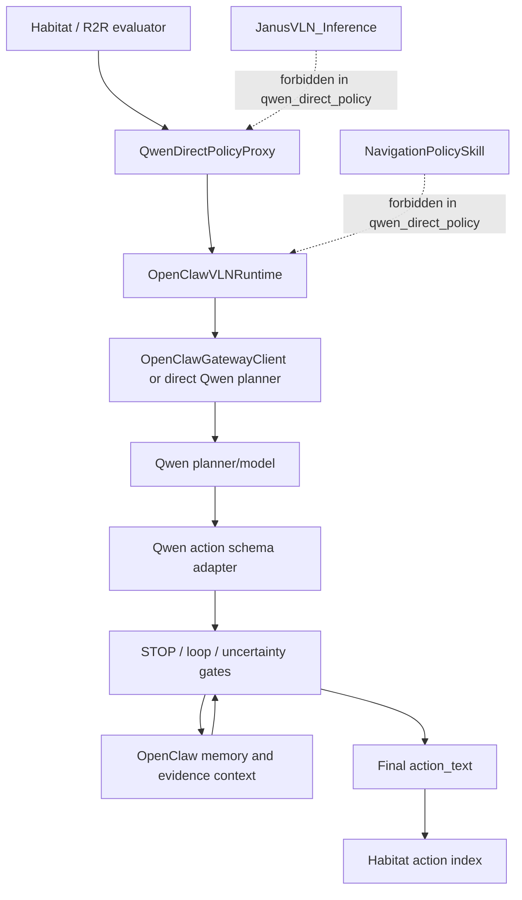
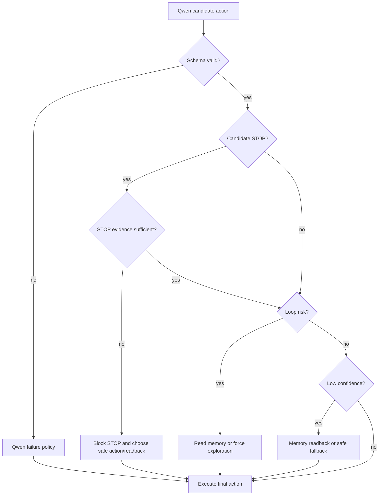

# feat: Add qwen_direct_policy no-Janus evaluation mode

## Goal Capsule

| Field | Value |
|---|---|
| Objective | Add a true no-Janus `qwen_direct_policy` evaluation path where Qwen is the only action-producing policy backbone, and OpenClaw supplies memory, evidence checks, STOP/loop control, and traceability. |
| Primary claim | Inference does not load or call JanusVLN policy; Qwen produces candidate actions; OpenClaw gates and records final action selection. |
| Authority hierarchy | Habitat/R2R evaluator owns episode iteration; `QwenDirectPolicyProxy` owns evaluator compatibility; `OpenClawVLNRuntime` owns memory/control gates; Qwen planner/model owns candidate action JSON; Habitat adapter owns action-index conversion. |
| Execution profile | Staged implementation, starting with no-Janus smoke and strict failure handling before memory/control improvements or training. |
| Stop conditions | Stop implementation if the smoke trace cannot prove Janus was not constructed, `NavigationPolicySkill` was not called, and every final action has a Qwen/control source. |
| Tail ownership | Evaluation artifacts and comparison scripts must prove fixed-set results; training/distillation remains follow-up unless zero-shot Qwen underperforms Janus by more than the agreed threshold. |

---

## Product Contract

### Summary

This plan adds a new `qwen_direct_policy` mode to ClawNav evaluation.
Unlike the current OpenClaw hybrid path, this mode must not construct `JanusVLN_Inference`, must not register or call Janus-backed `NavigationPolicySkill`, and must not treat `planner_action_override` as the proof of no-Janus execution.

The desired runtime path is:

```text
Habitat/R2R eval loop
  -> QwenDirectPolicyProxy
  -> OpenClawVLNRuntime
  -> OpenClawGatewayClient / direct Qwen planner adapter
  -> Qwen action JSON
  -> OpenClaw memory/control gates
  -> final Habitat action
```

### Problem Frame

The current `src/evaluation_harness.py` path imports and constructs `JanusVLN_Inference` in `main()` and passes it into `evaluate_harness()`.
`build_harness_components()` then registers `NavigationPolicySkill` when a model is present, and `src/harness/openclaw/runtime.py` falls back to calling `NavigationPolicySkill` whenever planner action override is absent or disabled.
That means the existing OpenClaw/Qwen fast path is a hybrid Janus policy path, not a no-Janus policy.

Prior shared-100 analysis showed the hybrid path underperformed the Janus baseline on SR/SPL while increasing near-miss STOP failures.
The next experiment therefore needs a clean architectural claim first: no Janus policy in inference, Qwen as the action-producing backbone, and OpenClaw as the memory/control layer.

### Actors

- A1. Researcher: runs fixed R2R subsets and needs artifact-backed claims.
- A2. Implementation agent: adds the mode without regressing existing Janus/hybrid paths.
- A3. Evaluator runtime: consumes a model-like proxy with `start_episode()` and `call_model()` hooks.
- A4. Qwen planner/model: returns strict structured candidate action JSON.
- A5. OpenClaw control layer: gates STOP, loop recovery, uncertainty handling, memory readback, and trace emission.
- A6. Experiment operator: configures external Qwen credentials, artifact retention, and run-level redaction policy.

### Requirements

- R1. `qwen_direct_policy` mode must not import, construct, or call `JanusVLN_Inference` during inference.
- R2. `qwen_direct_policy` mode must not register or call Janus-backed `NavigationPolicySkill`.
- R3. The evaluator must still use the existing Habitat/R2R evaluation loop and metrics aggregation.
- R4. Qwen must be the only action-producing model backbone in this mode.
- R5. Qwen output must be strict structured JSON with `action_text`, `confidence`, `visual_summary`, `progress_state`, `stop_evidence`, and `reason`, either directly or through an adapter that converts the shape into an `OpenClawPlanDecision`.
- R6. Invalid JSON, unsupported actions, low confidence, timeout, token guard trips, and gateway failures must not fallback to Janus; they must become explicit Qwen failure rows with a controller-safe final action.
- R7. STOP must pass an OpenClaw control gate before execution, based on `stop_evidence`, current visual evidence, and non-oracle state.
- R8. Loop and uncertainty gates must be able to trigger memory readback or a safe exploration action before final action selection.
- R9. Memory must be used as structured control/evidence context, not just long natural-language prompt injection.
- R10. Trace rows must prove policy backend, provider-neutral Qwen candidate status, provider-specific call status, failure reason, gate decisions, memory/readback influence, final action source, and whether Habitat stepped.
- R11. Evaluation must start from fixed episode sets, such as 1-episode smoke, targeted 7/20, then shared-100; episode selection must be declared before results are known.
- R12. Shared-set result reports must include `both_success`, `qwen_only`, `janus_only`, and `both_fail`, not only aggregate SR/SPL/OS.
- R13. Direct Qwen mode must define the external-model data boundary: credentials stay out of traces, raw provider prompts/images are not logged by default, memory/keyframe payloads are minimized, and runbooks document retention, redaction, and share-safe artifact settings.

### Acceptance Examples

- AE1. Given `--policy_backend qwen_direct`, when `main()` starts, then the trace and smoke artifacts show `janus_loaded=false`, `policy_backend=qwen_direct`, `direct_policy=true`, and no `NavigationPolicySkill` tool call.
- AE2. Given Qwen returns a valid `MOVE_FORWARD` action with sufficient confidence, when STOP/loop/uncertainty gates pass, then the final Habitat action is `MOVE_FORWARD` and the trace records `final_action_source=qwen`.
- AE3. Given Qwen returns malformed JSON, when the direct policy adapter parses the response, then the final action is a controller-safe fallback and the trace records `qwen_failure=true` with no Janus fallback.
- AE4. Given Qwen returns `STOP` with `stop_evidence=none`, when the STOP gate runs, then STOP is blocked and the trace records the replacement action and gate reason.
- AE5. Given a fixed shared-100 run completes, when the comparison script runs against Janus baseline artifacts, then it reports aligned `(scene_id, episode_id)` counts and the four overlap buckets.
- AE6. Given direct mode uses an external Qwen provider, when traces and summaries are written, then API keys, raw provider request bodies, raw provider images, and full prompts are absent unless an explicit debug-retention flag is enabled.
  Local raw image artifacts may still be saved for debugging, but they must be excluded from the default share-safe artifact set unless separately redacted.

### Scope Boundaries

In scope:

- Add a new `qwen_direct_policy` backend and keep existing Janus/hybrid behavior available.
- Reuse existing OpenClaw gateway/Qwen planner infrastructure where it fits.
- Add strict direct-policy schema adaptation, failure handling, control gates, and trace fields.
- Add smoke and unit tests that prove the mode cannot silently call Janus.
- Add fixed-set evaluation and comparison documentation/scripts needed to make claims auditable.

Deferred to follow-up work:

- Qwen action SFT or preference tuning from Janus trajectories and STOP-risk corrections.
- Larger memory-bank redesign beyond the control/evidence hooks needed by direct policy.
- Real robot executor work; this plan targets Habitat/R2R evaluation first.
- Publication-quality result tables beyond the fixed-set comparison artifacts.

Out of scope:

- Modifying JanusVLN model internals.
- Using oracle metrics, future observations, shortest-path actions, success labels, or distance-to-goal for online decisions.
- Cherry-picking episodes after a run.
- Claiming method improvement from readback activity alone without action/value evidence.

---

## Planning Contract

### Key Technical Decisions

- KTD1. Add `--policy_backend` instead of overloading `--openclaw_allow_planner_action_override`.
  `planner_action_override` is an existing runtime behavior; it can skip `NavigationPolicySkill` only when the planner already produced an action.
  It does not prove that the evaluator avoided Janus construction.

- KTD2. Create a no-base-model `QwenDirectPolicyProxy`.
  The current `HarnessModelProxy` delegates unknown attributes and `consume_last_visual_prune_profile()` to a base Janus model.
  Direct mode needs a lightweight proxy that satisfies the evaluator hooks without depending on a Janus object.

- KTD3. Keep the Qwen direct action schema explicit, then adapt it to runtime contracts.
  Existing OpenClaw runtime expects an `OpenClawPlanDecision` and action under `decision.arguments.action_text`.
  The user-facing direct schema can remain concise, but the adapter must map it deterministically into the runtime decision shape.

- KTD4. Treat Qwen failure as a first-class direct-policy outcome.
  Direct mode must not use heuristic fallback paths that lead back to `NavigationPolicySkill`.
  Failures become traceable controller decisions: blocked STOP, safe exploration action, or STOP only when no safer action exists.

- KTD4a. Define a bounded controller-safe fallback ladder.
  Direct mode should not let each call site invent fallback behavior.
  Hard Qwen/system failures default to STOP because no trustworthy action exists.
  Blocked STOP, loop, and uncertainty cases can choose memory readback or a deterministic exploration action, but they must record why that action is safer than executing the candidate action.

- KTD4b. Own direct-mode tool mapping and prompt defaults end to end.
  Existing OpenClaw gateway code maps `act` to `NavigationPolicySkill` and prompt text teaches the model that mapping.
  Direct mode must override prompt text, default tool-name mapping, normalization defaults, and model fallback behavior together so `NavigationPolicySkill` cannot re-enter through an implicit fallback path.

- KTD5. Gate final actions before executor conversion.
  STOP, loop, and uncertainty gates must run before `executor.command_for_action(...)`.
  A gate applied only after `planner_action_override` metadata is recorded is too late to change behavior.

- KTD6. Record proof fields from M1, before memory/control improvements.
  Trace fields must be available in the first smoke run so later results can prove the same execution contract.

- KTD7. Preserve fixed-set evaluation discipline.
  The mode can be explored on 1/7/20 episodes first, but shared-100 claims require predeclared keys and aligned comparison against Janus.

- KTD8. Keep external-model safety visible but separate from model quality.
  Data minimization, credential handling, and trace redaction are not navigation metrics, but they are part of the reproducibility and safety contract for any direct Qwen run.

### High-Level Technical Design



Direct-mode action contract:

```json
{
  "action_text": "MOVE_FORWARD",
  "confidence": 0.8,
  "visual_summary": "short current-view evidence",
  "progress_state": "following_instruction",
  "stop_evidence": "none",
  "reason": "short"
}
```

Runtime-adapted decision shape:

```json
{
  "intent": "act",
  "tool_name": "QwenDirectPolicy",
  "arguments": {
    "action_text": "MOVE_FORWARD",
    "confidence": 0.8,
    "visual_summary": "short current-view evidence",
    "progress_state": "following_instruction",
    "stop_evidence": "none"
  },
  "reason": "short",
  "runtime_metadata": {
    "context_audit": {
      "planner_authority": "qwen",
      "qwen_candidate_requested": true,
      "qwen_model_called": true,
      "qwen_provider": "qwen_api",
      "qwen_api_called": true,
      "policy_backend": "qwen_direct"
    }
  }
}
```

Gate order:



Controller-safe fallback ladder:

| Case | First response | Final fallback when unresolved | Required trace fields |
|---|---|---|---|
| Invalid JSON, unsupported action, timeout, token guard, gateway failure | Mark `qwen_failure=true`; do not call heuristic planner | `STOP` with `final_action_source=qwen_failure_stop` | `qwen_failure_reason`, `candidate_action=null`, `fallback_policy=hard_failure_stop` |
| Low confidence with valid action | Trigger one bounded memory/readback pass when budget allows | Use the reread action only if it is valid and passes gates; otherwise use `TURN_LEFT` unless the previous two executed actions were `TURN_LEFT`, in which case use `TURN_RIGHT`; if action conversion fails, use `STOP` | `uncertainty_gate_decision`, `memory_readback_used`, `readback_budget_used`, `fallback_policy=uncertainty_readback_action|uncertainty_turn|fallback_stop_no_safe_action` |
| `STOP` with insufficient evidence | Block STOP and check current-view/memory evidence | Use `TURN_LEFT` unless the previous two executed actions were `TURN_LEFT`, in which case use `TURN_RIGHT`; if loop gate is already active, defer to the loop-break row; if action conversion fails, use `STOP` | `stop_gate_decision=blocked`, `blocked_action=STOP`, `replacement_action`, `fallback_policy=blocked_stop_turn|fallback_stop_no_safe_action` |
| Repeated turns, oscillation, or no progress | Trigger loop gate and prefer memory/readback if available | For three repeated same-direction turns, choose the opposite turn once; for left/right oscillation, use `MOVE_FORWARD` only when non-oracle collision/traversability state says forward is available, otherwise choose the opposite of the last turn; if action conversion fails, use `STOP` | `loop_gate_decision`, `loop_pattern`, `replacement_action`, `fallback_policy=loop_break_turn|loop_break_forward|fallback_stop_no_safe_action` |
| Memory/readback unavailable | Skip readback and keep failure explicit | Follow the corresponding hard-failure or gate fallback above | `memory_readback_skipped_reason` |

### Assumptions

- The existing evaluator can work with a model-like proxy as long as `call_model(images, task, step_id)` returns a one-element action list and episode hooks remain available.
- Existing OpenClaw gateway/Qwen model mode is reusable, but its fallback policy must be made direct-mode aware.
- A conservative controller-safe fallback is acceptable for smoke and early targeted runs, as long as trace clearly marks it as Qwen/control failure rather than policy success.
- Prior shared-100 Janus and hybrid metrics are useful reference points, but current claims must refresh from live artifacts before publication or final reporting.

### Risks & Dependencies

| Risk | Impact | Mitigation |
|---|---|---|
| Direct Qwen zero-shot policy is much weaker than Janus | Low SR/SPL could make the no-Janus claim scientifically weak | Keep M6 distillation as a separate follow-up; do not mask weak zero-shot results with cherry-picking. |
| Existing fallback paths silently route to `NavigationPolicySkill` | Invalidates the core no-Janus claim | Add tests and trace gates that fail if direct mode registers or calls `NavigationPolicySkill`. |
| Existing gateway prompt/default tool map still says `act -> NavigationPolicySkill` | Direct mode may accidentally re-enter the Janus policy skill even after schema work | Add direct-mode prompt/default mapping tests and direct-mode fallback tests that inspect normalized decisions. |
| STOP gate over-blocks true successes | May reduce SR even when Qwen reaches the goal | Record blocked STOP evidence and compare STOP-risk episodes before broad rollout. |
| Qwen latency makes shared-100 expensive | Slow iteration and timeouts | Keep 1/7/20 staged runs; use image gating/text-only modes only when they preserve `planner_authority=qwen`. |
| Memory text becomes prompt injection again | Weakens OpenClaw contribution | Store memory as structured control/evidence fields and prove when it changes final action. |
| External Qwen calls leak sensitive run data into traces or provider logs | Makes artifacts harder to share and weakens experimental hygiene | Minimize provider payloads, redact credentials and raw provider prompt/image data by default, and document debug-retention flags separately. |

---

## Implementation Units

### U1. Add policy backend selection and no-Janus main path

- **Goal:** Add `--policy_backend janus_policy|qwen_direct` and branch `main()` so `qwen_direct` does not import or construct `JanusVLN_Inference`.
- **Requirements:** R1, R2, R3.
- **Dependencies:** None.
- **Files:**
  - `src/evaluation_harness.py`
  - `tests/test_evaluation_harness_imports.py`
  - `tests/test_evaluation_harness_openclaw_runtime.py`
- **Approach:** Make `--model_path` conditionally required for Janus mode only.
  For `qwen_direct`, initialize distributed evaluation and evaluator globals without constructing a Janus model.
  Pass `model=None` into component construction, and make direct-mode component setup reject any path that would require `NavigationPolicySkill`.
- **Patterns to follow:** Existing delayed heavy imports in `main()` and existing `build_harness_components(..., model=None)` behavior.
- **Test scenarios:**
  - With `policy_backend=janus_policy`, `main()` still requires `model_path` and constructs the existing Janus-backed proxy.
  - With `policy_backend=qwen_direct`, the import hook or monkeypatch confirms `JanusVLN_Inference` is not imported or constructed.
  - Component construction in direct mode leaves `NavigationPolicySkill` absent from the registry.
- **Verification:** Unit tests prove backend branching and no-Janus registry state without requiring GPU model loading.

### U2. Add QwenDirectPolicyProxy evaluator adapter

- **Goal:** Provide evaluator-compatible hooks for direct mode without delegating to a base Janus model.
- **Requirements:** R1, R3, R4, R10.
- **Dependencies:** U1.
- **Files:**
  - `src/evaluation_harness.py`
  - `tests/test_evaluation_harness_openclaw_runtime.py`
- **Approach:** Add a proxy with `start_episode()`, `call_model()`, working-memory updates, image artifact saving, and trace logging equivalent to `HarnessModelProxy`, but without `__getattr__` delegation to a base model.
  The proxy should require `openclaw_runtime` and should fail fast if runtime is absent.
  If evaluator code expects model-adjacent methods such as `consume_last_visual_prune_profile()`, direct proxy should provide explicit inert implementations rather than delegating to a Janus object.
  Local keyframe/current-frame artifacts should be marked as local debug artifacts and excluded from the share-safe artifact set unless redacted packaging explicitly includes them.
- **Patterns to follow:** Existing `HarnessModelProxy._runtime_payload()`, keyframe/current-frame artifact layout, and `HarnessLogger.log_step(...)`.
- **Test scenarios:**
  - `QwenDirectPolicyProxy.call_model()` returns `[action_text]` from runtime result.
  - `start_episode()` resets last action and keyframe paths between episodes.
  - Direct proxy emits `policy_backend=qwen_direct`, `direct_policy=true`, and `janus_loaded=false` in trace metadata.
  - Direct proxy fails clearly if constructed without an OpenClaw runtime.
  - Evaluator-level smoke test proves direct proxy has no Janus `.model` dependency and returns an empty or inert visual-prune profile when that hook is requested.
- **Verification:** Proxy tests exercise the evaluator-facing contract with fake frames and fake runtime responses.

### U3. Define strict Qwen direct action schema and failure policy

- **Goal:** Normalize Qwen output into a runtime decision while making malformed or unsafe output explicit and non-Janus.
- **Requirements:** R4, R5, R6, R10, R13.
- **Dependencies:** U1, U2.
- **Files:**
  - `src/harness/openclaw/openclaw_cli_plan_gateway.py`
  - `src/harness/openclaw/gateway.py`
  - `tests/test_openclaw_cli_plan_gateway.py`
  - `tests/test_openclaw_gateway_contract.py`
- **Approach:** Add direct-policy schema normalization that accepts the concise direct JSON and produces `intent=act`, `tool_name=QwenDirectPolicy`, and `arguments.action_text`.
  Add direct-mode fallback behavior that returns a failure decision with `qwen_failure=true`, `qwen_failure_reason`, and a controller-safe action instead of heuristic fallback to `NavigationPolicySkill`.
  Add a direct-mode gateway prompt/default tool map so `act` defaults to `QwenDirectPolicy`, not `NavigationPolicySkill`.
  Disable or branch `_model_fallback_decision()` and heuristic fallback in direct mode so parse failures, provider failures, and token-guard failures produce explicit direct-policy failure decisions.
  Apply the controller-safe fallback ladder above before returning a normalized decision.
  Emit provider-neutral fields (`qwen_candidate_requested`, `qwen_model_called`, `qwen_provider`) separately from provider-specific `qwen_api_called`.
  Keep existing model/hybrid behavior unchanged outside direct mode.
- **Patterns to follow:** Existing `_extract_json_object()`, `_normalize_action_text()`, `_normalize_decision()`, and `context_audit` metadata handling.
- **Test scenarios:**
  - Valid direct JSON with `TURN_LEFT` normalizes to a direct policy decision.
  - Lowercase or aliased actions normalize only when they map to supported Habitat actions.
  - Missing `action_text`, invalid JSON, timeout, token guard, or unsupported action produces a Qwen failure decision and does not set `tool_name=NavigationPolicySkill`.
  - Direct-mode prompt text and default `act` mapping name `QwenDirectPolicy`, while non-direct prompt text still names `NavigationPolicySkill`.
  - Direct-mode model fallback does not call `_heuristic_plan()` or return `NavigationPolicySkill`.
  - Direct-mode traces set `qwen_candidate_requested=true`; `qwen_api_called=true` is required only when `qwen_provider=qwen_api`.
  - Existing non-direct gateway tests continue to use `NavigationPolicySkill` where expected.
- **Verification:** Contract tests cover valid, invalid, and fallback cases and prove direct mode never emits a Janus policy tool call.

### U4. Add pre-executor STOP, loop, and uncertainty gates

- **Goal:** Control high-risk direct Qwen actions before they become Habitat commands.
- **Requirements:** R6, R7, R8, R10.
- **Dependencies:** U3.
- **Files:**
  - `src/harness/openclaw/runtime.py`
  - `src/harness/openclaw/control_gates.py`
  - `tests/test_openclaw_runtime_bridge.py`
  - `tests/test_qwen_direct_control_gates.py`
- **Approach:** Add a small direct-mode gate layer between planned action extraction and `executor.command_for_action(...)`.
  Gate results should include `candidate_action`, `final_action`, `gate_decision`, `gate_reason`, and `gate_source`.
  STOP gate requires acceptable `stop_evidence` plus current evidence.
  Loop gate detects repeated turns, oscillation, or no-progress patterns from recent action history.
  Uncertainty gate triggers when confidence is below threshold or evidence is missing.
  The gate layer owns the fallback ladder for blocked STOP, loop recovery, and uncertainty so runtime behavior remains deterministic and testable.
- **Patterns to follow:** Existing runtime metadata construction and existing `WorkingMemory` action history.
- **Test scenarios:**
  - `STOP` with `stop_evidence=none` is blocked before executor conversion.
  - `STOP` with allowed evidence passes when current evidence is present.
  - Repeated turn loop triggers a recovery action or memory readback request.
  - Low-confidence action records uncertainty handling and final action source.
  - Hard Qwen failures produce the configured hard-failure fallback and never enter STOP/loop gates as if they were normal model actions.
  - Fallback ladder rows produce stable `fallback_policy` values in trace metadata.
  - Non-direct Janus/hybrid mode is unaffected.
- **Verification:** Runtime tests assert executor command uses the gated final action, not the ungated candidate.

### U5. Promote memory/readback to structured control and evidence context

- **Goal:** Make OpenClaw memory/control a measurable contribution in direct mode without reducing it to prompt stuffing.
- **Requirements:** R8, R9, R10, R13.
- **Dependencies:** U4.
- **Files:**
  - `src/harness/memory/context_engine.py`
  - `src/harness/openclaw/runtime.py`
  - `src/harness/openclaw/openclaw_cli_plan_gateway.py`
  - `tests/test_context_engine.py`
  - `tests/test_openclaw_runtime_bridge.py`
- **Approach:** Separate direct-mode memory into `policy_input`, `control_context`, and `evidence_context`.
  Qwen receives compact current-view and Top-K memory cues.
  Gates receive structured evidence such as retrieved keyframe IDs, route-conflict hints, and STOP-risk markers.
  Trace records whether memory/readback changed candidate action, blocked action, or final action.
  The direct-mode Qwen payload should carry minimized keyframe references and structured cue summaries by default, not raw full-history memory dumps.
- **Patterns to follow:** Existing context engine `task_state`, `recent_step_summary`, `retrieved_memory_ids`, and runtime `recall_usage` metadata.
- **Test scenarios:**
  - Retrieved memory IDs are included in direct-mode planner context without exposing oracle fields.
  - Direct-mode Qwen payload includes only minimized memory/keyframe cues unless explicit debug retention is enabled.
  - Memory readback triggered by uncertainty records `memory_readback_used=true`.
  - A gate decision influenced by memory records candidate/final action difference.
  - Empty memory behaves deterministically and does not fabricate evidence.
- **Verification:** Tests prove memory fields are structured and traceable, and no raw oracle keys enter runtime decisions.

### U6. Add direct-policy trace and summary proof fields

- **Goal:** Make each run auditable for no-Janus execution, Qwen authority, control effects, and failure modes.
- **Requirements:** R1, R2, R4, R6, R10, R13.
- **Dependencies:** U2, U3, U4, U5.
- **Files:**
  - `src/harness/logging/harness_logger.py`
  - `scripts/run_memory_guided_fast_large_eval.py`
  - `tests/test_harness_logger.py`
  - `tests/test_memory_guided_fast_large_eval.py`
- **Approach:** Extend trace metadata and summary extraction with direct-policy counters:
  `policy_backend`, `direct_policy`, `janus_loaded`, `navigation_policy_skill_called`, `planner_authority`, `qwen_candidate_requested`, `qwen_model_called`, `qwen_provider`, `qwen_api_called`, `qwen_failure`, `qwen_failure_reason`, `candidate_action`, `final_action`, `final_action_source`, `fallback_policy`, `stop_gate_decision`, `loop_gate_decision`, `uncertainty_gate_decision`, `memory_readback_used`, `habitat_action_id`, `redaction_enabled`, `provider_payload_logged`, `provider_images_sent`, `image_artifacts_saved`, and `share_safe_artifact_set`.
  Keep `provider_payload_logged=false` by default; if debug payload retention is explicitly enabled, traces must mark that mode so artifacts are not mistaken for share-safe outputs.
  `qwen_api_called` remains provider-specific; smoke and comparison checks should use `qwen_candidate_requested`, `qwen_model_called`, and `qwen_provider` for backend-neutral proof.
- **Patterns to follow:** Existing `context_audit`, `planner_step_mode`, `qwen_api_called`, and fast-mode summary counters.
- **Test scenarios:**
  - A direct-mode successful action increments Qwen-authority counters.
  - A direct-mode Qwen failure increments failure counters and does not count as Janus fallback.
  - Trace summarization detects any `NavigationPolicySkill` tool call as invalid for direct mode.
  - Trace redaction tests prove API keys, raw provider request bodies, raw provider image payloads, and full prompts are absent by default.
  - Summary tests distinguish local image artifacts from provider payloads and mark whether the result bundle is share-safe.
  - Existing hybrid summaries remain backward compatible when direct fields are absent.
- **Verification:** Summary tests lock the exact counters used by smoke and shared-set validation.

### U7. Add launch/runbook support for staged evaluation

- **Goal:** Provide reproducible smoke, targeted, and shared-set runs for the new mode.
- **Requirements:** R11, R13.
- **Dependencies:** U1, U2, U6.
- **Files:**
  - `scripts/start_openclaw_cli_plan_gateway.sh`
  - `scripts/evaluation_openclaw_gateway.sh`
  - `scripts/evaluation_openclaw_gateway_val_unseen_full.sh`
  - `docs/runbooks/openclaw-qwen-direct-policy-eval.md`
  - `tests/test_evaluation_scripts.py`
- **Approach:** Add pass-through environment variables and documented launcher settings for `POLICY_BACKEND=qwen_direct`, direct model provider, direct failure policy, and gate thresholds.
  Document where Qwen credentials come from, which provider payloads are sent, which artifacts are retained, and how to enable or disable debug payload logging.
  Document that default share-safe artifact bundles exclude local raw keyframe/current-frame directories unless an explicit redaction/export step includes sanitized copies.
  Preserve existing Janus/hybrid launcher defaults.
  Document the smoke checks before allowing 7/20/shared-100 runs.
- **Patterns to follow:** Existing OpenClaw gateway runbooks and launcher env pass-through style.
- **Test scenarios:**
  - Launcher test verifies direct policy backend is passed to `src/evaluation_harness.py`.
  - Existing launcher behavior remains unchanged when direct mode env is unset.
  - Runbook names the required smoke trace proof fields.
  - Runbook marks default artifacts as share-safe only when `redaction_enabled=true` and `provider_payload_logged=false`.
  - Runbook distinguishes full local debug outputs from share-safe exported outputs.
- **Verification:** Shell syntax and script tests pass; runbook includes fixed-set discipline and direct-mode artifact checks.

### U8. Add fixed-set comparison and failure-bucket reporting

- **Goal:** Compare direct Qwen policy against Janus and hybrid baselines without cherry-picking.
- **Requirements:** R11, R12.
- **Dependencies:** U6, U7.
- **Files:**
  - `scripts/compare_qwen_direct_policy_results.py`
  - `tests/test_compare_qwen_direct_policy_results.py`
  - `docs/runbooks/openclaw-qwen-direct-policy-eval.md`
- **Approach:** Parse JSONL result files line-by-line, filter real episode rows, align by `(scene_id, episode_id)`, and report aggregate metrics plus overlap buckets.
  Keep missing and duplicate keys explicit.
  Include direct-mode trace validation in the comparison preflight when trace paths are provided.
- **Patterns to follow:** Existing shared-key comparison discipline from prior result analysis and JSONL parsing patterns in evaluation scripts.
- **Test scenarios:**
  - Shared keys are aligned exactly and non-episode footer rows are ignored.
  - Duplicate keys are reported rather than silently averaged.
  - `both_success`, `qwen_only`, `janus_only`, and `both_fail` counts are correct.
  - Direct-mode trace preflight fails if Janus fields or `NavigationPolicySkill` calls appear.
- **Verification:** Comparison tests use fixture JSONL files with footer rows, missing keys, duplicates, and mixed success outcomes.

---

## Verification Contract

| Gate | Applies to | Expected proof |
|---|---|---|
| Import/compile gate | U1-U8 | Python files touched by the plan compile successfully. |
| Unit test gate | U1-U8 | Targeted tests for evaluation harness, gateway schema, runtime gates, logger summaries, launchers, and comparison script pass. |
| 1-episode smoke | U1-U7 | Artifacts prove `janus_loaded=false`, `navigation_policy_skill_called=false`, `planner_authority=qwen`, `qwen_candidate_requested=true`, `qwen_model_called=true` or explicit Qwen failure, `direct_policy=true`, and no Janus fallback. When `qwen_provider=qwen_api`, artifacts must also prove `qwen_api_called=true`. |
| Targeted 7/20 run | U4-U8 | STOP-risk and loop-risk episodes show gate decisions, memory/readback influence, and final action source in trace. |
| Shared-100 run | U8 | Fixed-key comparison reports SR/SPL/OS plus overlap buckets against Janus baseline. |
| Oracle-safety gate | U3-U6 | Trace and tests prove oracle fields are stripped from planner/control inputs. |
| External-model safety gate | U3, U5, U6, U7 | Tests and runbook prove credentials, raw provider prompts, raw provider request bodies, raw provider image payloads, and raw full-history memory are redacted from default shareable artifacts; local raw image debug artifacts are either excluded from share-safe bundles or explicitly redacted. |

Minimum test set to update or add:

- `tests/test_evaluation_harness_imports.py`
- `tests/test_evaluation_harness_openclaw_runtime.py`
- `tests/test_openclaw_cli_plan_gateway.py`
- `tests/test_openclaw_gateway_contract.py`
- `tests/test_openclaw_runtime_bridge.py`
- `tests/test_qwen_direct_control_gates.py`
- `tests/test_harness_logger.py`
- `tests/test_memory_guided_fast_large_eval.py`
- `tests/test_evaluation_scripts.py`
- `tests/test_compare_qwen_direct_policy_results.py`

---

## Definition of Done

- `qwen_direct_policy` mode exists and can be selected without changing existing Janus/hybrid defaults.
- In direct mode, `JanusVLN_Inference` is not imported or constructed.
- In direct mode, `NavigationPolicySkill` is not registered and cannot be called by runtime fallback.
- In direct mode, gateway prompt text, default tool mapping, normalization, and fallback paths all point to `QwenDirectPolicy` or explicit direct-policy failure, never `NavigationPolicySkill`.
- Qwen direct output is normalized through a strict schema adapter.
- Qwen failures produce explicit trace rows and never fallback to Janus.
- STOP, loop, and uncertainty gates run before final action conversion and follow the documented fallback ladder.
- Trace and summary artifacts expose no-Janus proof fields, provider-neutral Qwen proof fields, and control-effect counters.
- Default share-safe artifacts redact credentials, raw provider prompts, raw provider requests, raw provider image payloads, and raw full-history memory unless debug retention is explicitly enabled; local raw image debug artifacts are not treated as share-safe unless exported through a redaction step.
- A 1-episode smoke run can be validated from artifacts before longer runs.
- The runbook documents the staged evaluation order and fixed-set discipline.
- Shared-set comparison reports aligned metrics and overlap buckets.
- Existing Janus/hybrid tests continue to pass, showing the new mode is additive.

---

## Appendix

### Current Code Anchors

- `src/evaluation_harness.py`: current parser, component construction, `HarnessModelProxy`, `evaluate_harness()`, and Janus-loading `main()` path.
- `src/harness/skills/navigation_policy.py`: current Janus-backed `NavigationPolicySkill`.
- `src/harness/openclaw/runtime.py`: current runtime branch where `planner_action_override` skips policy, otherwise `NavigationPolicySkill` is called.
- `src/harness/openclaw/openclaw_cli_plan_gateway.py`: existing direct Qwen API model mode, context audit fields, model fallback, and `memory_guided_policy_fast` local-policy skip behavior.
- `tests/test_openclaw_cli_plan_gateway.py`: existing `planner_authority`, `qwen_api_called`, and local-policy fast-mode expectations.
- `tests/test_openclaw_runtime_bridge.py`: existing runtime override and guidance behavior.

### Staged Milestones

- M0. Freeze shared-20 or shared-100 episode keys and baseline artifact paths before running experiments.
- M1. Implement no-Janus eval/proxy path.
- M2. Implement strict Qwen schema, adapter, and direct-mode failure policy.
- M3. Implement STOP, loop, and uncertainty gates.
- M4. Add structured memory/control readback effects.
- M5. Run 1-episode smoke, targeted 7/20, then shared-100.
- M6. If zero-shot Qwen is more than 5 SR points below Janus on the fixed shared set, stop prompt-only work and plan distillation separately.
