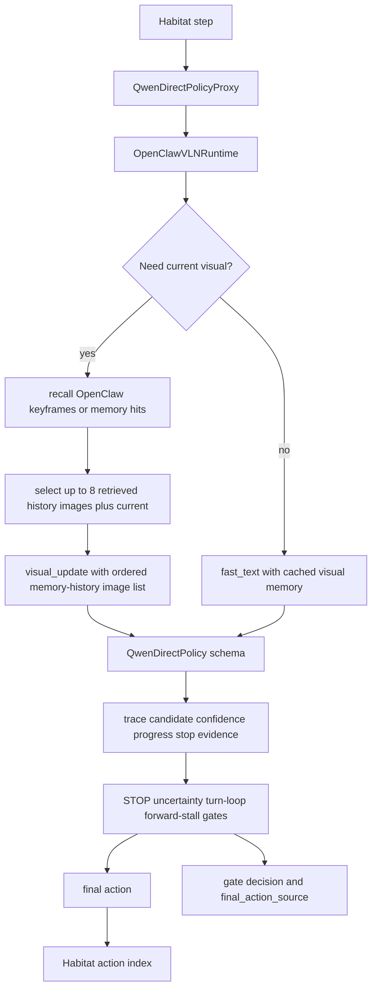
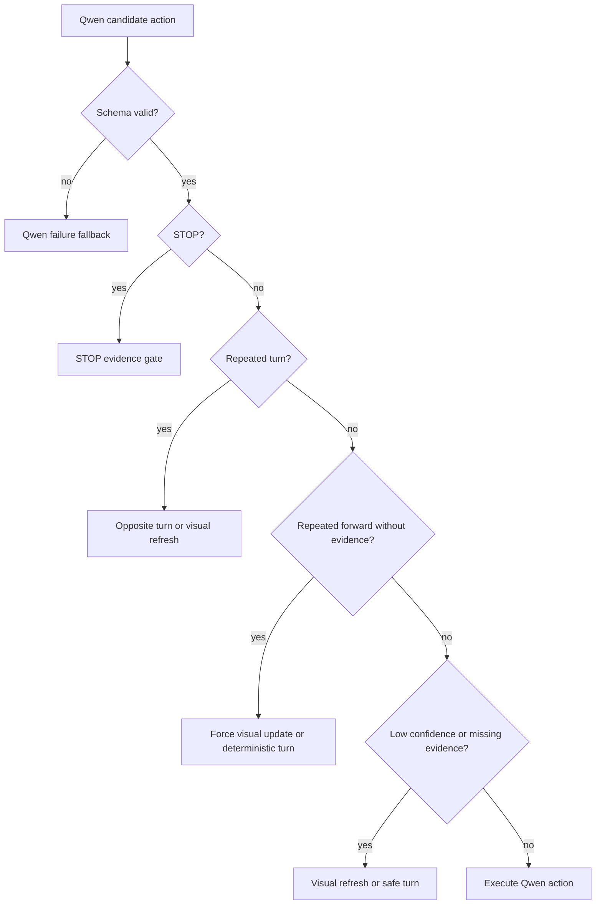

# fix: Stabilize qwen_direct_policy action selection

## Goal Capsule

| Field | Value |
|---|---|
| Objective | Fix the first `qwen_direct_policy` smoke failure where Qwen direct mode only emits `MOVE_FORWARD` and never recovers LEFT/RIGHT/STOP behavior. |
| Primary claim | The no-Janus path is structurally correct, but the current direct policy is not yet a usable navigation policy because visual freshness, prompt constraints, and control gates let repeated forward actions pass unchanged. |
| Evidence baseline | `results/qwen_direct_policy_smoke_20260704_8012_max8` has 1 episode, 9 trace rows, all `MOVE_FORWARD`, `success=0.0`, `spl=0.0`, `os=0.0`, `ne=5.112985610961914`. |
| Authority hierarchy | Habitat owns episode stepping; Qwen owns candidate actions; OpenClaw owns visual-refresh cadence, control gates, trace proof, and final action selection; no Janus fallback is allowed. |
| Execution profile | Start with a same-episode visual-cadence diagnosis, then harden prompt/schema/gates, then rerun fixed diagnostic and targeted sets before any shared-100 claim. |
| Stop conditions | Stop if a fix reintroduces `JanusVLN_Inference`, `NavigationPolicySkill`, oracle metrics, or post-hoc episode selection. |

---

## Product Contract

### Summary

The current `qwen_direct_policy` implementation proves the intended no-Janus execution contract, but the first complete smoke run shows poor control behavior.
Qwen emits `MOVE_FORWARD` for every step, the runtime accepts every candidate, and the episode fails.

This plan fixes the direct-policy control stack so LEFT/RIGHT/STOP can appear when visual evidence, instruction state, or repeated-action history requires them.
The work must preserve the no-Janus proof fields already achieved.

### Problem Frame

The smoke run at `results/qwen_direct_policy_smoke_20260704_8012_max8` shows the architecture is clean:

- `janus_loaded=true` count is `0`.
- `navigation_policy_skill_called=true` count is `0`.
- `planned_tool=NavigationPolicySkill` count is `0`.
- All rows have `policy_backend=qwen_direct`, `planned_tool=QwenDirectPolicy`, and `final_action_source=qwen`.

The same trace shows the behavior problem:

- Step 0 is `visual_update` with one image.
- Steps 1-8 are `fast_text` with `model_image_count=0`.
- The run does not use the intended OpenClaw visual-memory channel as Qwen history input: saved keyframes and recalled memory hits are not attached to Qwen direct as historical images, while the current smoke only sends a single image once.
  In the next diagnostic, history frames should come from OpenClaw-retrieved keyframe or memory-hit image paths, with the current frame appended last.
- Every candidate and final action is `MOVE_FORWARD`.
- No STOP, turn, uncertainty, loop, or forward-stall gate fires.
- The instruction says `Walk across the floor and wait the archway.`, but the policy only executes the walking portion and never proves arrival or waits.

The issue is therefore not missing action definitions.
The issue is that the direct-policy loop lacks the evidence and control pressure needed to choose turns or stop.

### Requirements

**No-Janus preservation**

- R1. The fix must keep `qwen_direct_policy` free of `JanusVLN_Inference` construction and free of `NavigationPolicySkill` registration or calls.
- R2. Every diagnostic and evaluation artifact must keep reporting `policy_backend=qwen_direct`, `direct_policy=true`, `janus_loaded=false`, and `navigation_policy_skill_called=false`.

**Visual and instruction grounding**

- R3. The direct-policy smoke must support a forced-current-visual diagnostic mode where every step uses current visual evidence instead of cached `fast_text`.
- R3a. Direct mode must support OpenClaw-retrieved visual history: pass up to 8 image frames from recalled keyframes or memory hits plus the current frame, with the current frame last and a direct diagnostic max-image budget of at least 9.
- R3b. Trace metadata must label these history frames as OpenClaw-retrieved memory/keyframe evidence, including retrieved memory IDs or keyframe IDs when available, rather than labeling them as chronological episode history.
- R4. The direct Qwen prompt must define action semantics: use `TURN_LEFT` or `TURN_RIGHT` when the route, target, or instruction landmark is not centered in the current view; use `MOVE_FORWARD` only when forward progress is visually justified; use `STOP` only when the current evidence supports the wait/arrival condition.
- R5. The prompt must treat `path clear` as insufficient by itself after repeated forward actions.

**Control and traceability**

- R6. The runtime must add a repeated-forward or no-progress gate that can force a visual refresh or choose a deterministic turn without using oracle metrics.
- R7. Gate metadata must distinguish candidate action, gate decision, replacement action, final action source, and fallback policy.
- R8. Qwen direct schema fields such as `confidence`, `visual_summary`, `progress_state`, `stop_evidence`, and `reason` must be trace-visible enough to explain why gates did or did not fire.
- R9. Memory and visual cache must be structured into policy input and control evidence rather than treated as a generic natural-language permission to keep moving forward.

**Evaluation discipline**

- R10. The same episode `2azQ1b91cZZ:11` must be rerun before targeted 7/20 or shared-100 evaluation.
- R11. Targeted and shared-set runs must use predeclared episode keys and must report action distribution, final action source distribution, gate counts, SR/SPL/OS/NE, and trace preflight validity.

### Acceptance Examples

- AE1. Given direct mode runs with forced current visuals on `2azQ1b91cZZ:11`, when the trace is audited, then rows still prove no-Janus execution and expose whether Qwen can produce LEFT/RIGHT/STOP with fresh images.
- AE1a. Given direct mode runs with OpenClaw-retrieved visual history enabled, when a later step is audited, then Qwen receives up to 8 memory/keyframe history images plus the current image, the current frame is last, and trace fields expose `retrieved_memory_image_count`, `selected_image_count`, and `model_image_count`.
- AE1b. Given OpenClaw resolves historical frame paths from memory hits or saved keyframes, when the trace is audited, then those paths are labeled as `openclaw_retrieved_memory` or equivalent memory/keyframe source and carry memory/keyframe identifiers when available.
- AE2. Given Qwen emits `MOVE_FORWARD` repeatedly without current visual refresh or progress evidence, when the forward-stall gate runs, then the final action is either a forced visual-refresh decision or a deterministic turn and the trace records `forward_stall_gate_decision`.
- AE3. Given Qwen proposes `STOP` with `stop_evidence=none`, when the STOP gate runs, then STOP remains blocked and no Janus fallback occurs.
- AE4. Given the instruction includes `wait the archway`, when current visual evidence supports arrival, then `STOP` may pass only with trace-visible `stop_evidence` and `final_action_source=qwen` or an explicit gate source.
- AE5. Given a targeted fixed set completes, when the summary is inspected, then action distribution is not inferred from success alone; it is reported directly from trace rows.

### Scope Boundaries

In scope:

- Direct-mode visual cadence controls.
- Direct Qwen prompt/action-schema hardening.
- Repeated-forward/no-progress control gate.
- Trace fields for Qwen schema and gate decisions.
- Same-episode and targeted fixed-set diagnostics.

Deferred to follow-up work:

- Training, SFT, or distillation from Janus trajectories.
- Large memory-bank redesign beyond structured control evidence.
- Publication-quality shared-100 result tables.
- Robot executor behavior outside Habitat/R2R.

Out of scope:

- Reintroducing Janus as a fallback.
- Using oracle success, distance-to-goal, shortest-path action, or future observations for online decisions.
- Selecting episodes after seeing results.

---

## Planning Contract

### Key Technical Decisions

- KTD1. Diagnose OpenClaw-retrieved visual history before changing model quality assumptions.
  The first failed smoke has only one image-backed step and eight cached-text steps, and it does not attach OpenClaw-retrieved keyframes or memory hits as Qwen history images.
  The first experiment must rerun the same episode with current visual evidence at every step and an ordered OpenClaw memory-history image list: up to 8 retrieved keyframe or memory-hit images plus the current frame.

- KTD1a. Treat OpenClaw memory-history input as the first diagnostic baseline.
  Janus chronological history parity can remain a later ablation, but this plan should first test the intended OpenClaw path: retrieve saved keyframes or memory hits, attach their image paths to Qwen as history frames, and trace the retrieval source.
  Otherwise a failure cannot distinguish "Qwen direct lacks useful OpenClaw visual memory" from "prompt/control context is wrong."

- KTD2. Keep no-Janus proof as a hard invariant.
  Any recovery path must remain inside Qwen direct plus OpenClaw control gates; `NavigationPolicySkill` is not an allowed safety fallback.

- KTD3. Make direct-mode prompt semantics action-specific.
  The current prompt allows Qwen to reason at the level of "path clear" and repeat forward; it must define when turning and stopping are required.

- KTD4. Add a forward-stall gate rather than relying only on repeated-turn gates.
  The observed failure is not a turn loop; it is a repeated-forward failure, so the control layer needs a separate non-oracle gate.

- KTD5. Record Qwen schema fields in trace rows.
  Without trace-visible `confidence`, `progress_state`, and `stop_evidence`, later failures cannot distinguish model overconfidence from missing evidence or parser loss.

- KTD6. Treat "strict instruction following" as stateful.
  For `Walk across the floor and wait the archway.`, strict execution includes movement, landmark approach, and wait/STOP; repeated forward actions satisfy only the first part.

### High-Level Technical Design

Gate order for direct mode:

### Assumptions

- The same episode `2azQ1b91cZZ:11` is still the first diagnostic target because it already exposed the failure mode.
- `OPENCLAW_MODEL_IMAGE_INTERVAL_STEPS=1` or `OPENCLAW_MODEL_FAST_MODE=off` is not sufficient by itself; the direct diagnostic must also attach OpenClaw-retrieved memory/keyframe images and allow at least 9 images.
- Habitat collision/progress signals may be available through existing non-oracle runtime context; if not, repeated action history is still sufficient for the first forward-stall gate.

### Risks & Dependencies

| Risk | Impact | Mitigation |
|---|---|---|
| Every-step Qwen visual calls are slow and costly | Targeted evaluation becomes expensive | Use it first as diagnosis, then reintroduce fast-text only after gates can detect stale control. |
| OpenClaw memory-history input exceeds the current direct image cap | Retrieved keyframes or memory hits are silently dropped before Qwen sees them | Raise the direct diagnostic image budget to at least 9 and trace retrieved/current image counts. |
| Prompt changes improve one episode but overfit phrasing | Apparent recovery may not generalize | Validate on fixed targeted 7/20 before shared-100. |
| Forward-stall fallback turns at the wrong time | Gate may hurt straight corridors | Gate only after repeated forward actions plus missing fresh evidence, collision/no-progress signal, or unchanged progress state. |
| Trace grows with schema fields | Artifacts become noisy | Store compact fields, not raw prompts or provider payloads. |

---

## Implementation Units

### U1. Add OpenClaw memory-hit visual history diagnostic mode

- **Goal:** Make it easy to rerun `qwen_direct_policy` with OpenClaw-retrieved visual history: current visual evidence at every step, up to 8 recalled keyframe or memory-hit images as history, and the current frame last.
- **Requirements:** R3, R3a, R3b, R10, R11.
- **Dependencies:** None.
- **Files:**
  - Modify: `src/evaluation_harness.py`
  - Modify: `src/harness/openclaw/runtime.py`
  - Modify: `src/harness/openclaw/openclaw_cli_plan_gateway.py`
  - Modify: `src/harness/memory/context_engine.py`
  - Modify: `scripts/start_openclaw_cli_plan_gateway.sh`
  - Modify: `docs/runbooks/openclaw-qwen-direct-policy-eval.md`
  - Test: `tests/test_evaluation_harness_openclaw_runtime.py`
  - Test: `tests/test_openclaw_cli_plan_gateway.py`
  - Test: `tests/test_context_engine.py`
  - Test: `tests/test_evaluation_scripts.py`
- **Approach:** Preserve existing defaults, but add and document a direct diagnostic setting that forces `visual_update` every step and passes OpenClaw-retrieved memory/keyframe image paths to Qwen direct.
  The ordered image list should be retrieved history frames first and the current frame last.
  The history budget is up to 8 retrieved memory/keyframe images; with the current frame, the provider image budget must be at least 9.
  If there are fewer than 8 valid retrieved image paths, use the available hits and trace the shortfall rather than filling from chronological episode frames.
  Janus chronological history parity is not the first diagnostic in this plan; it can be added later as a separate ablation if needed.
- **Execution note:** Start by proving trace-only retrieval and image-order behavior before judging Qwen action quality.
- **Patterns to follow:** Existing launcher environment pass-through style and runbook smoke-proof section.
- **Test scenarios:**
  - A step with 8 retrieved memory/keyframe images plus the current image records `retrieved_memory_image_count=8`, `selected_image_count=9`, `model_image_count=9`, and `current_image_last=true`.
  - Retrieved memory/keyframe image paths are ordered before the current frame and retain `retrieved_memory_ids` or keyframe IDs when available.
  - Missing or unreadable retrieved image paths are excluded from provider attachments and recorded in trace metadata.
  - When no memory hits are available, direct mode falls back to current-image-only visual update and reports `retrieved_memory_image_count=0` instead of silently using chronological episode frames.
  - Launcher documentation names a same-episode visual diagnostic command.
  - Existing launcher defaults remain compatible with current Janus/hybrid runs.
  - Runbook warns that the visual diagnostic is slower and should precede targeted 7/20.
- **Verification:** A same-episode diagnostic run can show `planner_step_mode=visual_update` for every direct-policy step and `model_image_count` matching retrieved memory/keyframe images plus current, up to 9.

### U2. Tighten the direct Qwen action prompt

- **Goal:** Make Qwen choose among `MOVE_FORWARD`, `TURN_LEFT`, `TURN_RIGHT`, and `STOP` according to current-view and instruction state rather than repeating forward on "path clear".
- **Requirements:** R4, R5, R8.
- **Dependencies:** U1.
- **Files:**
  - Modify: `src/harness/openclaw/openclaw_cli_plan_gateway.py`
  - Test: `tests/test_openclaw_cli_plan_gateway.py`
- **Approach:** Update the direct-mode prompt text to define action semantics and require a short evidence-bearing reason.
  The prompt should say that `MOVE_FORWARD` is valid only when the intended route remains centered and unobstructed, `TURN_LEFT/RIGHT` is required when the route or landmark is off-center, and `STOP` requires arrival/wait evidence.
- **Execution note:** Treat this as prompt-contract behavior, not a metric optimization; tests should assert the prompt contains the action-selection constraints.
- **Patterns to follow:** Existing `_direct_model_prompt_from_prompt_payload` branch and prompt tests in `tests/test_openclaw_cli_plan_gateway.py`.
- **Test scenarios:**
  - Direct prompt includes turn-selection rules.
  - Direct prompt states `path clear` alone is not enough after repeated forward actions.
  - Direct prompt keeps `QwenDirectPolicy` as the only action-producing policy.
  - Non-direct prompt remains unchanged.
- **Verification:** Prompt tests pass and direct gateway health still returns `tool_name=QwenDirectPolicy`.

### U3. Trace direct Qwen schema fields

- **Goal:** Preserve the Qwen candidate's confidence, progress state, visual summary, and stop evidence in audit artifacts.
- **Requirements:** R7, R8, R11.
- **Dependencies:** U2.
- **Files:**
  - Modify: `src/harness/openclaw/runtime.py`
  - Modify: `scripts/run_memory_guided_fast_large_eval.py`
  - Test: `tests/test_openclaw_runtime_bridge.py`
  - Test: `tests/test_memory_guided_fast_large_eval.py`
- **Approach:** Copy compact Qwen schema fields from `decision.arguments` into runtime metadata before gates run.
  Summary extraction should count missing confidence, missing stop evidence, final action source, and candidate/final differences for direct rows.
- **Execution note:** Do not log raw provider prompts, request bodies, images, or credentials.
- **Patterns to follow:** Existing `context_audit`, `candidate_action`, `final_action_source`, and direct summary counters.
- **Test scenarios:**
  - A direct action row records `qwen_confidence`, `qwen_progress_state`, `qwen_stop_evidence`, and `qwen_visual_summary_present`.
  - Summary extraction reports direct rows with candidate/final action differences.
  - Missing optional fields are counted without crashing.
  - Raw provider payload fields remain absent.
- **Verification:** Trace rows explain why gates passed or fired without exposing provider payloads.

### U4. Add repeated-forward and no-progress gate

- **Goal:** Stop direct mode from accepting unlimited `MOVE_FORWARD` when action history and evidence show no turn/STOP decision is emerging.
- **Requirements:** R6, R7, R9.
- **Dependencies:** U3.
- **Files:**
  - Modify: `src/harness/openclaw/control_gates.py`
  - Modify: `src/harness/openclaw/runtime.py`
  - Test: `tests/test_qwen_direct_control_gates.py`
  - Test: `tests/test_openclaw_runtime_bridge.py`
- **Approach:** Add a forward-stall gate after turn-loop handling and before uncertainty fallback.
  The first implementation can trigger on repeated `MOVE_FORWARD` count plus missing fresh visual evidence or unchanged progress state.
  The replacement should be deterministic, preferably a forced visual refresh signal if available, otherwise a turn fallback that records `forward_stall_gate_decision`.
- **Execution note:** Add tests before production code because this gate changes behavior.
- **Patterns to follow:** Existing STOP, repeated-turn, low-confidence gate metadata.
- **Test scenarios:**
  - Four or more recent `MOVE_FORWARD` actions with no fresh visual evidence triggers `forward_stall_gate_decision=blocked`.
  - The gate records `blocked_action=MOVE_FORWARD`, `replacement_action`, `fallback_policy`, and `final_action_source=forward_stall_gate`.
  - Fresh visual evidence or explicit progress state can allow forward to pass.
  - Non-direct mode remains unaffected.
- **Verification:** Runtime executor command uses the gated final action, not the repeated forward candidate.

### U5. Add structured visual-refresh and control context

- **Goal:** Make visual cadence and memory evidence part of the direct-mode control contract instead of only prompt text.
- **Requirements:** R6, R9, R11.
- **Dependencies:** U3, U4.
- **Files:**
  - Modify: `src/harness/openclaw/openclaw_cli_plan_gateway.py`
  - Modify: `src/harness/openclaw/runtime.py`
  - Modify: `src/harness/memory/context_engine.py`
  - Test: `tests/test_openclaw_cli_plan_gateway.py`
  - Test: `tests/test_openclaw_runtime_bridge.py`
  - Test: `tests/test_context_engine.py`
- **Approach:** Split direct-mode runtime context into compact `policy_input`, `control_context`, and `evidence_context`.
  Control context should include recent action counts, visual age, whether the current step used an image, and any non-oracle stall indicators.
  The gateway should consider forced visual refresh from control context before choosing `fast_text`.
- **Execution note:** Keep this minimal for direct-policy stabilization; do not redesign the whole memory bank.
- **Patterns to follow:** Existing `planner_step_mode`, `visual_memory_age_steps`, `memory_context_used`, and context-engine decision log fields.
- **Test scenarios:**
  - Direct payload includes recent action counts without oracle fields.
  - A forced visual refresh request produces `planner_step_mode=visual_update`.
  - Empty memory/control context behaves deterministically.
  - Context-engine rows record whether memory/control affected final action.
- **Verification:** Direct trace can explain whether a turn was Qwen-chosen, gate-chosen, or caused by forced visual refresh.

### U6. Add fixed diagnostic report before targeted runs

- **Goal:** Prevent moving to targeted 7/20 or shared-100 until the same-episode diagnostic proves action diversity or an explained gate intervention.
- **Requirements:** R10, R11.
- **Dependencies:** U1, U2, U3, U4, U5.
- **Files:**
  - Modify: `docs/runbooks/openclaw-qwen-direct-policy-eval.md`
  - Modify: `scripts/compare_qwen_direct_policy_results.py`
  - Test: `tests/test_compare_qwen_direct_policy_results.py`
  - Test: `tests/test_evaluation_scripts.py`
- **Approach:** Add a small trace-audit/report step that summarizes action distribution, planner step modes, final action sources, gate counts, Qwen failures, and no-Janus violations.
  This report should be required for `2azQ1b91cZZ:11` before any larger fixed set.
- **Execution note:** Do not treat SR/SPL alone as enough; action/control distributions are the diagnostic target.
- **Patterns to follow:** Existing direct trace preflight in `scripts/compare_qwen_direct_policy_results.py`.
- **Test scenarios:**
  - Audit report flags all-forward runs as behaviorally suspicious even when no-Janus proof passes.
  - Audit report fails on Janus or `NavigationPolicySkill` proof violations.
  - Audit report records gate counts and action diversity.
  - Existing result comparison still reports overlap buckets.
- **Verification:** A same-episode diagnostic artifact can answer whether LEFT/RIGHT/STOP are absent because Qwen never proposed them or because gates replaced them.

---

## Verification Contract

| Gate | Applies to | Expected proof |
|---|---|---|
| Unit test gate | U1-U6 | Focused tests for gateway prompt, control gates, runtime metadata, summary extraction, runbook checks, and comparison audit pass. |
| Compile gate | U1-U5 | Modified Python files compile successfully. |
| Same-episode visual diagnostic | U1-U6 | `2azQ1b91cZZ:11` rerun shows no-Janus proof, action distribution, planner step modes, final action sources, gate counts, retrieved memory/keyframe image count, selected image count, provider image count, retrieval source labels, and current-image-last proof. |
| No-Janus regression gate | U1-U6 | Trace audit reports zero `janus_loaded`, zero `NavigationPolicySkill` calls, zero planned `NavigationPolicySkill`, and all rows `policy_backend=qwen_direct`. |
| Instruction-following gate | U2-U6 | The diagnostic report explains whether the policy approached and waited at the archway, rather than only moving forward. |
| External-model safety gate | U2-U6 | Trace and reports do not include credentials, raw provider prompts, raw provider request bodies, or raw provider image payloads. |

Minimum commands to include in the implementation verification pass:

- `PYTHONPATH=src pytest tests/test_evaluation_harness_openclaw_runtime.py tests/test_openclaw_cli_plan_gateway.py tests/test_qwen_direct_control_gates.py tests/test_openclaw_runtime_bridge.py -q`
- `PYTHONPATH=.:src pytest tests/test_memory_guided_fast_large_eval.py tests/test_compare_qwen_direct_policy_results.py tests/test_evaluation_scripts.py -q`
- `PYTHONPATH=src python -m py_compile src/evaluation_harness.py src/harness/openclaw/openclaw_cli_plan_gateway.py src/harness/openclaw/runtime.py src/harness/openclaw/control_gates.py src/harness/memory/context_engine.py`
- `bash -n scripts/start_openclaw_cli_plan_gateway.sh scripts/evaluation_openclaw_gateway.sh`

---

## Definition of Done

- Direct mode still runs without Janus construction and without `NavigationPolicySkill` calls.
- The same-episode diagnostic can force every-step current visual evidence and prove OpenClaw-retrieved memory/keyframe history input up to 8 history frames plus current.
- Direct prompt text makes LEFT/RIGHT/STOP selection criteria explicit.
- Trace rows expose compact Qwen schema fields needed to explain gate behavior.
- Repeated-forward/no-progress behavior is gated or explicitly reported.
- A diagnostic report flags all-forward behavior before larger fixed-set runs.
- The runbook documents when to use every-step visual mode and when it is safe to return to fast-text.
- Same-episode diagnostic artifacts are available before targeted 7/20 begins.

---

## Appendix

### Smoke Baseline

The first complete smoke run used `results/qwen_direct_policy_smoke_20260704_8012_max8`.
It is a failure-case baseline for this plan, not a quality result.

| Field | Value |
|---|---|
| Episode | `2azQ1b91cZZ:11` |
| Instruction | `Walk across the floor and wait the archway.` |
| Result | `success=0.0`, `spl=0.0`, `os=0.0`, `ne=5.112985610961914` |
| Steps | `9` |
| Actions | `MOVE_FORWARD: 9` |
| Final action sources | `qwen: 9` |
| Planner step modes | `visual_update: 1`, `fast_text: 8` |
| Qwen failures | `0` |
| Janus proof violations | `0` |

### Diagnosis Summary

The run did not fail because LEFT/RIGHT actions are unavailable.
It failed because Qwen was only image-grounded at the first step, then repeated a cached `path clear` interpretation through fast-text steps, and the current gate layer has no repeated-forward/no-progress intervention.
It also did not attach OpenClaw-retrieved keyframe or memory-hit images as visual history for Qwen direct.
Those history frames should be loaded from saved keyframe or memory-hit image artifacts that OpenClaw finds, and for this diagnostic they should be labeled as OpenClaw memory/keyframe evidence.

The first fix should prove or disprove this by rerunning the same episode with OpenClaw-retrieved visual-history images and fresh current visual evidence at every step.
