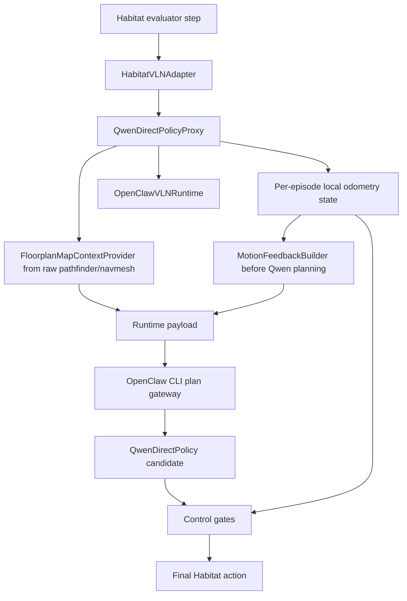
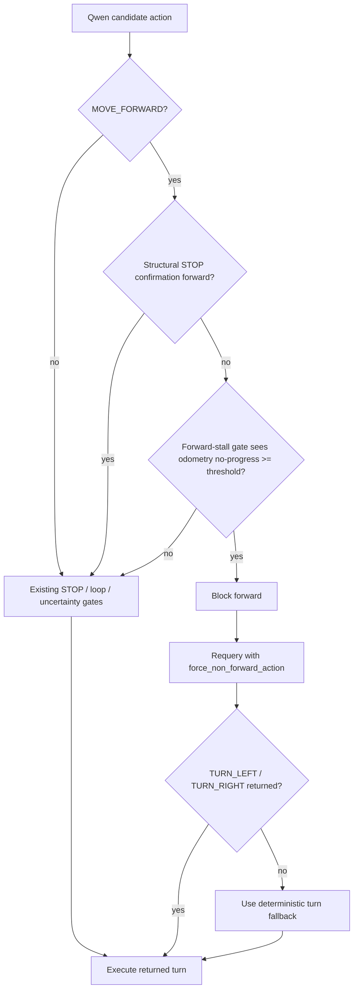

# feat: Add floorplan_map_assisted odometry control

## Goal Capsule

| Field | Value |
|---|---|
| Objective | Add a `floorplan_map_assisted` Qwen-direct navigation mode that gives Qwen a policy-safe goal/path-free privileged floorplan+pose image while local runtime/controller logic uses odometry and collision deltas to control distance, no-progress, and spatial-position failure modes. |
| Primary claim | Qwen receives full floorplan context without target, GT path, shortest path, goal distance, or correct trajectory; local runtime uses measured motion effects to prevent repeated ineffective forward actions. This is a map-assisted privileged-input setting, not a pure RGB or standard no-map result. |
| Authority hierarchy | Habitat owns simulator pose and raw pathfinder/navmesh floorplan source; `QwenDirectPolicyProxy` owns evaluator state injection, per-step odometry context, and periodic map context assembly before Qwen planning; `OpenClawVLNRuntime` owns odometry and local constraints; `OpenClawCliPlanGateway` owns prompt/image packaging and outbound allowlists; Qwen owns candidate actions only after map/motion context is bounded. |
| Execution profile | Continue on the current `feat/qwen-direct-policy` branch; build on the existing odometry/action-calibration work; implement as an additive `floorplan_map_assisted` setting separate from pure RGB baseline. |
| Stop conditions | Stop if the policy map is rendered from a decorated `info["top_down_map"]`, reads episode goals/reference paths/shortest paths, or if the map image contains target markers, shortest-path/reference-path data, goal-distance labels, view-point goal markers, or any other GT/Oracle cue; stop if raw simulator coordinates, local artifact paths, credentials, image bytes/base64, or full provider payloads enter Qwen-visible prompt text or shared traces. |
| Tail ownership | Implementation should land with targeted unit tests, thresholds frozen from a calibration set separate from the proof set, and a fixed EP10/EP11/EP12/EP16 evaluation comparison before broader runs. |

---

## Product Contract

### Summary

The current Qwen-direct stack can now record action effects such as `odometry_last_forward_delta_m`, `odometry_collision`, and `odometry_consecutive_no_progress_forward`.
That gives the local runtime a real motion signal, but Qwen still sees mostly egocentric RGB and cannot reliably infer spatial layout, free space, or whether its previous forward command actually moved the agent.

This plan adds a map-assisted setting that combines:

- A policy-safe full floorplan top-down image with current agent position, heading, and visited trail.
- Optional collision/no-progress overlays only in motion/gate-enabled variants, so the RGB+floorplan ablation stays separable from motion feedback.
- A compact `motion_feedback` object that converts raw odometry into semantic action-effect feedback.
- An odometry-backed extension of the existing forward-stall gate that prevents repeated ineffective forward actions when measured motion says the agent is blocked.

The setting is intentionally named `floorplan_map_assisted`, not pure RGB, because the model receives a scene-level privileged global floorplan prior.

### Problem Frame

The EP11/EP16 action calibration showed that turn actions are stable at about 15 degrees, while forward actions are nominally 0.25 meters but frequently collide or produce no progress in those episodes.
This means the remaining weakness is not that the discrete action scale is unknown; it is that the model/control stack does not reliably convert egocentric images and recent history into spatial-control decisions.

The desired behavior is not goal/path oracle planning.
The model may see the full floorplan and the agent's current pose/trail, so reported results must be labeled as privileged map+pose assisted.
The model must not see the goal, target location, reference path, shortest path, distance-to-goal, or correct future trajectory.
The runtime must keep raw simulator coordinates local and only expose bounded, rounded odometry feedback to Qwen.

### Requirements

- R1. Add a `floorplan_map_assisted` runtime mode that is explicitly separated from pure RGB baseline reporting.
- R2. Generate policy map images from raw pathfinder/navmesh occupancy, not from decorated `info["top_down_map"]` and not from episode goal/reference-path/shortest-path fields, with full navigable floorplan context, current agent position, heading, and visited trail.
- R3. Policy map images must not contain target markers, GT/reference/shortest paths, goal distance, goal labels, view-point goal markers, future/correct trajectory, waypoint predictions, oracle waypoint markers, or reference-path colors.
- R4. Raw `sim_position` and `sim_rotation` may be used locally, but must not be inserted into Qwen prompt payloads.
- R5. Convert odometry into compact `motion_feedback` fields such as `actual_effect`, rounded `last_forward_delta_m`, `collision_recent`, and `recommended_constraint`; exact coordinates and full pose history stay local.
- R6. Attach the floorplan map image to Qwen's visual input on a fixed `map_frame_interval_steps=5` cadence in a stable labeled order without breaking the current-image-last contract, while pinning `map_view` and `current` on map-attach steps and tracing any dropped image candidates by source.
- R7. Extend the existing forward-stall gate with odometry evidence instead of adding a parallel gate; block repeated ineffective `MOVE_FORWARD` based on measured delta/collision, then request a corrective turn action, while preserving STOP-confirmation forward exceptions.
- R8. Trace rows must prove whether map assistance was enabled, which input regime was used, which map image label/hash was attached, whether the map passed policy-safety checks, what motion feedback category was provided, whether the forward-stall gate used odometry evidence, and whether the gate changed the final action.
- R9. Fixed-set evaluation must compare pure RGB Qwen-direct, RGB+motion, RGB+floorplan, and RGB+floorplan+motion+gate settings on the same episode keys before broad claims.
- R10. Existing Janus/hybrid and Qwen-direct pure RGB behavior must remain available and unchanged unless the new flags are enabled.
- R11. Qwen-visible prompt payloads must use an outbound allowlist that excludes local artifact paths, raw pose fields, credentials, request headers, image bytes/base64, and provider request/response bodies.
- R12. Reporting must include `input_regime`, `policy_backend=qwen_direct`, no-Janus proof fields, map source, pose source, image-budget behavior, and goal/path leakage status for every ablation row.

### Acceptance Examples

- AE1. Given `map_assist_mode=floorplan_map_assisted` and `step_id % 5 == 0`, when Qwen is called, then one attached image is labeled `map_view`, the exact map image is saved under the local run directory, and the final attached RGB image remains the current observation.
- AE2. Given a map image is produced, when its metadata is logged, then `map_safety` covers every R3 leakage category and records false for goal, GT path, shortest path, goal distance, goal labels, view-point goal markers, future trajectory, waypoint prediction, oracle waypoint, and reference-path overlays.
- AE3. Given the previous action was `MOVE_FORWARD` and the measured forward delta is `0.02m` with collision, when motion feedback is built, then Qwen receives `actual_effect=blocked`, rounded `last_forward_delta_m=0.02`, and `recommended_constraint=avoid_forward`, not raw simulator coordinates or pose history.
- AE4. Given Qwen outputs `MOVE_FORWARD` after two consecutive no-progress forward actions, when the odometry-backed forward-stall gate runs, then final action is not `MOVE_FORWARD`, and trace records `forward_stall_gate_decision=blocked` plus `forward_stall_evidence_source=odometry`.
- AE5. Given map assistance, motion feedback, and odometry-backed forward-stall gating are all disabled, when the same evaluation path runs, then prompt payloads, image attachments, and trace rows match the current pure RGB behavior except for existing odometry trace metadata.
- AE6. Given `map_context` contains `map_image_path`, when the Qwen prompt is serialized, then the path is used only for image attachment and trace metadata, while Qwen-visible text contains only labels, booleans, counts, and bounded motion feedback.
- AE7. Given `step_id` is not divisible by 5, when map assistance is enabled, then no new `map_view` image is persisted for that step and trace records `map_frame_due=false`.

### Scope Boundaries

In scope:

- Directly implement the `floorplan_map_assisted` setting, per user direction.
- Use full floorplan map context without target/path/goal leakage, reported as privileged map+pose assistance.
- Keep odometry raw values local and expose only compact motion feedback to Qwen.
- Extend the existing forward-stall gate with calibrated odometry no-progress thresholds.
- Evaluate on the fixed scene `2azQ1b91cZZ` episodes already used for Qwen direct diagnosis, after freezing thresholds from separate calibration episodes.

Deferred to follow-up work:

- `explored_map` / fog-of-war-only map mode.
- Treating explored/fog-of-war map as the main non-oracle benchmark comparator.
- True multi-subagent map planner.
- Learned map-based policy or training/distillation.
- Room semantic labels unless they can be generated without oracle labels.
- Complex deterministic escape sweeps beyond blocking repeated no-progress forward.

Out of scope:

- Showing target position, final waypoint, reference path, shortest path, future trajectory, `distance_to_goal`, success labels, or oracle actions to Qwen.
- Reporting map-assisted numbers as a pure RGB improvement.
- Reporting global-floorplan-prior numbers as a standard no-map/non-oracle benchmark result without privileged-input disclosure.
- Replacing Qwen direct policy with Janus or planner-side action override.

---

## Planning Contract

### Key Technical Decisions

- KTD1. Use `floorplan_map_assisted` directly as the first map mode.
  This follows the user decision and avoids spending the first slice on an explored-map renderer.
  The plan treats this as a privileged global-floorplan-prior experiment, not pure RGB and not a standard no-map non-oracle result.

- KTD2. Generate a separate policy-safe map image path instead of reusing video `step_maps`.
  Existing `src/evaluation.py` step-map rendering can include extra-goal overlays or measurement settings intended for diagnostics.
  Policy input must be rendered from raw pathfinder/navmesh occupancy or an equivalent explicitly overlay-free source, with goal/path/viewpoint drawing disabled.
  Decorated `info["top_down_map"]` can be used only as diagnostic evidence that a policy map is unsafe or unavailable.

- KTD3. Keep raw odometry out of Qwen prompt payloads.
  Raw `sim_position` and `sim_rotation` are useful for controller decisions and trace diagnostics, but Qwen should receive semantic motion feedback instead of simulator coordinates.
  Rounded `last_forward_delta_m` is an allowed odometry sensor field for this experiment; exact raw pose and full pose history are not.

- KTD4. Preserve the current-image-last visual contract.
  The existing direct prompt says attached images end with the current observation.
  Map images should be attached as labeled context before recent/current RGB images, not after the current RGB image.
  On map-attach steps, the image selector must pin `map_view` and `current`, then trim retrieved-memory/recent-current candidates by a documented priority and trace dropped candidate counts by source.
  The default map attach/save cadence is every 5 steps, using `step_id % 5 == 0`.

- KTD5. Extend local gating after Qwen candidate action, before Habitat action conversion.
  Motion feedback may help Qwen choose better turns, but repeated measured no-progress must be prevented by deterministic local control.
  This should reuse the existing forward-stall requery path and add odometry as an evidence source, instead of introducing a separate parallel gate namespace.
  Structural STOP-confirmation forward moves must either run before this check or have an explicit exemption.

- KTD6. Treat map assistance, motion feedback, and odometry-backed forward-stall gating as independently ablatable.
  The implementation should support fixed comparisons: RGB only, RGB+motion, RGB+floorplan, RGB+floorplan+motion+gate.
  Collision/no-progress map overlays belong only to motion/gate-enabled variants, not the RGB+floorplan ablation.

### High-Level Technical Design



Policy-safe map payload shape:

```json
{
  "map_context": {
    "mode": "floorplan_map_assisted",
    "input_regime": "rgb_plus_privileged_floorplan_pose",
    "map_source": "raw_pathfinder_navmesh",
    "map_frame_interval_steps": 5,
    "map_frame_due": true,
    "map_step_id": 5,
    "image_source_label": "map_view",
    "qwen_visible": {
      "image_source_label": "map_view",
      "map_safety": {
        "has_goal": false,
        "has_gt_path": false,
        "has_shortest_path": false,
        "has_goal_distance": false,
        "has_goal_label": false,
        "has_viewpoint_goal_marker": false,
        "has_future_trajectory": false,
        "has_waypoint_prediction": false,
        "has_oracle_waypoint": false,
        "has_reference_path_overlay": false
      },
      "agent_heading_available": true,
      "visited_points_count": 10
    },
    "internal_only": {
      "map_image_path": "openclaw_map_frames/<scene>/<episode>/step_000005.png",
      "map_image_hash": "sha256:...",
      "collision_points_count": 2,
      "no_progress_points_count": 1
    },
    "agent_heading_available": true,
    "visited_points_count": 10
  }
}
```

Bounded motion feedback shape:

```json
{
  "motion_feedback": {
    "last_action": "MOVE_FORWARD",
    "expected_effect": "advance about 0.25m",
    "actual_effect": "blocked",
    "last_forward_delta_m": 0.02,
    "distance_source": "rounded_local_odometry",
    "collision_recent": true,
    "consecutive_no_progress_forward": 2,
    "recommended_constraint": "avoid_forward"
  }
}
```

Gate flow:



### Assumptions

- Work continues on the current `feat/qwen-direct-policy` branch.
- The existing odometry/action-calibration changes are the base for this plan.
- Full floorplan without target/path is acceptable only as a privileged `map_assisted` setting, and must be reported separately from pure RGB and no-map non-oracle results.
- Raw Habitat pathfinder/navmesh utilities are sufficient to produce the first policy-safe floorplan renderer without relying on decorated `info["top_down_map"]`.
- The first useful gate threshold is expected to be near `last_forward_delta_m < 0.05m` or `consecutive_no_progress_forward >= 2`, but the final threshold must be frozen from calibration episodes that are not reused as the proof set.

### Risks & Dependencies

| Risk | Impact | Mitigation |
|---|---|---|
| Policy map leaks goal or GT path | Invalidates evaluation | Build a raw pathfinder/navmesh policy renderer and pixel-level negative tests that fail on every R3 overlay category. |
| Qwen over-relies on full floorplan and ignores RGB | Better spatial control but weaker visual grounding | Keep current RGB as final image and make prompt state that map is context, not the current view. |
| Map image ordering, cadence, or budget changes confound ablations | Model may act on wrong image, lose retrieved/recent context, or assume stale map context is current | Add gateway tests for 5-step map cadence, image order, pinned `map_view`/`current`, dropped-candidate counts, and equal-budget plus expanded-budget ablations. |
| Motion feedback becomes raw simulator leakage | Invalid privileged-input boundary | Exclude raw pose fields and full pose history from the prompt allowlist; expose only rounded/bucketed odometry fields and test prompt serialization. |
| Odometry-backed forward-stall gate over-blocks valid forward | Lower success near narrow passages or STOP-confirmation regressions | Reuse existing forward-stall gate, define gate precedence, exempt structural STOP-confirmation forward moves, and record every blocked action. |
| Extra map artifacts leak local data when shared | Sensitive debug artifacts may expose full layouts/trails | Store under the run output root, exclude from git/upload by default, add cleanup guidance, and make comparison reports use counters/hashes rather than copying images. |

---

## Implementation Units

### U1. Add map-assisted configuration and policy-safe map contract

- **Goal:** Add config/CLI/env plumbing for `floorplan_map_assisted` without changing default pure RGB behavior.
- **Requirements:** R1, R3, R8, R10, R11, R12.
- **Dependencies:** None.
- **Files:**
  - `src/evaluation_harness.py`
  - `src/harness/config.py`
  - `scripts/run_qwen.sh`
  - `scripts/evaluation_openclaw_gateway.sh`
  - `tests/test_evaluation_harness_openclaw_runtime.py`
  - `tests/test_evaluation_scripts.py`
- **Approach:** Introduce disabled-by-default knobs: `OPENCLAW_MAP_ASSIST_MODE=off|floorplan_map_assisted`, `OPENCLAW_MAP_FRAME_INTERVAL_STEPS=5`, `OPENCLAW_MOTION_FEEDBACK_ENABLED=0|1`, `OPENCLAW_FORWARD_STALL_ODOMETRY_ENABLED=0|1`, and `OPENCLAW_MAP_COLLISION_OVERLAY_ENABLED=0|1`.
  Preserve current launcher behavior unless the new env/arg is set.
  Add map safety, input-regime, map-source, pose-source, and redaction metadata fields to the runtime payload contract, but do not attach images until U2/U3.
- **Patterns to follow:** Existing env-to-arg pass-through for Qwen direct settings and keyframe policy settings.
- **Test scenarios:**
  - Default args keep map assistance off.
  - Setting floorplan mode reaches harness config and runtime payload metadata.
  - Motion feedback and odometry-backed forward-stall gating can be toggled independently from map assistance.
  - Existing Qwen direct payloads remain unchanged when map mode is off.
  - Launcher tests verify the new setting is optional and does not replace existing episode/keyframe settings.
- **Verification:** Config and script tests prove the feature flag is additive.

### U2. Build FloorplanMapContextProvider with no goal/path leakage

- **Goal:** Generate policy-safe floorplan metadata each step and persist the Qwen-visible floorplan image locally every 5 steps by default.
- **Requirements:** R2, R3, R8.
- **Dependencies:** U1.
- **Files:**
  - `src/harness/openclaw/map_context.py`
  - `src/evaluation.py`
  - `src/evaluation_harness.py`
  - `tests/test_openclaw_map_context.py`
  - `tests/test_evaluation_harness_openclaw_runtime.py`
- **Approach:** Add a provider that consumes raw Habitat pathfinder/navmesh occupancy, current pose, action history, and optional odometry/collision markers.
  Render and persist the Qwen-visible map image to `openclaw_map_frames/<scene>/<episode>/step_xxxxxx.png` only when `step_id % OPENCLAW_MAP_FRAME_INTERVAL_STEPS == 0` by default.
  On non-map steps, emit `map_frame_due=false` metadata and do not create a new local `map_view` artifact.
  Use a policy renderer that never reads decorated `info["top_down_map"]`, episode goals, reference paths, shortest paths, distance-to-goal, success labels, or oracle actions; never calls the existing extra-goal overlay path; never enables fog-of-war for this full-floorplan mode; and never enables goal/viewpoint/shortest-path drawing.
  Include visited trail derived from local per-episode map trace state.
  Include collision/no-progress markers only when `OPENCLAW_MAP_COLLISION_OVERLAY_ENABLED=1`, so RGB+floorplan remains separable from RGB+motion.
- **Patterns to follow:** Existing current-frame/keyframe artifact paths in `HarnessModelProxy`, and top-down rendering utilities in `src/evaluation.py` and `src/habitat_extensions/maps.py`.
- **Test scenarios:**
  - Provider writes a map image path only on step 0, 5, 10, 15, ... when floorplan mode is enabled and pathfinder/navmesh map generation succeeds.
  - Provider does not write a new map image on steps 1-4, 6-9, 11-14, ... and records `map_frame_due=false`.
  - Metadata explicitly records `map_safety` false values for every R3 leakage category.
  - Provider tests prove map generation does not read episode goals, reference paths, shortest paths, goal distance, success metrics, or oracle actions.
  - Provider refuses or marks unsafe any decorated top-down-map source with enabled goal/path/viewpoint overlays.
  - Pixel/color negative tests fail when injected target, path, viewpoint, waypoint, oracle waypoint, or reference-path overlay colors appear in a policy map.
  - Visited trail count increases from local map trace state.
  - Collision/no-progress point counts increase only when the collision overlay flag is enabled and local odometry reports blocked forward.
  - Missing pathfinder/navmesh map source degrades gracefully with `map_available=false`.
- **Verification:** Unit tests prove map artifact generation and safety metadata without requiring Qwen.

### U3. Attach map_view image to Qwen direct prompt and image ordering

- **Goal:** Feed the floorplan map image to Qwen as visual context while preserving the final-current-RGB contract.
- **Requirements:** R6, R8, R10, R11, R12.
- **Dependencies:** U2.
- **Files:**
  - `src/harness/openclaw/openclaw_cli_plan_gateway.py`
  - `tests/test_openclaw_cli_plan_gateway.py`
  - `tests/test_openclaw_gateway_server.py`
- **Approach:** Split `map_context` into internal/trace metadata and Qwen-visible metadata before adding it to the direct prompt whitelist and model image candidate builder.
  Place map image candidates before retrieved-memory and recent-current images only when `map_frame_due=true`.
  Keep the final image as current RGB.
  Add `attached_image_order` metadata that labels `map_view`, retrieved memories, recent currents, and current RGB.
  On map-attach steps, pin `map_view` and `current`, then trim retrieved-memory/recent-current candidates by priority and trace dropped candidate counts by source.
- **Patterns to follow:** Existing `_qwen_direct_model_image_candidates()`, `_model_image_files()`, and `attached_image_order` metadata.
- **Test scenarios:**
  - Direct mode includes `map_context` only when map assistance is enabled.
  - Image candidates include `map_view` only on step 0, 5, 10, 15, ... and still end with `source=current`.
  - Non-map steps do not attach a stale `map_view` and trace `map_frame_due=false`.
  - Image budget truncation never drops the final current image.
  - Image budget truncation never drops `map_view` when map assistance is enabled.
  - Prompt payload omits unsafe or empty map context.
  - Prompt payload omits `map_image_path`, raw pose, full pose history, local artifact paths, credentials, request headers, image bytes/base64, and provider request/response bodies.
  - Non-direct or map-disabled prompt behavior remains unchanged.
- **Verification:** Gateway tests lock prompt payload and image ordering.

### U4. Add bounded motion_feedback for Qwen

- **Goal:** Convert raw odometry into semantic action-effect feedback Qwen can use.
- **Requirements:** R4, R5, R8, R10, R11.
- **Dependencies:** U1 and existing odometry state.
- **Files:**
  - `src/harness/openclaw/motion_feedback.py`
  - `src/harness/openclaw/runtime.py`
  - `src/harness/openclaw/openclaw_cli_plan_gateway.py`
  - `tests/test_openclaw_motion_feedback.py`
  - `tests/test_openclaw_runtime_bridge.py`
  - `tests/test_openclaw_cli_plan_gateway.py`
- **Approach:** Build feedback from `local_control_context.odometry`.
  Use categories such as `effective_forward`, `partial_forward`, `blocked`, `effective_turn`, and `unknown`.
  Build `local_control_context.odometry` and `motion_feedback` before the initial Qwen planner call, either in `QwenDirectPolicyProxy._runtime_payload()` or by moving runtime odometry context assembly before `planner.plan()`.
  Add `motion_feedback` to Qwen prompt payload only when enabled; never include raw `sim_position`, `sim_rotation`, local path fields, or full pose history.
- **Patterns to follow:** Current local odometry metadata in `OpenClawVLNRuntime` and existing prompt sanitization in `OpenClawCliPlanGateway`.
- **Test scenarios:**
  - Forward delta near `0.25m` becomes `actual_effect=effective_forward`.
  - Forward delta below `0.05m` with collision becomes `actual_effect=blocked` and `recommended_constraint=avoid_forward`.
  - Turn delta near `15deg` becomes `actual_effect=effective_turn`.
  - Motion feedback is present in the first Qwen call after a prior action effect is observable, not only in post-plan trace metadata.
  - Raw simulator pose fields are absent from serialized direct prompt payload.
  - Motion feedback can be disabled independently from map assistance.
- **Verification:** Motion feedback tests prove category mapping and prompt redaction.

### U5. Extend forward-stall gate with odometry evidence

- **Goal:** Prevent repeated ineffective `MOVE_FORWARD` actions when local odometry proves no progress, without creating a parallel gate path.
- **Requirements:** R7, R8, R10.
- **Dependencies:** U4.
- **Files:**
  - `src/harness/openclaw/control_gates.py`
  - `src/harness/openclaw/runtime.py`
  - `tests/test_qwen_direct_control_gates.py`
  - `tests/test_openclaw_runtime_bridge.py`
- **Approach:** Extend the existing forward-stall gate with odometry evidence.
  When Qwen proposes `MOVE_FORWARD` and local odometry shows repeated no-progress or recent collision with tiny forward delta, block forward and requery with `force_non_forward_action`.
  If the requery still returns `MOVE_FORWARD` or invalid output, choose a deterministic turn fallback.
  Trace both candidate and final actions with `forward_stall_gate_decision`, `forward_stall_evidence_source=odometry`, and `blocked_forward_by_odometry_gate`.
  Define gate precedence so structural STOP-confirmation forward moves either run before the odometry-backed block or carry an explicit exemption.
- **Patterns to follow:** Existing STOP gate and forward-stall requery flow in `OpenClawVLNRuntime`.
- **Test scenarios:**
  - Candidate `MOVE_FORWARD` passes when prior forward delta is effective.
  - Candidate `MOVE_FORWARD` is blocked when `consecutive_no_progress_forward >= 2`.
  - Blocked forward requery allows only `TURN_LEFT` and `TURN_RIGHT`.
  - Invalid requery result falls back to deterministic turn and records `fallback_policy`.
  - STOP and semantic confirmation gates still run as before.
  - Structural STOP-confirmation forward is not blocked by stale odometry no-progress state.
- **Verification:** Runtime tests assert final action source, `forward_stall_gate_decision`, and `forward_stall_evidence_source=odometry`.

### U6. Add trace, runbook, and fixed-set evaluation comparison

- **Goal:** Make map-assisted behavior auditable and comparable against pure RGB Qwen-direct.
- **Requirements:** R8, R9, R10, R11, R12.
- **Dependencies:** U1-U5.
- **Files:**
  - `docs/runbooks/openclaw-qwen-direct-policy-eval.md`
  - `scripts/compare_qwen_direct_policy_results.py`
  - `tests/test_openclaw_map_context.py`
  - `tests/test_compare_qwen_direct_policy_results.py`
- **Approach:** Add trace fields for `input_regime`, `policy_backend`, `direct_policy`, `janus_loaded`, `navigation_policy_skill_called`, `map_assist_mode`, `map_frame_interval_steps`, `map_frame_due`, `map_step_id`, redacted `map_image_hash`/label, `map_safety`, `map_source`, `pose_source`, `motion_feedback`, `forward_stall_evidence_source`, `blocked_forward_by_odometry_gate`, image order, and dropped image candidates by source.
  Update the runbook to define four fixed ablations: RGB only, RGB+motion, RGB+floorplan, RGB+floorplan+motion+gate.
  Extend `scripts/compare_qwen_direct_policy_results.py` to surface map/gate/no-Janus counters alongside SR/SPL/steps/collisions.
  Only touch `HarnessLogger` if generic runtime-field pass-through is insufficient.
- **Patterns to follow:** Existing harness trace metadata, Qwen-direct trace preflight, and prior fixed-set comparison discipline.
- **Test scenarios:**
  - Trace row records map mode and map safety metadata when enabled.
  - Trace row records `map_frame_due=true` and map label/hash on step 0, 5, 10, 15, ... when map mode is enabled.
  - Trace row records `map_frame_due=false` and no new map label/hash on non-map steps.
  - Trace row omits map fields or marks disabled when map mode is off.
  - Trace row records forward-stall odometry evidence and blocked-forward counts.
  - Trace row and comparison output prove Qwen-direct/no-Janus execution for every ablation.
  - Trace row uses redacted labels/hashes rather than raw image bytes/base64 or provider payloads.
  - Runbook names the fixed EP10/EP11/EP12/EP16 set and separates map-assisted from pure RGB reporting.
  - Comparison output can show no-progress/collision/gate counters for each ablation.
- **Verification:** Trace and comparison tests pass; runbook gives an implementer enough evidence gates to run the fixed-set study.

---

## Verification Contract

| Gate | Applies to | Expected proof |
|---|---|---|
| Static compile | U1-U6 | Changed Python files compile successfully. |
| Map safety and cadence tests | U2-U3 | Unit and pixel negative tests prove policy maps are generated from raw pathfinder/navmesh source, contain no R3 overlay category, are persisted locally only every 5 steps by default, and keep current RGB last when attached. |
| Motion feedback tests | U4 | Unit tests prove odometry-to-feedback categories, first-call prompt availability, and raw pose/path redaction. |
| Gate tests | U5 | Runtime/control-gate tests prove repeated no-progress forward is blocked through the existing forward-stall gate, traced with odometry evidence, and does not block structural STOP-confirmation forward. |
| Trace tests | U6 | Runtime/comparison tests prove map cadence, motion, forward-stall evidence, no-Janus proof, redaction, image-budget, and input-regime fields are emitted only when expected. |
| Calibration holdout | U4-U5 | No-progress thresholds are frozen on calibration episodes that are not reused as the fixed proof set, with a small threshold-sensitivity table. |
| Fixed-set smoke | U1-U6 | The same `2azQ1b91cZZ:10,11,12,16` keys run under RGB, RGB+motion, RGB+floorplan, and RGB+floorplan+motion+gate variants with artifact-backed comparison. |

Minimum targeted tests:

- `PYTHONPATH=src pytest tests/test_openclaw_map_context.py -q`
- `PYTHONPATH=src pytest tests/test_openclaw_motion_feedback.py -q`
- `PYTHONPATH=src pytest tests/test_openclaw_cli_plan_gateway.py -q`
- `PYTHONPATH=src pytest tests/test_openclaw_runtime_bridge.py tests/test_qwen_direct_control_gates.py -q`
- `PYTHONPATH=src pytest tests/test_evaluation_harness_openclaw_runtime.py tests/test_compare_qwen_direct_policy_results.py -q`

---

## Definition of Done

- `floorplan_map_assisted` can be enabled without changing default Qwen-direct pure RGB behavior.
- Policy map artifacts are generated from raw pathfinder/navmesh source under a dedicated map-frame directory and carry explicit safety metadata.
- Qwen-visible policy map artifacts are saved locally every 5 steps by default, with `map_frame_interval_steps=5`, `map_frame_due`, and `map_step_id` in trace rows.
- Policy map artifacts never include target markers, shortest/reference paths, view-point goal markers, goal distance, or future/correct trajectories.
- Qwen direct prompt can include `map_view` while keeping current RGB as the final image and without exposing local artifact paths.
- Qwen receives bounded `motion_feedback` but never raw `sim_position`, `sim_rotation`, full pose history, credentials, headers, image bytes/base64, or provider payloads.
- The existing forward-stall gate blocks repeated no-progress `MOVE_FORWARD` using odometry evidence and records candidate/final action differences.
- Trace rows expose input regime, map mode, map cadence, redacted map label/hash, map safety, motion feedback category, forward-stall evidence source, image ordering, image-budget behavior, and Qwen-direct/no-Janus proof fields.
- Fixed-set results separate pure RGB baseline from privileged map-assisted ablations.
- Runbook marks map/RGB frame artifacts as sensitive debug artifacts, excludes them from git/upload by default, and documents cleanup guidance.
- Existing Janus/hybrid and map-disabled Qwen-direct tests continue to pass.
