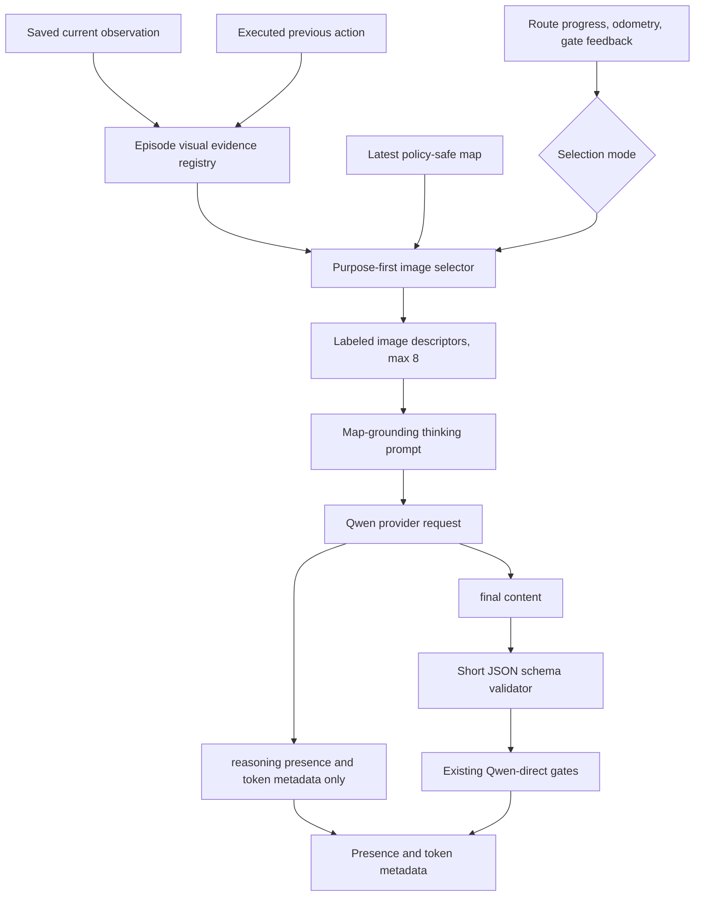

# feat: Add state-aware visual context and Qwen thinking ablation

## Goal Capsule

| Field | Value |
|---|---|
| Objective | Replace fixed history-heavy image packing with state-aware, semantically labeled visual evidence, then add a real provider-level Qwen thinking/non-thinking ablation whose final action interface remains a short validated JSON object. |
| Primary claim | Navigation quality should improve because each attached image has a state-specific purpose, not because requests are blindly padded with more images; Qwen thinking should explicitly reason over the non-oracle floorplan and RGB evidence while the controller consumes only the concise final JSON. |
| Authority hierarchy | `QwenDirectPolicyProxy` owns real observation artifacts and per-step frame/action association; `OpenClawVLNRuntime` owns navigation state, gate-triggered selection mode, and non-oracle semantic evidence; `OpenClawCliPlanPlanner` owns image selection, labels, prompts, provider requests, response separation, and audit metadata; existing local control gates retain final STOP and stall authority. |
| Execution profile | Add disabled or compatibility-preserving settings on `feat/qwen-direct-policy`; let dynamic selection attach the evidence roles available for the current state without a fixed image-count target; compare dynamic visual selection and thinking in a fixed 2x2 ablation with all map, motion, and controller settings held constant. |
| Stop conditions | Stop if the implementation inserts scan actions, pads or truncates dynamic context to a fixed attachment count, uses goal/reference/shortest-path data to choose images, treats model self-report as simulator truth, places raw `reasoning_content` or provider payloads in default traces, or removes `semantic_stop_state` from the current STOP contract. |
| Tail ownership | Land with focused unit/integration tests, an offline trace replay, fixed EP10/EP11/EP12/EP16 smoke comparisons, and a frozen larger-set comparison before making quality claims. |

---

## Product Contract

### Summary

The current Qwen-direct path can attach up to 8 images, but its selection policy is still mostly fixed: an optional map, retrieved memory, recent chronological frames, and current RGB.
This plan changes the selection objective from quantity to evidence purpose.
Normal navigation, stuck recovery, and STOP-blocked verification receive different labeled evidence sets, while the current RGB remains last and the total image budget does not increase.

The second part adds an explicit Qwen API thinking ablation.
Thinking mode is controlled by the provider request rather than prompt wording alone.
The internal reasoning is instructed to ground itself in the labeled top-down map before reconciling the map with egocentric RGB, but only the final short JSON reaches the navigation runtime.

### Problem Frame

The existing selector in `OpenClawCliPlanPlanner` can spend most of the budget on generic retrieved or recent frames even when the current failure requires a directional scan, the view before a stall, a confirmed landmark, or the view that triggered a target hypothesis.
Those images may be individually valid but do not have a stable role in the model prompt.
This makes the model infer both image identity and navigation relevance before it can decide an action.

The current default model is `qwen3.5-flash`, a hybrid-thinking model whose provider currently enables thinking by default.
The adapter does not send an explicit thinking switch, does not expose whether reasoning was returned, and does not distinguish JSON validity from general provider success.
Consequently, current runs cannot prove whether thinking was enabled and cannot form a clean thinking/non-thinking ablation.

### Requirements

**Dynamic visual evidence**

- R1. Dynamic selection must not use `OPENCLAW_MODEL_MAX_IMAGES` as a target or truncation rule. The current navigation state and available semantic evidence roles determine the attachment count; missing roles are not backfilled, and `current` remains last when present. Compatibility/fixed selection may retain its legacy limit.
- R1a. Trace must distinguish `model_image_count_policy=role_adaptive` with `openclaw_model_max_images_applied=false` from the fixed-selection `legacy_cap` baseline so an inherited launcher value cannot be mistaken for an active dynamic limit.
- R2. Select one of three modes before every Qwen call: `normal`, `stuck`, or `stop_blocked`, with `stop_blocked` taking precedence over `stuck` when both signals are present.
- R3. In `normal` mode, prefer `map_view`, `current`, the latest eligible model-confirmed landmark view, and at most one useful promoted/retrieved keyframe ranked by current route-stage/target relevance and then recency; do not fill unused slots with arbitrary chronological frames.
- R4. In `stuck` mode, prefer `map_view`, `current`, `left_scan`, `center_scan`, `right_scan`, and `stuck_before_keyframe`; include only roles backed by real observations already produced by executed actions and assign left/right relative to the active recovery anchor heading rather than from the previous action name alone.
- R5. In `stop_blocked` mode, prefer `map_view`, `current`, `confirmed_landmark`, and `target_candidate`; both semantic roles remain historical model-grounded claims that must be reverified against current evidence and cannot independently authorize STOP. The candidate is non-oracle observed evidence and must never be derived from Habitat goals, reference paths, shortest paths, goal distance, or success metrics.
- R6. Do not execute additional left/right turns to manufacture scan images; missing directional roles remain missing and are traced as such.
- R7. Every attached image must have a controlled semantic label from `map_view`, `current`, `left_scan`, `center_scan`, `right_scan`, `keyframe`, `confirmed_landmark`, `target_candidate`, or `stuck_before_keyframe`.
- R8. Deduplicate identical paths while retaining all semantic roles in metadata; the final attached image must remain `current`.
- R9. On a non-map-cadence step, state-aware recovery may reuse the latest previously rendered policy-safe map only when its safety metadata is complete and `0 <= map_age_steps < map_frame_interval_steps`; it must not generate an extra map or present a stale map as current. An older map is omitted with missing reason `stale_map`.
- R10. The selector must trace selection mode, ordered labels, source step IDs, missing roles, dropped candidates, current-last proof, map age, and total image count without exposing image bytes or provider payloads. The episode visual-evidence registry is capped at 32 frame records with deterministic pin and eviction behavior.

**Qwen thinking and short JSON**

- R11. Add an explicit Qwen thinking mode with `auto`, `off`, and `on`; `auto` preserves compatibility, while every reported ablation run must use explicit `off` or `on`.
- R12. When thinking is `on`, send provider-level `enable_thinking=true`; when `off`, send `enable_thinking=false`; do not infer an ablation arm from the provider default.
- R12a. Explicit thinking control is supported first on the direct `qwen_api` provider used by `run_qwen.sh`; selecting explicit thinking with `openclaw_cli` must fail configuration validation rather than falsely claim the requested mode was applied.
- R13. Use a configurable positive thinking budget with 1024 tokens in the first fixed-set experiment, preventing the model's much larger provider maximum from dominating navigation latency.
- R14. In thinking mode, instruct Qwen to reason internally over map position, heading, visited trail, navigable connectivity, unexplored branches, route stage, candidate direction, and map/RGB consistency before deciding the action; inspect collision marks only when the attached `map_view` metadata says the collision overlay is enabled.
- R15. If no `map_view` is attached, the prompt must say that map evidence is unavailable and prohibit invented map conclusions.
- R16. Keep `reasoning_content` separate from final `content`; parse actions only from `content`, never recover an action from raw reasoning.
- R17. Raw reasoning, full provider responses or error bodies, API credentials, request bodies, image base64, and unsanitized provider exception text must not enter default runtime metadata, trace JSONL, visual memory, or share-safe artifacts. Provider failures retain only HTTP status when available, an allowlisted bounded error code/category, retryability, and attempt counters.
- R18. Trace at least `qwen_thinking_enabled`, `qwen_thinking_exercised`, `qwen_output_json_valid`, and `thinking_model_supported` with explicit unknown semantics, plus reasoning-presence/token counters when the provider reports them, without tracing reasoning text. Request acceptance and observed reasoning exercise are distinct facts.
- R19. If explicit thinking is rejected as unsupported, inspect the response transiently, retain only the sanitized capability classification, retry once with explicit thinking disabled, record the fallback, and continue. Do not classify timeouts, rate limits, server failures, or a stream-required/transport incompatibility as unsupported thinking; transport incompatibility fails the explicit arm without retrying it as thinking-off.
- R20. Add an output schema mode of `legacy|route_v2`; `route_v2` content must remain a short JSON object containing `action_text`, `confidence`, `visual_summary`, `progress_state`, controlled-enum `route_stage`, `confirmed_landmarks`, `current_target`, `target_relation`, `stop_evidence`, `semantic_stop_state`, and `reason`.
- R21. In `route_v2`, `qwen_output_json_valid=true` means the whitespace-trimmed final `content` is exactly one JSON object with no Markdown fence, leading explanation, trailing commentary, or second object, and that object satisfies every type, enum, presence, and length constraint in the `route_v2` Schema Limits table. `legacy` retains the existing tolerant extraction contract.
- R22. Thinking mode must not use provider JSON mode because the current Qwen API does not support structured output together with thinking; schema failure follows the existing safe Qwen-direct failure path rather than guessing an action.

**Evaluation and compatibility**

- R23. Existing Janus/hybrid paths, Qwen direct map safety, route progress, odometry, motion feedback, forward-stall control, and STOP confirmation must remain unchanged when the new features are not enabled.
- R24. Compare visual selection and thinking with a fixed 2x2 design: fixed-selection/thinking-off, dynamic-selection/thinking-off, fixed-selection/thinking-on, and dynamic-selection/thinking-on.
- R24a. A thinking-on arm with any capability fallback, transport incompatibility, or zero calls with `qwen_thinking_exercised=true` is not a valid thinking-effect result and must be reported separately rather than pooled into the thinking-on navigation metrics.
- R25. Compatibility mode may retain the mutable `qwen/qwen3.5-flash` alias, but every 2x2 arm must configure the immutable `qwen/qwen3.5-flash-2026-02-23` model ID and synchronous transport. Canonicalize model identity by stripping the optional provider prefix before comparing it with provider-returned `qwen3.5-flash-2026-02-23`; hold that canonical identity, `route_v2` output schema, provider sampling parameters including the existing `temperature=0`, visual/map cadence, motion feedback, control gates, timeouts, and episode keys constant across the comparison.
- R26. Report navigation metrics and the predeclared primary-comparison outcome class together with image-role coverage, missing-role rate, JSON-valid rate, thinking fallback/transport-incompatibility rate, thinking-exercised rate, reasoning tokens, latency, route-stage distribution, action distribution, STOP block/requery counts, and controller-changed-action counts.

### Acceptance Examples

- AE1. Given a normal step with current RGB, a fresh map, a confirmed landmark frame, and several recent generic frames, when dynamic selection runs, then it attaches the map, landmark, and current evidence but does not pad the request with generic recency or truncate it to a configured count.
- AE2. Given forward-stall feedback after real turn observations exist 30 degrees to either side of the preserved center heading, when the requery is built, then those observations are labeled `left_scan` and `right_scan` from signed relative heading and the images are ordered `map_view`, `stuck_before_keyframe`, `left_scan`, `center_scan`, `right_scan`, and `current`, with current last.
- AE3. Given a stuck event without a prior right-turn observation, when selection runs, then `right_scan` is listed under missing roles and no extra turn action or duplicate image is inserted.
- AE4. Given STOP is blocked after schema-valid Qwen output positively names an intermediate landmark in current visual evidence and proposes a target candidate, when the requery runs, then the latest eligible non-oracle views are labeled `confirmed_landmark` and `target_candidate`, the prompt requires current revalidation, and neither role independently satisfies STOP.
- AE5. Given the latest floorplan was rendered two steps ago and a STOP-blocked requery occurs off cadence, when the map is reused, then no new map file is created and trace records `map_age_steps=2`.
- AE6. Given thinking mode is on, when the Qwen request is sent, then the request contains `enable_thinking=true` and the map-grounding checklist, while the runtime parser receives only final `content`.
- AE7. Given a provider response contains long `reasoning_content` followed by valid short JSON in `content`, when the response is normalized, then the action comes from `content`, reasoning-presence/token metadata is recorded, and no reasoning text appears in trace or visual memory.
- AE8. Given thinking mode returns valid JSON missing `route_stage`, when schema validation runs, then `qwen_output_json_valid=false` and the existing Qwen-direct safe failure path is used.
- AE9. Given the provider rejects `enable_thinking` with a recognized unsupported-parameter response, when fallback runs, then one explicit non-thinking request is made and trace records `thinking_model_supported=false` and `qwen_thinking_enabled=false`.
- AE10. Given the provider returns HTTP 429 or times out, when error handling runs, then the existing retry/failure behavior applies and the event is not mislabeled as unsupported thinking.
- AE11. Given an HTTP error body or request exception string contains an API key, prompt fragment, image base64, or reasoning text, when failure normalization runs, then only allowlisted status/category/retry metadata survives and none of the injected text appears in runtime-visible artifacts.
- AE12. Given `route_v2` output is 2049 characters, contains an oversized field, or wraps a valid object in prose or Markdown, when validation runs, then `qwen_output_json_valid=false` and no action is recovered from the embedded object.
- AE13. Given an ablation profile uses mutable model alias `qwen/qwen3.5-flash` or the provider response reports a different canonical model ID after optional-prefix normalization, when preflight/comparison validation runs, then the arm is rejected as `invalid_comparison` before an improvement claim.
- AE14. Given the synchronous thinking-on capability probe succeeds but reports no reasoning text or token evidence, when audit normalization runs, then `qwen_thinking_enabled=true` and `qwen_thinking_exercised` is `false` or `null` according to provider evidence; no raw reasoning is retained.
- AE15. Given the provider returns `enable_thinking only support stream call`, when failure classification runs, then the event is recorded as transport incompatibility, no thinking-off fallback is sent, and the thinking-on arm is invalid.

### Success Criteria

- All selected provider images have stable labels and current remains last.
- No state-aware mode pads or truncates attachments to a fixed count or inserts simulator actions.
- The EP10/EP11/EP12 success cases do not regress because of missing images or JSON failures in the dynamic-selection smoke.
- EP16 trace demonstrates that stuck or STOP-blocked calls receive the intended role-specific evidence even if navigation still fails.
- Explicit thinking-on rows separately prove accepted thinking requests and observed reasoning exercise; thinking-off rows show explicit disablement.
- No raw reasoning, full provider payload/error body, or unsanitized provider exception appears in `harness_trace_rank*.jsonl`, context-engine records, visual-memory records, logs covered by tests, or default result summaries.

### Experiment Decision Rules

Engineering completion and experimental outcome are separate:

- Implementation is complete when the four arms finish on identical exact episode keys, their immutable configured/provider model IDs, synchronous transport, treatment settings, and trace contracts are auditable, and thinking-on rows contain no capability fallback or transport incompatibility. Completion does not imply a navigation improvement.
- The primary navigation metric is success rate (SR). SPL is the predeclared efficiency discriminator only when SR is tied. JSON-validity, provider-failure, latency, reasoning-token, role-coverage, and controller-intervention metrics explain tradeoffs but cannot override a worse SR.
- Phase 3's primary treatment comparison is `fixed-selection/thinking-off` versus `dynamic-selection/thinking-off`.
- Phase 4's primary treatment comparison is `dynamic-selection/thinking-off` versus `dynamic-selection/thinking-on`.
- The two remaining edges are reported as interaction-consistency checks; they are not substituted for either primary comparison after results are known.
- Classify a primary comparison as `navigation_improvement` only when treatment SR is higher, `efficiency_improvement_only` when SR is equal and treatment SPL is higher, `no_improvement` when both are equal, and `negative` when treatment SR is lower. An arm with incomplete exact keys, mutable or mismatched model IDs, unproven explicit settings, thinking fallback/transport incompatibility in a thinking-on arm, zero calls with proven thinking exercise, or incomplete trace audit is `invalid_comparison` rather than positive or negative.

### Scope Boundaries

In scope:

- State-aware selection over already-saved RGB, keyframe, memory, and policy-safe map artifacts.
- Episode-local association between frame paths, executed actions, model-confirmed landmarks, target candidates, stall boundaries, and STOP-blocked requery state.
- Explicit Qwen3.5 Flash thinking/non-thinking control through the existing DashScope-compatible client.
- Short JSON schema extension and trace audit fields.
- Fixed diagnostic and frozen larger-set ablations.

Out of scope:

- Blindly adding chronological frames or imposing a fixed attachment-count target on dynamic selection.
- Inserting panoramic scan actions or overriding Qwen actions to collect views.
- Training, fine-tuning, distillation, or changing the Qwen model family in the first ablation.
- Persisting raw chain-of-thought or using it as controller evidence.
- Provider `response_format=json_object` in thinking mode.
- Oracle target-view retrieval, goal markers, reference paths, shortest paths, or goal-distance-based image ranking.

### Sources

- Existing floorplan and odometry contract: `docs/plans/2026-07-13-001-feat-floorplan-map-assisted-odometry-plan.md`.
- Existing image selection and direct prompt pattern: `src/harness/openclaw/openclaw_cli_plan_gateway.py`.
- Existing state, STOP requery, route progress, and odometry ownership: `src/harness/openclaw/runtime.py`.
- Existing frame artifact and evaluator payload ownership: `src/evaluation_harness.py`.
- Current comparison artifact: `results/qwen_floorplan_conservative_controller_20260715_102700`.
- Alibaba Cloud Model Studio, deep thinking: https://www.alibabacloud.com/help/en/model-studio/deep-thinking
- Alibaba Cloud Model Studio, visual reasoning: https://www.alibabacloud.com/help/en/model-studio/visual-reasoning
- Alibaba Cloud Model Studio, structured output: https://www.alibabacloud.com/help/en/model-studio/qwen-structured-output

---

## Planning Contract

### Key Technical Decisions

- KTD1. Use purpose-first variable-size image sets under the existing cap.
  The selector stops after the useful evidence is attached; unused capacity is not a reason to add generic recent frames.

- KTD2. Detect state from existing controller/runtime signals.
  `blocked_stop_feedback` or `stop_verification_feedback` selects `stop_blocked`; `forward_stall_feedback`, odometry-backed repeated no-progress, or blocked motion feedback selects `stuck`; all other calls use `normal`.

- KTD3. Never create scan observations through action intervention.
  A frame at step `t` is associated with the previously executed action that produced it, but the action name alone does not determine its directional role.
  For an active recovery, preserve the `center_scan` heading as the anchor and derive each later observation's episode-local signed relative heading from the existing pose/odometry input.
  Eligible left/right candidates must occur after the anchor, lie 15-90 degrees on the corresponding side, and come from a real executed turn; select the candidate closest to 45 degrees on each side, breaking ties by recency.
  If signed heading is unavailable or ambiguous, leave the role missing; raw heading remains local metadata and is never exposed in the Qwen prompt or shared trace.

- KTD4. Keep semantic evidence episode-local and auditable.
  A confirmed-landmark, target-candidate, or keyframe record stores the observed frame path, step, bounded label/text, confidence, evidence source, capture-time controlled `route_stage`, bounded normalized `current_target`, and `confirmation_basis` where applicable; it is a model-grounded non-oracle claim, not simulator truth.
  Promote a confirmed landmark only from schema-valid current-call output where the landmark appears in `confirmed_landmarks`, is supported by non-negated current `visual_summary`, and is bound to the current image provenance; a required route waypoint must also pass the existing route-progress classifier.
  Retain only the latest eligible record for each active semantic role and rank normal-mode history by non-`unknown` route-stage exact match, non-empty normalized current-target exact match, semantic eligibility, and then recency.
  A retrieved keyframe without capture-time stage/target metadata participates only in the recency fallback; do not add embedding or fuzzy-text ranking in Phase 3.
  The prompt must describe `confirmed_landmark` as historical model-confirmed evidence that requires current revalidation, and local STOP logic must never treat that role alone as arrival evidence.

- KTD5. Reuse the latest safe map only for recovery context and within one cadence window.
  The map provider retains the last generated map path/hash/step and complete safety metadata; off-cadence recovery may attach it only while `0 <= map_age_steps < map_frame_interval_steps`.
  At or beyond the next scheduled map frame, a prior map is omitted as `stale_map` rather than surviving a render failure, while normal cadence and map safety behavior stay unchanged.

- KTD6. Interleave labels with images at the provider boundary.
  The Qwen request receives an ordered descriptor per image rather than relying only on an unlabeled list of paths; local paths remain internal and prompt text contains role/index metadata only.

- KTD7. Use a tri-state thinking control.
  `auto` preserves compatibility for unrelated runs, but `on` and `off` send explicit provider parameters and are mandatory for experimental comparisons.

- KTD8. Keep thinking and action channels separate.
  `reasoning_content` is reduced immediately to presence, tri-state exercise evidence, and token counters; only `content` reaches JSON extraction and decision normalization.

- KTD9. Do not combine thinking with JSON response mode.
  Prompt-only JSON plus local schema validation follows the provider's current capability boundary; invalid output remains a measurable policy failure instead of invoking an untracked repair model.

- KTD10. Preserve `semantic_stop_state` in the short JSON.
  The new `route_stage` and `confirmed_landmarks` fields supplement, rather than replace, the structural STOP evidence used by the controller.

- KTD11. Version the stricter action schema independently from the two ablation treatments.
  `legacy` preserves existing Qwen-direct behavior outside the experiment, while every 2x2 arm uses `route_v2` so schema strictness is not confounded with dynamic selection or thinking.

### High-Level Technical Design

### Selection Contracts

| Mode | Trigger priority | Ordered desired roles | Missing-role behavior |
|---|---|---|---|
| `normal` | Default | `map_view`, `confirmed_landmark`, `keyframe`, `current` | Omit unavailable historical roles; do not fill with arbitrary recency. |
| `stuck` | Stall feedback or repeated odometry no-progress | `map_view`, `stuck_before_keyframe`, `left_scan`, `center_scan`, `right_scan`, `current` | Trace missing directions; never insert actions or duplicate paths merely to fill the set. |
| `stop_blocked` | Blocked STOP or structural STOP verification | `map_view`, `confirmed_landmark`, `target_candidate`, `current` | Keep candidate status explicit; fall back to map/current if semantic views are unavailable. |

When one path serves several roles, attach it once with one primary label selected by the table priority and retain all roles in trace metadata.
The current frame is always moved to the final provider position after deduplication.

### Thinking Contract

The thinking-on prompt tells Qwen to perform the following internally before emitting final JSON:

1. Identify whether `map_view` is present and note its age.
2. Ground agent position, heading, visited trail, navigable connectivity, and unexplored branches on that map; inspect collision marks only when the map metadata says the collision overlay is enabled.
3. Associate each labeled RGB image with its role rather than treating the input as an unlabeled chronology.
4. Reconcile the map direction with `current`, directional scan roles, confirmed landmarks, and the target candidate.
5. Check route stage and required waypoint/turn-round progress.
6. Check immediate action feasibility from current RGB.
7. Emit only the bounded JSON schema.

The prompt must not ask the model to print these steps.
The final `reason` is a concise decision summary, not a chain-of-thought transcript.

### `route_v2` Schema Limits

Limits use Python string length after trimming and before normalization; exceeding a limit is a schema failure, not a truncation request.
Trace-only copies may still use the existing bounded-metadata truncation after validation.

| Field | Type and limit |
|---|---|
| Entire final `content` | At most 2048 characters and exactly one JSON object. |
| `action_text` | Required controlled action enum. |
| `confidence` | Required finite JSON number in `[0,1]`; booleans are invalid. |
| `visual_summary` | Required string, at most 240 characters. |
| `progress_state` | Required string, at most 120 characters. |
| `route_stage` | Required enum: `start`, `en_route`, `intermediate_landmark`, `post_landmark_transition`, `approaching_target`, `verifying_target`, `complete`, or `unknown`. |
| `confirmed_landmarks` | Required list of at most 8 strings, each at most 80 characters. |
| `current_target` | Required string, at most 120 characters. |
| `target_relation` | Required string, at most 120 characters. |
| `stop_evidence` | Required controlled existing enum. |
| `semantic_stop_state` | Required controlled existing enum. |
| `reason` | Required string, at most 160 characters. |

### Audit Semantics

| Field | `true` | `false` | `null` |
|---|---|---|---|
| `qwen_thinking_enabled` | Explicit thinking-on request was accepted, or auto mode returned provider reasoning evidence. | Explicit thinking-off request was used, including a capability fallback. | Auto mode returned no evidence that proves whether the provider used thinking. |
| `qwen_thinking_exercised` | A non-empty reasoning field was observed transiently or provider usage reported positive reasoning tokens. | Provider usage explicitly reported zero reasoning tokens for a successful call. | The provider returned no trustworthy exercise signal; absence alone is not treated as false. |
| `thinking_model_supported` | Current model is in the supported capability contract or accepted an explicit thinking-on request. | Provider returned a recognized unsupported-thinking error. | Capability was not probed and cannot be inferred safely. |
| `qwen_output_json_valid` | Final `content` passed syntax and active-schema validation. | Final `content` existed but failed syntax or active-schema validation. | No final content was returned because the provider call itself failed or was skipped. |

The comparator must keep `null` distinct from `false`; unknown provider behavior is not a valid non-thinking result.

### Sequencing

1. Characterize and lock the current selector, response parser, and trace behavior with tests before changing selection.
2. Add the visual evidence registry and state trigger contract without changing which images are sent.
3. Switch the direct selector to state-aware labeled descriptors behind a disabled-by-default flag.
4. Add explicit thinking request/response separation and schema auditing behind a separate tri-state setting.
5. Run the fixed 2x2 smoke, then freeze and run the larger comparison set only after trace contracts pass.

### Risks and Mitigations

| Risk | Impact | Mitigation |
|---|---|---|
| Directional labels do not match the recovery-relative observation heading | Qwen may turn the wrong way | Associate every frame with its producing action, derive signed heading relative to the recovery anchor, test multi-turn and wraparound histories, and omit ambiguous sides. |
| Model-confirmed landmark is hallucinated or self-reinforced | Misleading memory evidence | Require current-call positive evidence and provenance for promotion, record the confirmation basis, rank by current route relevance, require revalidation, and never promote it to simulator truth or independent STOP evidence. |
| Stale map dominates current RGB | Incorrect immediate action | Reuse a cached map only within one cadence window, include `map_age_steps`, omit it as `stale_map` afterward, keep current last, and state that RGB decides immediate feasibility. |
| Thinking increases latency or times out | Lower throughput and incomplete runs | Fix the first budget at 1024, use one synchronous transport contract across all arms, run a live capability probe, record latency/reasoning tokens, and retain explicit non-thinking mode. |
| Thinking output breaks JSON | Safe STOP failures increase | Validate schema, trace invalid output, and compare JSON-valid rates before judging navigation quality. |
| Unsupported fallback hides a provider or transport incident | Confounded ablation | Fallback only for recognized model-capability errors; preserve normal retry/error handling for timeout, 429, and 5xx, and quarantine stream-required responses as transport incompatibility without fallback. |
| Mutable model alias changes between arms | Treatment effect is confounded with provider model drift | Pin `qwen/qwen3.5-flash-2026-02-23`, record configured and returned model IDs, and reject mismatches before comparison. |
| Thinking-on request produces no reasoning evidence | The arm is configured but the intended treatment is unproven | Keep request acceptance separate from `qwen_thinking_exercised`, report exercise rate, and invalidate a thinking-effect comparison with zero proven exercised calls. |
| Raw reasoning leaks into traces or memory | Privacy and artifact-sharing risk | Drop reasoning text inside the provider normalizer and add negative serialization tests across trace and context-engine records. |
| Provider error body leaks through exception metadata | Credentials, prompt fragments, or reasoning may enter artifacts | Classify errors at the provider boundary, retain only allowlisted structured fields, discard raw exception/body text, and test hostile response bodies. |
| Dynamic selection changes both evidence and image count | Harder attribution | Report per-step image count and role coverage, keep max 8 fixed, and use the full 2x2 design. |

### System-Wide Impact

- **Episode lifecycle:** The 32-record frame/evidence registry, last safe map, stall anchor, directional scan candidates, confirmed landmark, and target candidate must reset together at `start_episode()`; state from one episode must never be eligible in another episode even when scene IDs match. Only the current frame, active recovery anchors, and the latest active semantic-role records are pinned; recovery completion or role replacement unpins superseded records, and the oldest non-pinned record is evicted first.
- **Initial call versus requery:** Normal selection is assembled before the first planner call, while stuck and STOP-blocked selection can be assembled for a same-step requery after a controller gate fires. Both paths must use the same selector and evidence schema so trace rows remain comparable.
- **Provider parity:** Dynamic selection and ordered role metadata apply to both model-provider paths. Native `enable_thinking` control is limited to `qwen_api` until the OpenClaw CLI exposes an equivalent auditable switch; unsupported provider/mode combinations fail before evaluation. The first ablation pins synchronous transport and `qwen/qwen3.5-flash-2026-02-23` across all arms.
- **Failure propagation:** Missing role evidence degrades to a smaller valid image set. Invalid JSON, provider failure, model-capability fallback, transport incompatibility, unproven thinking exercise, and controller rejection remain distinct outcomes and must not be collapsed into one generic Qwen failure count.
- **Data lifecycle:** Local image paths remain available to the attachment layer and trace audit, while prompt text receives labels and bounded metadata only. Raw reasoning, provider responses/error bodies, and unsanitized exception strings are discarded before visual memory, context-engine, logger, or summary code can observe them; failure metadata contains only allowlisted structured fields.
- **Performance:** Dynamic selection should reduce average attached images in normal mode. Thinking adds billed output tokens and latency, so the fixed budget, reasoning-token counters, and per-call latency must be present before scaling beyond the smoke set.

---

## Implementation Units

### U1. Add configuration and trace contracts

- **Goal:** Introduce independent dynamic-visual and thinking controls without changing unrelated defaults.
- **Requirements:** R1, R10-R13, R18, R23-R25.
- **Dependencies:** None.
- **Files:**
  - `src/harness/config.py`
  - `src/evaluation_harness.py`
  - `src/harness/openclaw/openclaw_cli_plan_gateway.py`
  - `scripts/check_openclaw_qwen_connection.py`
  - `scripts/start_openclaw_cli_plan_gateway.sh`
  - `scripts/run_qwen.sh`
  - `scripts/evaluation_openclaw_gateway.sh`
  - `tests/test_evaluation_harness_openclaw_runtime.py`
  - `tests/test_evaluation_scripts.py`
- **Approach:** Add a disabled-by-default dynamic visual-selection flag, a thinking mode of `auto|off|on`, an output schema mode of `legacy|route_v2`, an optional positive thinking budget, and sanitized audit fields for raw configured/canonical returned model ID, synchronous transport, and tri-state thinking exercise.
  Thread them through launcher, gateway CLI, planner, and client configuration.
  Keep the mutable model alias for compatibility profiles, but make the 2x2 profile and live preflight require `qwen/qwen3.5-flash-2026-02-23`.
  Define the audit field names and types before feature logic lands.
- **Patterns to follow:** Existing map/motion env-to-arg plumbing and `context_audit` propagation.
- **Test scenarios:**
  - Default configuration preserves fixed visual selection and `auto` provider behavior.
  - Dynamic selection and thinking can be toggled independently.
  - Legacy schema preserves the current direct parser contract, while all 2x2 profiles select `route_v2`.
  - Invalid thinking mode or non-positive explicit budget fails configuration validation.
  - Explicit thinking on/off with `openclaw_cli` fails preflight rather than claiming provider support.
  - A 2x2 profile using a mutable model alias or non-synchronous transport fails preflight.
  - Launch scripts pass the settings to the gateway without altering the max image default of 8.
  - Runtime trace can carry the new audit keys without raw response fields.
- **Verification:** Parser/config/script tests lock the public experiment knobs and backward-compatible defaults.

### U2. Build the episode visual evidence registry

- **Goal:** Associate real observation artifacts with the actions and semantic evidence that produced their useful roles.
- **Requirements:** R3-R10, R20, R23.
- **Dependencies:** U1.
- **Files:**
  - `src/evaluation_harness.py`
  - `src/harness/openclaw/runtime.py`
  - `tests/test_evaluation_harness_openclaw_runtime.py`
  - `tests/test_openclaw_runtime_bridge.py`
- **Approach:** Add bounded episode-local frame records containing step, path, previous executed action, keyframe status, and non-oracle semantic associations.
  Record a new frame when the current artifact is saved.
  Cap the registry at 32 records; pin only current, active recovery anchors, and the latest active semantic-role records, then evict the oldest non-pinned record.
  Update landmark and target-candidate associations after valid Qwen output only when the semantic promotion contract passes, using current image provenance, bounded schema fields, capture-time route stage/current target, and a recorded confirmation basis.
  Save the same stage/target provenance on newly promoted keyframe records.
  Capture the frame and signed heading at the beginning of a no-progress sequence as `stuck_before_keyframe` and preserve the pre-turn anchor as `center_scan`.
  Derive left/right candidates from signed heading relative to that anchor, not merely from their producing action name.
- **Patterns to follow:** Existing `qwen_direct_episode_state`, promoted-keyframe handling, route waypoint observation recording, and per-episode reset hooks.
- **Test scenarios:**
  - A frame at step `t` records the action executed before that observation, not the candidate action produced at step `t`.
  - Frames following actual turns are assigned left/right only when their signed heading lies 15-90 degrees on the corresponding side of the active center anchor; the candidate closest to 45 degrees wins with a recency tie-break.
  - No directional role appears without a corresponding executed turn observation.
  - Consecutive same-direction turns, left-then-right histories, 180/360-degree wraparound, and unavailable signed heading do not invert or fabricate directional roles.
  - Episode reset removes all prior scene/episode evidence.
  - Negated route-waypoint summaries do not create confirmed-landmark records.
  - A landmark omitted from `confirmed_landmarks`, absent from current positive `visual_summary`, or rejected by the route-progress classifier for a required waypoint is not promoted.
  - Semantic and promoted-keyframe records preserve controlled capture-time route stage and bounded normalized current target.
  - Replacing a semantic record or completing recovery unpins its superseded frame.
  - A valid target candidate stores current-image provenance but is not marked as confirmed arrival.
  - Registry size never exceeds 32 and evicts oldest non-pinned entries without dropping the current frame or active stall anchor.
- **Verification:** Runtime/proxy tests prove role provenance without any provider call.

### U3. Implement state-aware labeled image selection

- **Goal:** Select purpose-specific evidence sets for normal, stuck, and STOP-blocked calls with an adaptive count determined by available semantic roles.
- **Requirements:** R1-R10, R20, R23.
- **Dependencies:** U2.
- **Files:**
  - `src/harness/openclaw/map_context.py`
  - `src/harness/openclaw/runtime.py`
  - `src/harness/openclaw/openclaw_cli_plan_gateway.py`
  - `tests/test_openclaw_map_context.py`
  - `tests/test_openclaw_runtime_bridge.py`
  - `tests/test_openclaw_cli_plan_gateway.py`
- **Approach:** Derive `visual_context_mode` from runtime feedback with deterministic precedence.
  Extend the map provider to retain latest safe-map metadata without rendering off cadence and reject reuse at or beyond the next cadence boundary.
  Replace the fixed direct candidate ordering, only when enabled, with the Selection Contracts table.
  Rank normal-mode semantic history by non-`unknown` exact stage match, non-empty normalized target exact match, eligibility, and recency; metadata-free retrieved keyframes enter only the recency fallback.
  Deduplicate by path, retain role aliases, trace missing/dropped roles, and force current last.
- **Patterns to follow:** Existing `_qwen_direct_model_image_candidates()`, map candidate safety metadata, and requery payload construction.
- **Test scenarios:**
  - Normal mode selects map, useful semantic/keyframe history, and current without padding or truncating to a configured count.
  - Normal-mode history ranking is deterministic when several landmark and keyframe candidates exist, and an ineligible self-reported landmark cannot outrank a valid keyframe.
  - Equivalent free-text descriptions cannot alter ranking because stage is a controlled enum; `unknown` and missing metadata receive no stage/target relevance boost.
  - Forward-stall requery selects stuck mode and the real directional observations available in the registry.
  - STOP-blocked and structural verification requeries select stop-blocked mode even when stall evidence also exists.
  - Missing roles are traced and not replaced by duplicated or arbitrary chronological frames.
  - Same-path multi-role candidates are attached once and preserve role aliases.
  - Current is always last and total attachments never exceed 8.
  - Off-cadence recovery reuses the latest safe map only while `map_age_steps < map_frame_interval_steps`, records age, and writes no new map file.
  - A cached map at or beyond the cadence boundary, or without complete safety metadata, is omitted with missing reason `stale_map`.
  - Feature-disabled selection remains byte-for-byte compatible with current candidate ordering metadata.
- **Verification:** Gateway and runtime tests lock all three state-dependent selection contracts.

### U4. Attach semantic labels at the Qwen provider boundary

- **Goal:** Make each image role unambiguous to Qwen, especially during map-grounded reasoning.
- **Requirements:** R7-R10, R14-R15, R17.
- **Dependencies:** U3.
- **Files:**
  - `src/harness/openclaw/openclaw_cli_plan_gateway.py`
  - `tests/test_openclaw_cli_plan_gateway.py`
- **Approach:** Pass ordered image descriptors rather than bare path strings from planner to `QwenApiModelClient`.
  Interleave a short label/index text item with each provider image item and include the same ordered label list in the sanitized prompt context.
  Keep local paths, hashes, and bytes out of prompt text and shared trace.
- **Patterns to follow:** Existing `_message_content()`, `attached_image_order`, prompt sanitization, and image-selection audit metadata.
- **Test scenarios:**
  - Provider message content associates every image with exactly one primary controlled label.
  - Role aliases remain trace-only metadata and do not create duplicate attachments.
  - Map label precedes its image and current label precedes the final image.
  - Prompt describes map age and absence correctly.
  - Prompt describes `confirmed_landmark` as historical model evidence requiring current revalidation and never as independent STOP evidence.
  - Local paths, image bytes/base64, raw pose, and provider credentials remain absent from Qwen-visible text and trace metadata.
  - Non-direct planner paths retain their current image interface.
- **Verification:** Request-construction tests inspect labels and redaction without sending an API request.

### U5. Add native Qwen thinking and response separation

- **Goal:** Make thinking/non-thinking behavior explicit and measurable while preventing CoT from entering navigation state.
- **Requirements:** R11-R19, R22-R25.
- **Dependencies:** U1 and U4.
- **Files:**
  - `src/harness/openclaw/openclaw_cli_plan_gateway.py`
  - `scripts/check_openclaw_qwen_connection.py`
  - `tests/test_openclaw_cli_plan_gateway.py`
  - `tests/test_openclaw_gateway_check_script.py`
- **Approach:** Add `enable_thinking` and bounded `thinking_budget` to the raw DashScope-compatible synchronous request for explicit modes.
  Extend the connection check with a minimal labeled-image thinking-on probe using the pinned dated model before an ablation starts.
  Extract final `content`, reasoning-present status, tri-state exercise evidence, provider-returned model ID, and provider-reported reasoning tokens separately.
  Remove full raw provider response retention from the normalized client result.
  Normalize request and HTTP failures to status, an allowlisted bounded error code/category, retryability, and attempt counters; never propagate raw `response.text` or `str(exc)` into runtime-visible metadata.
  Recognize only documented model-capability errors for one explicit non-thinking fallback, inspecting any provider body transiently and discarding it after classification.
  Classify stream-required errors as transport incompatibility and fail the arm without a thinking-off retry.
- **Patterns to follow:** Existing request retry loop, `_normalize_response()`, `_model_request_metadata()`, and direct-policy provider failure path.
- **Test scenarios:**
  - Explicit on/off requests contain the correct provider parameter.
  - `auto` omits the parameter and is never accepted as a labeled ablation arm.
  - Thinking-on request uses budget 1024 in the fixed experiment profile.
  - Thinking-off request omits `thinking_budget`.
  - All four experimental requests use synchronous transport, `temperature=0`, and the pinned dated model.
  - The live capability probe sends one labeled image and proves explicit thinking acceptance before evaluation episodes start.
  - Response with both reasoning and final content exposes only final content to JSON extraction.
  - Reasoning presence and token count reach audit metadata without reasoning text.
  - Non-empty transient reasoning or positive reasoning-token usage sets `qwen_thinking_exercised=true`; explicit zero usage sets false; absent evidence remains null.
  - Recognized unsupported-parameter response retries once with thinking off and marks support false.
  - HTTP 429, timeout, and 5xx use existing retry/failure paths without capability fallback.
  - A stream-required response is classified as transport incompatibility and never retried with thinking disabled.
  - Raw configured and canonical provider-returned model IDs are recorded; optional `qwen/` prefix normalization passes, while a canonical mismatch fails experimental preflight.
  - No normalized client object or trace record retains full raw provider payload.
  - Error bodies and exception strings containing an API key, prompt fragment, image base64, or reasoning text produce only sanitized structured failure metadata, and none of the injected secrets appears in trace, visual memory, context-engine, logs captured by tests, or summaries.
- **Verification:** Fake-session tests prove request shape, fallback classification, response separation, and redaction.

### U6. Extend the short JSON schema and map-grounding prompt

- **Goal:** Keep the action contract concise while exposing route and landmark conclusions needed to assess thinking quality.
- **Requirements:** R14-R16, R18, R20-R23.
- **Dependencies:** U4 and U5.
- **Files:**
  - `src/harness/openclaw/openclaw_cli_plan_gateway.py`
  - `src/harness/openclaw/runtime.py`
  - `src/harness/openclaw/control_gates.py`
  - `tests/test_openclaw_cli_plan_gateway.py`
  - `tests/test_openclaw_runtime_bridge.py`
  - `tests/test_qwen_direct_control_gates.py`
- **Approach:** Add `route_v2` direct normalization with `route_stage` and bounded `confirmed_landmarks`, retain `semantic_stop_state`, require the entire trimmed final content to decode as one JSON object, and validate the full required schema before action execution.
  Keep the existing normalization contract under `legacy` for unrelated runs.
  Apply the `route_v2` Schema Limits table before any runtime normalization; reject invalid type, non-finite confidence, boolean confidence, or oversized content rather than truncating action fields.
  Add the internal map-grounding checklist only for explicit thinking-on mode and state that it must not be printed.
  Keep `reason` short and preserve current STOP/controller semantics.
- **Patterns to follow:** Existing concise direct schema prompt, `_normalize_direct_policy_decision()`, `_qwen_direct_schema_metadata()`, and semantic STOP gate fields.
- **Test scenarios:**
  - Complete short JSON with a controlled route stage normalizes every required field and records `qwen_output_json_valid=true`.
  - Legacy mode continues to accept the current concise response shape without requiring `route_stage` or `confirmed_landmarks`.
  - Leading prose, trailing prose, Markdown fences, or multiple JSON objects make `route_v2` invalid even when one embedded object would pass the schema; the same fixtures continue to follow legacy behavior under `legacy`.
  - Missing required field, invalid confidence, invalid landmark type, oversized field, or unsupported action records invalid JSON/schema and uses safe failure.
  - A route stage outside the controlled enum is schema-invalid; every allowed stage round-trips unchanged into runtime and trace metadata.
  - Every field boundary and the 2048-character whole-content boundary has exact pass-at-limit and fail-over-limit tests; trace-only truncation occurs only after a valid decision exists.
  - `semantic_stop_state` continues to control STOP eligibility exactly as before.
  - Thinking-on prompt contains top-down map checks and a no-map anti-hallucination branch.
  - Thinking-off prompt keeps the same final schema without claiming hidden reasoning.
  - Raw reasoning cannot populate `reason`, route stage, landmarks, candidate target, or action.
- **Verification:** Parser/runtime/gate tests prove schema strictness and controller compatibility.

### U7. Add fixed ablation workflow and result audit

- **Goal:** Separate the effects of evidence selection and native thinking with reproducible result artifacts.
- **Requirements:** R24-R26.
- **Dependencies:** U3-U6.
- **Files:**
  - `scripts/run_qwen.sh`
  - `scripts/evaluation_openclaw_gateway.sh`
  - `scripts/compare_qwen_direct_policy_results.py`
  - `docs/runbooks/openclaw-qwen-dynamic-visual-thinking-eval.md`
  - `tests/test_evaluation_scripts.py`
  - `tests/test_compare_qwen_direct_policy_results.py`
- **Approach:** Add named run profiles for the 2x2 matrix while holding all non-treatment settings fixed.
  Extend the existing Qwen-direct result comparator to summarize image roles, missing roles, JSON validity, thinking support/fallback, reasoning tokens, latency, gate activity, and action changes alongside navigation metrics.
  Encode the Experiment Decision Rules without selecting a different edge or secondary metric after results are known.
  Use EP10/EP11/EP12/EP16 as a diagnostic smoke only, then run a frozen larger set not chosen from smoke outcomes.
- **Patterns to follow:** Existing fixed episode selection in `run_qwen.sh`, trace-backed comparison utilities, and `docs/runbooks/openclaw-qwen-direct-policy-eval.md`.
- **Test scenarios:**
  - All four profiles configure `qwen/qwen3.5-flash-2026-02-23`, receive canonical provider model `qwen3.5-flash-2026-02-23`, and use synchronous transport, `temperature=0` and any other sampling parameters, visual/map cadence, motion/controller settings, timeout, and episode keys.
  - Comparator rejects `auto` thinking rows from explicit on/off ablation summaries.
  - Comparator rejects or separately quarantines fallback rows from the thinking-on arm.
  - Comparator rejects transport-incompatible rows and labels a thinking-on arm with zero exercised calls `invalid_comparison`.
  - Comparator aligns rows by exact `(scene_id, episode_id)` before metric differences.
  - Comparator rejects mutable configured model IDs, configured/returned model mismatches, or cross-arm model/transport/sampling differences.
  - Comparator labels the two predeclared primary edges and the two interaction-consistency edges, then classifies primary outcomes from SR first and SPL only on an SR tie.
  - Incomplete exact keys, unproven explicit treatment settings, or thinking fallback yield `invalid_comparison` and cannot be relabeled from a secondary metric.
  - Summary reports selected image-count distribution and role coverage rather than assuming 8 images were used.
  - Summary distinguishes unsupported fallback, transport incompatibility, unproven thinking exercise, JSON invalidity, provider failure, route-stage distribution, and controller action changes.
  - Share-safe output contains no raw prompt, image payload, reasoning text, API key, or full provider response.
- **Verification:** Script tests and a synthetic trace fixture prove matrix consistency and report semantics before live Qwen calls.

---

## Verification Contract

| Gate | Command or artifact | Covers | Pass signal |
|---|---|---|---|
| Syntax | `PYTHONPATH=src python -m py_compile src/evaluation_harness.py src/harness/openclaw/runtime.py src/harness/openclaw/map_context.py src/harness/openclaw/openclaw_cli_plan_gateway.py` | U1-U6 | All changed Python entry points compile. |
| Gateway/provider tests | `PYTHONPATH=src pytest -q tests/test_openclaw_cli_plan_gateway.py tests/test_openclaw_gateway_check_script.py` | U1, U3-U6 | Selection, labels, dated-model/transport preflight, thinking request/exercise audit, response separation, JSON validation, and redaction pass. |
| Runtime/controller tests | `PYTHONPATH=src pytest -q tests/test_openclaw_runtime_bridge.py tests/test_qwen_direct_control_gates.py` | U2, U3, U6 | State triggers, evidence provenance, requery behavior, and STOP compatibility pass. |
| Proxy/map/config tests | `PYTHONPATH=src pytest -q tests/test_evaluation_harness_openclaw_runtime.py tests/test_openclaw_map_context.py tests/test_evaluation_scripts.py` | U1-U4, U7 | Frame/action alignment, cached-map age, launcher settings, and no extra map renders pass. |
| Comparator tests | `PYTHONPATH=src pytest -q tests/test_compare_qwen_direct_policy_results.py` | U7 | Exact-key alignment, treatment-edge labels, invalid-comparison quarantine, SR-first classification, and new audit metrics pass. |
| Full regression | `PYTHONPATH=src:. pytest -q tests` | U1-U7 | No new failures beyond documented pre-existing repository failures. |
| Static diff hygiene | `git diff --check` | U1-U7 | No whitespace errors or unrelated generated artifacts. |
| Offline replay | Replay `results/qwen_floorplan_conservative_controller_20260715_102700/harness_traces/harness_trace_rank0.jsonl` through selection-state classification | U2, U3, U7 | EP16 STOP/stall events choose recovery evidence modes; EP10/11/12 normal steps remain normal. |
| Fixed 2x2 smoke | Four runs over scene `2azQ1b91cZZ`, episodes 10, 11, 12, and 16 | U3-U7 | All arms prove the pinned configured/returned model, synchronous transport, fixed sampling, explicit treatment settings, valid labeled attachments, no raw CoT, and comparable trace coverage; thinking-on has at least one exercised call. |
| Frozen larger set | Same 2x2 settings on a predeclared episode list | U7 | Exact-key navigation and systems metrics are complete, and both primary comparisons receive a predeclared outcome classification before any improvement claim. |

The live smoke must be treated as a diagnostic gate, not a sufficient performance result.
No tuning decision may use EP16 alone without rechecking the retained success episodes and the frozen larger set.

---

## Definition of Done

- U1 is done when dynamic selection and thinking have independent, validated launcher/config controls, compatibility mode may retain the mutable alias, and every reported ablation run preflights the pinned dated model, synchronous transport, fixed sampling, and explicit thinking on/off.
- U2 is done when every semantic image role can be traced to a real episode observation and previously executed action, directional roles are validated against signed recovery-relative heading, promotion plus capture-time stage/target provenance is explicit, the registry never exceeds 32 records, and reset/unpin/eviction tests pass.
- U3 is done when all three state modes select deterministic purpose-specific evidence without a fixed attachment-count rule, semantic history follows the enum-stage/exact-target/eligibility/recency ranking contract, cached maps expire at the cadence boundary, current remains last, and no scan action is inserted.
- U4 is done when every provider image is semantically labeled without leaking local paths or payload bytes.
- U5 is done when Qwen thinking is explicitly controlled and live-probed, request acceptance and exercise are separately audited, response reasoning is discarded, model capability and transport incompatibility are distinct, provider successes/failures expose no raw body or exception text, and configured/returned model identities are proven equal after optional-prefix canonicalization.
- U6 is done when the required short JSON validates every `route_v2` type, enum, and numeric limit without tolerant extraction or silent action-field truncation, while preserving the existing semantic STOP contract.
- U7 is done when the 2x2 comparator aligns exact episode keys, rejects model/transport/sampling drift and unexercised thinking arms, reports navigation, image-role, JSON, thinking, route-stage, latency, gate, and action-change metrics, and applies the predeclared SR-first outcome rules to the two primary comparisons.
- The EP10/EP11/EP12/EP16 smoke produces complete trace evidence for all four arms, including the selected image-count distribution and `current_image_last` audit without enforcing one count across calls.
- Thinking-on results are accepted only when every counted Qwen call records `qwen_thinking_enabled=true`, no capability fallback or transport incompatibility occurs, and at least one counted call records `qwen_thinking_exercised=true`.
- Default traces, context-engine records, memory records, captured logs, and summaries contain no raw reasoning, full provider response/error body, unsanitized provider exception, request body, credentials, or image base64.
- Existing non-direct policy behavior and feature-disabled Qwen-direct behavior remain covered by regression tests.
- Documentation clearly labels the floorplan input as privileged map+pose assistance and thinking results as an inference-time ablation.
- Experimental dead ends, temporary response dumps, obsolete flags, and unused selection paths are removed before landing.
