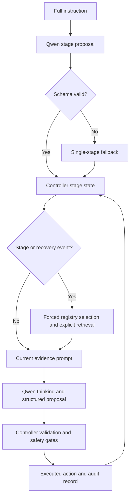

# Controller-Owned Staged Visual Memory Harness - Plan

## Goal Capsule

| Field | Value |
|---|---|
| Objective | Refine Qwen-direct into a controller-owned harness that segments each instruction, forces event-driven visual-memory use, injects goal-free floorplan and historical visual evidence, and leaves auditable proof from trigger through executed action. |
| Product authority | Qwen owns semantic interpretation and action proposals; the controller owns stage state, recall triggers, transition validation, STOP acceptance, and the final executed action. |
| Open blockers | No product-scope blocker remains. Planning must choose bounded schemas, debounce rules, retrieval ranking, and shadow-replay sampling without changing the authority model in this contract. |

---

## Product Contract

### Summary

Build a controller-owned Qwen-direct harness with instruction stages and two layers of visual memory.
At defined navigation events, the controller must force visual-memory retrieval, inject labeled floorplan, current-view, and historical evidence into Qwen thinking, validate the result, and record whether memory reached or changed the executed action.

### Problem Frame

The current Qwen-direct path can attach a goal-free floorplan, current RGB, and episode-local historical image roles, and it can expose whether Qwen thinking ran.
That proves visual evidence reached the provider, but it does not prove an explicit memory-retrieval path participated: recent traces can attach historical evidence while reporting `memory_context_used=false`.

The full natural-language instruction also remains the main task unit throughout navigation.
Without controller-owned stages, Qwen can conflate seeing a landmark with passing it, carry completed clauses too long, or claim route completion from its own text rather than grounded evidence.

Prompt wording alone cannot guarantee memory use or safe progression.
The harness needs deterministic trigger authority and an audit chain connecting the trigger, recalled evidence, provider input, candidate action, controller decision, and environment action.

### Key Decisions

- **Use two visual-memory layers.** (session-settled: user-directed — chosen over registry-only or retrieval-only memory: the registry supplies fast episode evidence while explicit retrieval makes memory use independently auditable.)
- **Segment once at episode start with Qwen.** (session-settled: user-directed — chosen over rule-based or offline segmentation: semantic decomposition remains online while a strict contract and single-stage fallback bound failure.)
- **Let the controller validate stage completion.** (session-settled: user-directed — chosen over model-only or fixed-step transitions: seeing or naming a landmark is not sufficient evidence that the route clause is complete.)
- **Force memory on stage and recovery events.** (session-settled: user-directed — chosen over every-step or failure-only retrieval: normal stage progression remains memory-grounded without paying retrieval cost on every action.)
- **Keep online control fully distance-free.** (session-settled: user-directed — chosen over a distance-based debug or primary STOP mode: target distance must not affect prompts, transitions, recall, STOP, or actions.)
- **Prove use with traces and counterfactual comparisons.** (session-settled: user-directed — chosen over trace-only or metric-only evidence: the evaluation must establish both execution facts and decision impact.)

### Actors

- A1. **Qwen segmenter and policy** interprets the instruction, proposes ordered stages, reasons over labeled visual evidence, and returns bounded structured proposals.
- A2. **Harness controller** owns stage lifecycle, event triggers, validation, safety gates, and the final action sent to the environment.
- A3. **Visual-memory system** maintains the episode evidence registry and performs explicit image-backed retrieval with provenance.
- A4. **Evaluation and audit layer** records online proof, runs memory-on/off comparisons, and performs same-state shadow replay without changing the primary trajectory.

### Key Flow

- F1. **Initialize instruction stages**
  - **Trigger:** An episode begins with a complete navigation instruction.
  - **Actors:** A1, A2.
  - **Steps:** Qwen proposes ordered stages in one bounded response; the controller validates order and required fields; invalid output becomes one stage containing the full instruction.
  - **Outcome:** Every episode starts with a valid controller-owned stage state.

- F2. **Navigate within a stage**
  - **Trigger:** The current stage is active and no forced-memory event is pending.
  - **Actors:** A1, A2, A3.
  - **Steps:** The controller supplies current stage context and available labeled visual evidence; Qwen proposes one action; safety gates determine the final action.
  - **Outcome:** Normal steps remain grounded in the active route clause without letting Qwen mutate stage state directly.

- F3. **Force visual-memory use**
  - **Trigger:** Stage entry, stage-completion proposal, lack of progress, turn loop, or STOP proposal occurs.
  - **Actors:** A2, A3, A1.
  - **Steps:** The controller forces episode-registry selection and explicit retrieval; retrieved evidence is labeled and attached with the floorplan and current observation; Qwen is then called with the enriched context.
  - **Outcome:** The trigger cannot complete without a recorded recall attempt and a recorded provider decision path.

- F4. **Validate stage transition**
  - **Trigger:** Qwen proposes that the current stage is complete.
  - **Actors:** A1, A2, A3.
  - **Steps:** The controller checks current RGB, relevant historical evidence, executed-motion progress, and required landmark relations; it accepts, rejects, or requests further verification.
  - **Outcome:** Only controller-confirmed evidence advances the active stage.

- F5. **Validate final STOP**
  - **Trigger:** Qwen proposes STOP in the final stage.
  - **Actors:** A1, A2, A3.
  - **Steps:** The controller forces final-stage memory retrieval, applies semantic and structural arrival checks, and either accepts STOP or executes a safe non-STOP verification action.
  - **Outcome:** STOP is never accepted from target distance or model self-report alone.

### Requirements

**Instruction-stage contract**

- R1. The harness must request one ordered stage decomposition at episode start and must not repeat segmentation during ordinary steps.
- R2. Each stage must identify its route clause, expected landmark or transition, completion evidence, and final-stage status in a bounded structured response.
- R3. The controller must reject malformed, empty, reordered, duplicated, or unsupported stage output and fall back to one stage containing the original instruction.
- R4. The original instruction must remain immutable and available for audit while the active stage becomes the controller's primary progress unit.
- R5. Qwen may propose stage completion, but only the controller may update the active stage.

**Two-layer visual memory**

- R6. The first memory layer must maintain a bounded episode-local registry of labeled observations and their action, pose-progress, stage, and provenance context.
- R7. The second memory layer must perform an explicit image-backed query whose result identifies the recalled memory records and source images.
- R8. A forced-memory event must attempt both registry selection and explicit retrieval even when one layer returns no usable evidence.
- R9. Retrieved evidence must be ranked for the active stage and trigger reason without using goal coordinates, reference paths, shortest paths, success labels, or target distance.
- R10. Identical image artifacts must be deduplicated while retaining every role and provenance link that caused selection.
- R11. Missing or failed retrieval must produce an explicit bounded status and must not silently masquerade as a successful memory-assisted decision.

**Controller authority and triggers**

- R12. The controller must force memory retrieval on stage entry, stage-completion proposal, lack of progress, turn loop, and STOP proposal.
- R13. Qwen must not be able to suppress, defer, or mark a controller-required retrieval as complete through prompt output.
- R14. Trigger cooldowns or caps may bound repeated retrieval, but the trace must state when and why a required event was suppressed.
- R15. Stage completion must require evidence appropriate to the route clause, and a currently visible landmark alone must not prove that it was passed, entered, exited, or reached.
- R16. The controller must retain final authority over stage transition, repeated-motion recovery, structural arrival confirmation, STOP acceptance, and the environment action.

**Prompt and thinking contract**

- R17. Memory-assisted prompts must distinguish the full instruction, active stage, completed stages, pending stages, trigger reason, and the evidence requested from Qwen.
- R18. Every attached image must have a controlled role, and the final current RGB must remain identifiable as the authority for immediate motion feasibility.
- R19. The floorplan must remain goal-free and path-free, and its prompt contract must describe it as coarse privileged map-and-pose context rather than a target oracle.
- R20. Thinking-enabled runs must use provider-level thinking controls and must record whether thinking was accepted and exercised without storing reasoning text.
- R21. Qwen must return a bounded structured stage or action proposal, and invalid output must follow a safe failure path rather than being recovered from free-form reasoning.

**Audit and causal proof**

- R22. Every forced-memory event must link the trigger, active stage, query, recalled memory identifiers, attached image roles, provider call, candidate action, controller decision, and executed action.
- R23. Audit output must distinguish evidence selection, provider attachment, model proposal, controller intervention, and environment execution as separate facts.
- R24. The evaluation must report how often memory was triggered, returned evidence, reached Qwen, coincided with a changed candidate action, and changed the final executed action.
- R25. Memory-on and memory-off runs must use the same frozen episode keys and otherwise matched settings before navigation metrics are compared.
- R26. A fixed subset of memory-triggered states must support shadow replay with the same non-memory inputs so action or stage-proposal differences can be measured without altering the primary trajectory.
- R27. Shadow replay must be excluded from online memory, stage state, controller state, and navigation metrics.

**Non-oracle and compatibility boundaries**

- R28. `distance_to_goal`, success, SPL, oracle success, target coordinates, reference paths, and shortest-path information must remain absent from online prompts and decisions.
- R29. Oracle metrics may appear only in diagnostic and final evaluation artifacts, where audit fields must continue to state that they were not used for decisions.
- R30. Existing Qwen-direct map, motion-feedback, thinking, output-schema, and STOP-gate behavior must remain available when staged dual-memory mode is disabled.
- R31. Raw chain-of-thought, image bytes, credentials, full provider payloads, and unsanitized provider errors must not enter default traces, memory, comparison outputs, or share-safe artifacts.

### Acceptance Examples

- AE1. **Covers R1-R5.** Given a valid multi-clause instruction, when the episode starts, then Qwen proposes ordered stages once and the controller activates stage zero while preserving the original instruction.
- AE2. **Covers R2-R4.** Given malformed or semantically empty stage output, when validation runs, then the episode continues with one stage containing the full instruction and records the fallback reason.
- AE3. **Covers R8, R12-R14.** Given entry into a new stage, when the next decision begins, then both memory layers are attempted before Qwen acts, unless a recorded controller suppression rule applies.
- AE4. **Covers R7-R11, R17-R19.** Given relevant historical keyframes, when a forced retrieval succeeds, then the prompt contains their controlled roles and provenance together with a goal-free floorplan and final current RGB.
- AE5. **Covers R5, R15-R16.** Given Qwen reports a doorway stage complete because the doorway is visible ahead, when the agent has not crossed the threshold, then the controller rejects the transition and retains the current stage.
- AE6. **Covers R12-R16.** Given a repeated turn loop, when the recovery trigger fires, then memory retrieval cannot be bypassed and the controller retains authority over the final recovery action.
- AE7. **Covers R12, R15-R16, R28-R29.** Given Qwen proposes STOP, when current and recalled evidence do not prove final-stage arrival, then STOP is blocked without consulting `distance_to_goal`.
- AE8. **Covers R20-R21, R31.** Given a thinking-enabled provider response contains internal reasoning and a valid final action object, when normalized, then only the bounded action fields and reasoning counters survive.
- AE9. **Covers R22-R24.** Given a memory-triggered step, when the trace is inspected, then a reviewer can follow one identifier chain from trigger through retrieval, provider attachment, candidate action, controller decision, and executed action.
- AE10. **Covers R25-R27.** Given a selected memory-triggered state, when shadow replay runs with memory evidence masked, then its output is compared with the primary proposal and cannot change the live episode state or metrics.
- AE11. **Covers R28-R31.** Given oracle metrics are present in environment diagnostics, when prompts, memory records, controller inputs, and share-safe traces are scanned, then none of those metrics appears as a decision input.

### Success Criteria

- Every evaluated episode initializes a valid ordered stage state or an explicit single-stage fallback.
- Every required stage or recovery event yields a traceable memory attempt or an explicit controller suppression reason.
- Every memory-assisted Qwen call records the recalled memory identifiers, selected image roles, current-image-last proof, provider-call status, and final action source.
- No online prompt, stage transition, memory selection, STOP decision, or environment action consumes target distance or another prohibited oracle field.
- The fixed-set memory-on/off comparison completes with exact episode-key alignment and reports SR, SPL, NE, steps, provider validity, latency, trigger coverage, retrieval coverage, and controller interventions.
- Shadow replay covers a predeclared fixed subset of memory-triggered states and reports action and stage-proposal agreement without contaminating primary trajectories.
- Default artifacts contain no raw reasoning, provider request bodies, image payloads, credentials, or unsanitized provider error text.
- A claim that visual memory affected navigation is made only when execution traces prove evidence delivery and the matched comparison or shadow replay shows a decision or outcome difference.

### Scope Boundaries

In scope:

- Qwen-generated instruction stages with controller validation and fallback.
- Controller-owned stage lifecycle and forced memory triggers.
- Episode visual-evidence registry plus explicit image-backed retrieval.
- Goal-free floorplan, current RGB, and historical visual evidence in labeled prompts.
- Provider-level thinking with short structured final outputs.
- Step-level audit, matched memory-on/off evaluation, and non-mutating shadow replay.

Out of scope:

- Training, fine-tuning, distillation, or changing the Qwen model family.
- Distance-based early STOP, including a separate online oracle-debug mode.
- Goal coordinates, goal markers, oracle paths, shortest-path actions, success labels, or future observations.
- Every-step explicit retrieval when no stage or recovery event requires it.
- Letting Qwen directly mutate controller stage state or bypass controller gates.
- Persisting or evaluating raw chain-of-thought as navigation evidence.

### Dependencies and Assumptions

- The existing Qwen-direct provider path continues to support image attachments, bounded JSON output, and auditable provider-level thinking controls.
- The existing floorplan remains goal-free but is still a privileged navmesh-and-simulator-pose input; every experiment using it must report that input regime clearly.
- Current RGB, keyframe, map, motion-feedback, and controller artifacts remain available to the staged harness.
- Explicit retrieval latency is acceptable at event frequency; planning must add bounded failure and cooldown behavior rather than weakening mandatory trigger semantics.
- The fixed evaluation set is frozen before treatment outcomes are inspected.

### Outstanding Questions

Deferred to planning:

- Define the bounded stage proposal fields and validation limits.
- Define trigger debounce, retry, and per-episode caps while preserving explicit suppression evidence.
- Define stage-aware retrieval ranking and the predeclared shadow-replay subset.
- Decide whether the first implementation extends the existing requirements plan in place or lands as an isolated opt-in mode before later consolidation.

### Sources

- Existing dynamic visual evidence and thinking contract: `docs/plans/2026-07-15-001-feat-dynamic-visual-context-qwen-thinking-plan.md`.
- Existing goal-free floorplan and odometry contract: `docs/plans/2026-07-13-001-feat-floorplan-map-assisted-odometry-plan.md`.
- Current provider prompt, image selection, and thinking path: `src/harness/openclaw/openclaw_cli_plan_gateway.py`.
- Current controller, visual-evidence registry, memory, and STOP path: `src/harness/openclaw/runtime.py` and `src/harness/openclaw/control_gates.py`.
- Current floorplan safety and artifact contract: `src/harness/openclaw/map_context.py`.
- Current no-oracle adapter boundary: `src/harness/env_adapters/habitat_vln_adapter.py`.
- Current trace-backed dynamic-thinking run: `results/qwen_latest_dynamic_on_6ep_20260717_111732/`.
