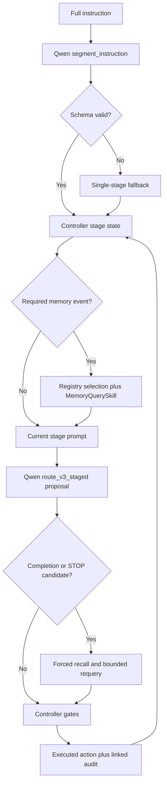
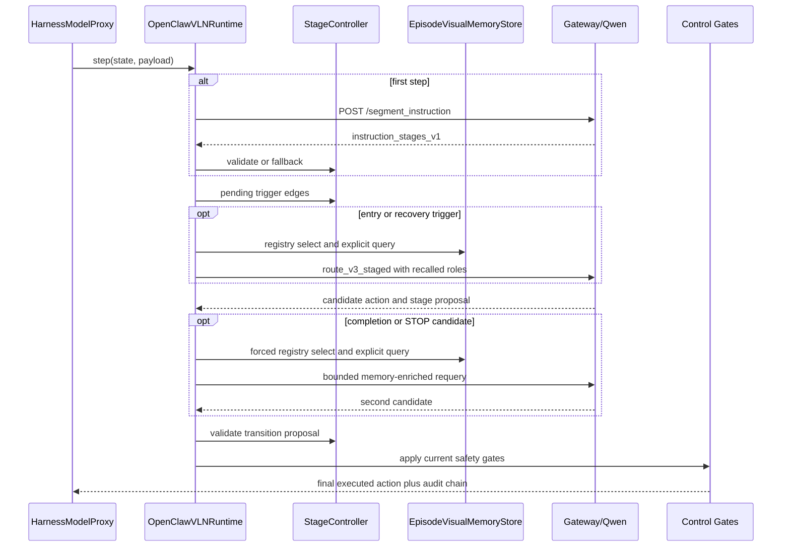

# Controller-Owned Staged Visual Memory Harness - Implementation Plan

## Goal Capsule

| Field | Value |
|---|---|
| Objective | Add an opt-in, controller-owned Qwen-direct harness that segments instructions once, forces event-driven visual-memory retrieval, validates stage progress without target distance, and proves which evidence reached and changed the executed action. |
| Product authority | Qwen owns semantic interpretation and proposals. The controller owns stage state, trigger scheduling, transition validation, STOP acceptance, and the final environment action. |
| Execution profile | Implement behind `staged_visual_memory_enabled=false`; preserve the current `route_v2` path and introduce strict `route_v3_staged` only for the new mode. Use a separate ablation-only treatment switch so memory-off keeps the same staged controller. |
| Stop conditions | Stop implementation if any online control path requires `distance_to_goal`, success, target coordinates, a reference path, or raw chain-of-thought. Do not substitute prompt claims for trigger or execution evidence. |
| Tail ownership | The implementer owns code, focused tests, launcher wiring, one-episode smoke, fixed-key comparison tooling, and share-safe audit validation. |
| Launch blockers | None. Provider and GPU availability affect running the final evaluation, not implementation readiness. |

This is a new implementation artifact. The requirements-only source document remains unchanged. The Product Contract below preserves its authority model and scope.

---

## Product Contract

### Summary

Build a controller-owned Qwen-direct harness with instruction stages and two layers of visual memory. At defined navigation events, the controller must force visual-memory retrieval, inject labeled floorplan, current-view, and historical evidence into Qwen thinking, validate the result, and record whether memory reached or changed the executed action.

### Problem Frame

The current Qwen-direct path can attach a goal-free floorplan, current RGB, and episode-local historical image roles, and it can expose whether Qwen thinking ran. That proves visual evidence reached the provider, but it does not prove an explicit memory-retrieval path participated: recent traces can attach historical evidence while reporting `memory_context_used=false`.

The full natural-language instruction also remains the main task unit throughout navigation. Without controller-owned stages, Qwen can conflate seeing a landmark with passing it, carry completed clauses too long, or claim route completion from its own text rather than grounded evidence.

Prompt wording alone cannot guarantee memory use or safe progression. The harness needs deterministic trigger authority and an audit chain connecting the trigger, recalled evidence, provider input, candidate action, controller decision, and environment action.

### Key Decisions

- **Use two visual-memory layers.** (session-settled: user-directed — the registry supplies fast episode evidence while explicit retrieval makes memory use independently auditable.)
- **Segment once at episode start with Qwen.** (session-settled: user-directed — a strict contract and single-stage fallback bound online semantic decomposition.)
- **Let the controller validate stage completion.** (session-settled: user-directed — seeing or naming a landmark is not sufficient evidence that the route clause is complete.)
- **Force memory on stage and recovery events.** (session-settled: user-directed — stage entry, completion candidate, no-progress, turn-loop, and STOP candidate are mandatory trigger classes.)
- **Keep online control fully distance-free.** (session-settled: user-directed — target distance must not affect prompts, transitions, recall, STOP, or actions, including debug mode.)
- **Prove use with traces and counterfactual comparisons.** (session-settled: user-directed — step evidence, matched runs, and same-state shadow replay are all required.)

### Actors

- A1. **Qwen segmenter and policy** proposes ordered stages and bounded action-stage objects from labeled evidence.
- A2. **Harness controller** owns stage lifecycle, event triggers, validation, safety gates, and the final action.
- A3. **Visual-memory system** maintains an episode registry and performs explicit image-backed retrieval with provenance.
- A4. **Evaluation and audit layer** records online proof and performs matched and same-state comparisons without changing the live trajectory.

### Key Flow



- F1. Initialize instruction stages once at episode start, validating the structured proposal or falling back to the full instruction as one stage.
- F2. Navigate using the immutable full instruction plus controller-selected active stage, without allowing Qwen to mutate stage state.
- F3. Force both registry selection and explicit image-backed retrieval on stage entry, completion proposal, no-progress, turn loop, and STOP proposal.
- F4. Accept, reject, or defer a stage transition using current RGB, historical evidence, executed motion, and transition-specific landmark relations.
- F5. Force final-stage recall before applying semantic and structural STOP gates, with no target-distance input.

### Requirements

**Instruction-stage contract**

- R1. Request one ordered stage decomposition at episode start and do not repeat it during ordinary steps.
- R2. Bound every stage by route clause, expected landmarks, transition type, completion cues, and final-stage status.
- R3. Reject malformed, empty, reordered, duplicated, excessive, or unsupported stage output and fall back to one stage containing the original instruction.
- R4. Keep the original instruction immutable and auditable while using the active stage as the controller progress unit.
- R5. Allow Qwen to propose completion, but allow only the controller to update the active stage.

**Two-layer visual memory**

- R6. Maintain a bounded episode-local registry of labeled observations with action, pose-progress, stage, and provenance context.
- R7. Perform an explicit image-backed query whose result identifies recalled records and source images.
- R8. Attempt registry selection and explicit retrieval for every forced-memory event, even if either layer returns no evidence.
- R9. Rank evidence for the active stage and trigger reason without goal coordinates, paths, success labels, or target distance.
- R10. Deduplicate identical images while retaining every role and provenance link.
- R11. Record empty, failed, retried, and suppressed retrieval states explicitly.

**Controller authority and triggers**

- R12. Force memory retrieval on stage entry, stage-completion proposal, lack of progress, turn loop, and STOP proposal.
- R13. Do not let Qwen suppress, defer, or acknowledge a required retrieval as completed.
- R14. Bound repeated retrieval with controller-owned coalescing, cooldown, retry, and cap rules that always emit a suppression reason.
- R15. Require transition-specific evidence; current visibility alone cannot prove passed, entered, exited, or reached.
- R16. Retain controller authority over transition, recovery, structural arrival, STOP, and final environment action.

**Prompt and thinking contract**

- R17. Distinguish full instruction, active stage, completed stages, pending stages, trigger reasons, and requested evidence in the prompt.
- R18. Give every image a controlled role and keep the final current RGB authoritative for immediate motion feasibility.
- R19. Keep floorplan input goal-free and path-free and label it as coarse privileged map-and-pose context.
- R20. Record provider thinking controls and whether thinking was accepted and exercised, without storing reasoning text.
- R21. Require bounded structured outputs and use safe fallback paths instead of parsing free-form reasoning.

**Audit and causal proof**

- R22. Link trigger, stage, query, memory IDs, image roles, provider call, candidate action, controller decision, and executed action with one event ID.
- R23. Distinguish selection, attachment, proposal, intervention, and execution as separate trace facts.
- R24. Report trigger, retrieval, provider-delivery, candidate-change, and executed-action-change coverage.
- R25. Compare memory-on and memory-off runs on the same frozen episode keys and matched settings.
- R26. Shadow replay a predeclared subset of triggered states with identical non-memory inputs.
- R27. Keep shadow replay outside online memory, stage state, controller state, and navigation metrics.

**Non-oracle and compatibility boundaries**

- R28. Keep `distance_to_goal`, success, SPL, oracle success, target coordinates, reference paths, and shortest-path information out of online prompts and decisions.
- R29. Permit oracle metrics only in diagnostics and final evaluation artifacts, with audit proof that they were not decision inputs.
- R30. Preserve current Qwen-direct map, motion, thinking, schema, and STOP behavior when the new mode is disabled.
- R31. Exclude raw reasoning, image bytes, credentials, full provider payloads, and unsanitized provider errors from default artifacts.

### Acceptance Examples

- AE1. A valid multi-clause instruction is segmented once, stage zero becomes active, and the immutable original instruction remains in audit state.
- AE2. Invalid segmentation yields a single full-instruction stage and a bounded fallback category rather than an aborted episode.
- AE3. Stage entry attempts both memory layers before the first action for that stage, unless a controller suppression record explains why.
- AE4. Successful forced retrieval attaches provenance-labeled history alongside the goal-free floorplan and final current RGB.
- AE5. A visible doorway ahead does not complete a pass or enter stage until motion and relation evidence satisfy the controller rule.
- AE6. A turn-loop trigger cannot be bypassed by Qwen and leads to a controller-owned recovery decision.
- AE7. A STOP proposal without final-stage structural evidence is blocked without consulting `distance_to_goal`.
- AE8. Thinking-enabled responses retain only bounded final fields and thinking counters.
- AE9. A reviewer can follow one `memory_event_id` from trigger through final environment action.
- AE10. Shadow replay masks memory roles from a frozen state and cannot write to live state or metrics.
- AE11. Oracle-field scans find no prohibited input in prompts, stage state, memory records, or share-safe traces.

### Success Criteria

- Every episode has valid controller-owned stage state or a recorded single-stage fallback.
- Every required event has a two-layer memory attempt or a controller suppression record.
- Every memory-assisted call proves recalled IDs, attached roles, current-image-last ordering, provider status, and final action source.
- No online control artifact consumes prohibited oracle fields.
- Fixed-key memory-on/off output reports navigation metrics, provider validity, latency, trigger coverage, retrieval coverage, and interventions.
- Predeclared shadow states report action and stage-proposal agreement without trajectory contamination.
- Visual-memory impact claims require both execution proof and a matched or shadow decision difference.

### Scope Boundaries

In scope: online Qwen segmentation, controller stage state, dual episode memory, forced triggers, goal-free map and current/history image prompts, bounded thinking outputs, audits, matched comparisons, and offline shadow replay.

Out of scope: training or fine-tuning, distance-based early stop, goal/path oracle input, every-step explicit retrieval, model-owned stage mutation, raw chain-of-thought persistence, a general rewrite of `runtime.py`, or replacement of the current memory service.

### Dependencies and Assumptions

- The Qwen provider continues to accept labeled image attachments and provider-level thinking controls.
- The existing floorplan remains a privileged navmesh-and-simulator-pose input and is reported as such.
- Current RGB, keyframes, map context, motion feedback, controller gates, and trace logger remain available.
- The fixed evaluation episode list is frozen before treatment results are inspected.

---

## Planning Contract

### Key Technical Decisions

#### KTD1. Ship as an isolated opt-in path

Add `HarnessConfig.staged_visual_memory_enabled` with a default of `False`. The disabled branch must continue using the current `route_v2`, visual registry, context-engine merge, requery gates, and trace schema unchanged. This contains regression risk in the already-modified Qwen-direct runtime.

Add `staged_memory_treatment` with values `on` and `off_ablation`; it is valid only when the staged harness is enabled and defaults to `on`. `off_ablation` keeps segmentation, stage state, current RGB, goal-free map, motion feedback, provider settings, and controller gates identical while masking both historical registry evidence and explicit retrieval from Qwen and from transition validation. It records `treatment_disabled_for_ablation` at every otherwise-required event. This switch is an explicitly non-conformant control arm for R8/R12 causal evaluation, not a production mode, and must not become a runtime bypass for mandatory recall.

#### KTD2. Use a separate segmentation request and schema

Add `OpenClawGatewayClient.segment_instruction()` and `POST /segment_instruction` to the existing `gateway_server.py` process. The runtime invokes it once on the first step after `reset_episode`; the request is text-only and contains the immutable instruction plus scene/episode identifiers, not live metrics or images.

The endpoint inherits the existing repo-local gateway trust boundary and is not a new public service. Staged launchers must bind it to loopback. Enabling staged mode with a non-loopback adapter host must fail preflight unless a future authenticated deployment contract is implemented. Bound the request body to 64 KiB and the instruction to 4096 characters before provider invocation; reject invalid JSON, arrays, empty instruction, and excess input with a sanitized 4xx response. Give segmentation a separate 120-second default timeout so the evaluator's long action-planning timeout cannot stall episode initialization indefinitely.

Expose a mandatory staged capability contract in `/health`: `instruction_segmentation=true`, `stage_schema_versions=["instruction_stages_v1"]`, `action_schema_versions` containing `route_v3_staged`, `active_stage_schema="instruction_stages_v1"`, and `active_action_schema` equal to the configured Qwen output schema. Extend the preflight checker with required active stage/action schema arguments and fail before evaluation if the adapter merely supports but is not currently configured for the requested schemas.

The strict `instruction_stages_v1` response is:

```json
{
  "schema_version": "instruction_stages_v1",
  "stages": [
    {
      "order": 0,
      "route_clause": "walk through the doorway",
      "transition_type": "enter",
      "expected_landmarks": ["doorway"],
      "completion_cues": ["threshold crossed"],
      "final_stage": true
    }
  ]
}
```

Allow 1-12 stages. Require contiguous zero-based order, exactly one final stage at the end, non-empty unique route clauses, one supported transition type, at most four landmarks, and at most three completion cues. Bound each clause to 240 characters and each landmark or cue to 96 characters. The controller assigns stable `stage_00` IDs; provider IDs are not trusted. Any parse, transport, schema, or semantic failure creates one `traverse` stage containing the original instruction and records a sanitized fallback category.

For matched causal evaluation, generate `staged_stage_plan_manifest_v1` once before either treatment arm by calling the same Qwen segmentation endpoint for the frozen episode keys. Each row stores the episode key, `instruction_sha256`, normalized stages, `stage_plan_sha256`, model/prompt/schema fingerprint, and generation status. Both arms still request segmentation at episode start, but an evaluation-only gateway option returns the matching frozen Qwen plan instead of invoking Qwen again. Missing keys, instruction-hash mismatch, invalid rows, or stage-hash mismatch fail the arm rather than falling back silently. Production and smoke runs omit the manifest and continue using live one-time Qwen segmentation.

#### KTD3. Introduce `route_v3_staged` without loosening `route_v2`

Keep the exact-field `route_v2` parser untouched. Add `route_v3_staged`, consisting of all current `route_v2` fields plus:

```json
{
  "active_stage_id": "stage_00",
  "stage_complete_candidate": false,
  "stage_relation": "before|at|inside|past|outside|unknown",
  "stage_evidence_refs": ["current", "registry:obs_0004", "memory:mem_000003"]
}
```

Require exact fields, bounded strings, at most six evidence references, and an exact match between `active_stage_id` and controller prompt state. Invalid staged output follows the existing one-repair limit; a second failure returns the existing safe provider failure path and cannot advance a stage.

#### KTD4. Share one episode visual store across registry and explicit query

Create `EpisodeVisualMemoryStore` and inject one instance into `MemoryManager` and `OpenClawVLNRuntime`. The store is the bounded episode-local source of image-backed records. It exposes two different operations over the same audited records:

- `select_registry_evidence(...)` for deterministic recency, role, and stage selection.
- `query_semantic(...)` through `MemoryQuerySkill` for explicit stage-aware retrieval.

`MemoryManager.recall()` merges episode-store hits before optional external-backend hits, deduplicates by canonical image path, and retains source provenance. This makes the default `HARNESS_MEMORY_BACKEND=fake` incapable of fabricating visual-memory success: fake hits without image paths remain identifiable and cannot satisfy image-backed retrieval coverage. Continue mirroring promoted records into `MemoryAwareContextEngine` for durable artifacts, but do not treat an automatic context merge as proof of a forced query.

Store at most 64 records per episode by default. Query at most four records, select at most two registry candidates, then deduplicate and attach at most the existing `max_memory_images` historical images. Every record contains `memory_id`, image path, scene/episode/step, stage ID, visual summary, landmarks, action before/after capture, odometry snapshot, image role, and provenance. Reset the store on `start_episode`/`reset_episode`.

#### KTD5. Put stage state and transition validation outside the large runtime

Create `instruction_stages.py` with immutable stage definitions, mutable episode stage state, schema validation, and single-stage fallback. Create `stage_validation.py` with a pure `StageTransitionValidator`. The runtime orchestrates these modules but does not embed their rules as another large conditional block.

The validator returns `accepted`, `rejected`, or `needs_verification` plus rule IDs and evidence references. It rejects any evidence reference that is absent from the controller-owned attachment manifest. The controller does not introduce a second visual model or interpret pixels independently: Qwen owns visual-semantic claims, while the controller verifies that cited current/history images were actually attached, that their provenance and stage match, and that the claim agrees with executed motion and deterministic transition rules. It requires a Qwen completion candidate and applies a transition matrix:

| Transition | Minimum controller evidence |
|---|---|
| `turn` | Executed heading change since stage entry plus stage-consistent current relation. |
| `approach` | Current landmark evidence, relation `at`, `inside`, or an explicitly grounded completion cue, plus executed progress from the stage anchor. |
| `pass` | Landmark was previously/currently grounded, relation is `past`, and translation continued after first grounding. |
| `enter` | Threshold landmark was grounded, relation is `inside`, and post-threshold executed translation exists. |
| `exit` | Interior/threshold evidence was grounded, relation is `outside`, and post-threshold executed translation exists. |
| `traverse` | At least one completion cue is grounded and executed progress occurred after stage entry. |
| `final_arrival` | Final-stage candidate plus existing semantic and structural STOP gates; visibility alone is insufficient. |

Use existing odometry deltas and executed-action history only. Put numeric minima in config (`stage_min_translation_m=0.25`, `stage_min_heading_change_deg=15.0`) so unit tests can exercise boundaries. These are progress checks, not goal-distance checks.

#### KTD6. Model forced recall as edge-triggered controller events

Create `staged_visual_memory.py` with trigger enums, event coalescing, query construction, retry policy, and audit records. Required trigger classes are `stage_entry`, `stage_completion_candidate`, `no_progress`, `turn_loop`, and `stop_candidate`.

- A new condition edge always creates an event.
- Multiple reasons on one step coalesce into one event with all reasons; priority is STOP, stage completion, recovery, then stage entry.
- Registry selection and `MemoryQuerySkill` are attempted independently for every event.
- One transient query retry is allowed; schema-empty results are not retried.
- A sticky recovery condition can retrigger after three steps; repeated same-step calls are suppressed.
- Stop and completion candidates are not hidden by recovery cooldown, but can join the same event.
- Cap events at 64 per episode. Later required events produce `suppressed:event_cap` records and still pass through ordinary safety gates.
- At most one memory-enriched Qwen requery occurs per environment step.

The query combines active route clause, expected landmarks, completion cues, trigger reasons, current visual summary, and stage relation. It never uses the complete evaluation metrics dictionary.

#### KTD7. Validate candidate events in a two-pass decision sequence

Stage entry and recovery events enrich the first policy call. Stage-completion and STOP candidates arise from the first policy proposal, so the controller must force retrieval and issue one memory-enriched requery before validation and final gating. The controller validates the second proposal, while the audit preserves both candidates.

If retrieval or requery fails, stage state does not advance. Existing STOP and forward-stall gates still run and choose the final safe action. Qwen output cannot directly write `active_stage_index`, completed stages, trigger state, or executed action.

#### KTD8. Capture shadow inputs online and replay them offline

Write a sanitized snapshot before each selected memory-enriched provider call, whether memory is attached to the first call for stage-entry/recovery events or to a requery for completion/STOP events. A predeclared shadow manifest lists episode keys and trigger classes; within each episode, select the first observed event of each listed trigger class, capped at five events. Eligibility necessarily follows the pre-memory trigger proposal for `stage_completion_candidate` and `stop_candidate`; after that event exists, selection depends only on scene, episode, step, and trigger class and never on the memory-enriched response, executed action, or navigation outcome.

Snapshots contain the sanitized bounded prompt fields, the full controlled image-role/path manifest, a derived non-memory role mask, model/schema/thinking configuration fingerprint, stage state, and the primary event ID. They omit credentials, request headers, image bytes, raw provider payloads, raw reasoning, and oracle metrics. `scripts/replay_staged_visual_memory_shadow.py` reconstructs both memory-on and memory-masked `/plan` requests, writes to a separate shadow directory, and never imports or mutates live runtime state.

Run two offline replicas per arm for every selected state. Count `stable_memory_associated_change` only when both memory-on replicas agree with each other, both memory-off replicas agree with each other, the action or stage proposal differs between arms, and the provider/model/schema/thinking fingerprints match. Report disagreeing replicas as `provider_unstable` and exclude them from causal-change counts. Shadow output describes candidate-action and stage-proposal counterfactuals only; it must not label an unexecuted replay action as an environment-action counterfactual.

#### KTD9. Extend existing comparison and trace conventions

Keep `HarnessLogger` as the step-level sink and add one `staged_visual_memory` object to runtime metadata. Extend `scripts/compare_qwen_direct_policy_results.py` with `comparison_type=staged_memory` in the existing ablation manifest instead of creating a second incompatible matched-run report. Preserve the current 2x2 behavior when `comparison_type` is absent or `dynamic_thinking_2x2`. Add a separate shadow replay script because it performs provider calls, while the comparator remains read-only.

The staged comparator requires `staged_memory_off` and `staged_memory_on` arms, an explicit frozen episode-key list, the shared stage-plan manifest, and per-arm result/trace paths. It rejects duplicate or missing episode keys, different instruction/stage-plan hashes, unequal provider configuration fingerprints, unexpected treatment values, provider-invalid traces, incomplete results, and primary-output paths modified by shadow replay.

### High-Level Technical Design



### Audit Data Contract

Each triggered step adds the following share-safe shape to `runtime_metadata` and therefore to `harness_traces/harness_trace_rank0.jsonl`:

```json
{
  "staged_visual_memory": {
    "stage_schema_version": "instruction_stages_v1",
    "action_schema_version": "route_v3_staged",
    "segmentation_source": "live_qwen|frozen_qwen_manifest|single_stage_fallback",
    "instruction_sha256": "hex",
    "stage_plan_sha256": "hex",
    "provider_config_sha256": "hex",
    "active_stage_id": "stage_02",
    "memory_event_id": "scene:episode:step:ordinal",
    "trigger_reasons": ["stop_candidate"],
    "registry_status": "hit|empty|failed|suppressed|disabled_ablation",
    "query_status": "hit|empty|failed|retried|suppressed|disabled_ablation",
    "query_text": "bounded text",
    "selected_memory_ids": ["mem_000003"],
    "attached_image_roles": ["map_view", "retrieved_memory", "current"],
    "provider_call_ids": ["primary", "memory_requery"],
    "candidate_action_before": "STOP",
    "candidate_action_after": "TURN_LEFT",
    "stage_candidate_before": true,
    "stage_candidate_after": false,
    "transition_decision": "rejected",
    "transition_rule_ids": ["enter_requires_inside_relation"],
    "controller_intervention": "blocked_stop",
    "executed_action": "TURN_LEFT",
    "oracle_fields_used": false
  }
}
```

The trace may store bounded captions and artifact paths, but not base64 images, full request JSON, headers, tokens, or reasoning text.

### Sequencing and Constraints

1. Land data types, config, and store interfaces before changing gateway or runtime behavior.
2. Land strict gateway schemas and unit tests before runtime calls them.
3. Integrate stage initialization, then forced triggers, then transition validation.
4. Add audit snapshots and comparison tooling only after event IDs and stage IDs are stable.
5. Keep the feature off through unit and regression work; enable it only in staged-mode integration tests and smoke launchers.
6. Do not refactor unrelated current dirty-worktree changes. Edit only the named seams and preserve existing behavior when the flag is off.

### Risks and Mitigations

| Risk | Mitigation |
|---|---|
| Segmentation latency delays episode start | One text-only request per episode, strict timeout, immediate single-stage fallback. |
| Event requery doubles provider calls | Edge-triggering, same-step coalescing, one requery per step, explicit event cap. |
| Fake backend produces misleading recall | Only image-backed episode-store hits count as visual retrieval; report backend-only hits separately. |
| Qwen self-reports stage completion | Controller validator requires grounded relation and executed progress. |
| Added fields break `route_v2` | New exact `route_v3_staged`; disabled mode never requests it. |
| Shadow replay contaminates live state | File-based sanitized snapshots and a separate offline process/output directory. |
| Oracle metrics leak from Habitat payloads | Reuse `strip_oracle_fields`, add explicit forbidden-key tests and artifact scans. |
| New segmentation endpoint is exposed beyond the evaluator host | Reuse the existing server, require loopback in staged preflight, bound request size, and reject non-local staged startup without a future authenticated contract. |
| Existing runtime grows further | Put stage, validation, store, and trigger logic in new focused modules. |

---

## Implementation Units

### U1. Add staged-mode configuration and shared contracts

**Goal:** Define opt-in configuration, strict data types, defaults, and validation without changing runtime behavior.

**Requirements:** R1-R5, R14, R28-R31.

**Dependencies:** None.

**Files:**

- Modify `src/harness/config.py`.
- Modify `src/evaluation_harness.py` argument/config/component wiring.
- Create `src/harness/openclaw/instruction_stages.py`.
- Create `src/harness/openclaw/stage_validation.py`.
- Create `tests/test_instruction_stages.py`.
- Create `tests/test_stage_validation.py`.

**Approach:** Add the staged flag, the evaluation-only `staged_memory_treatment`, and bounded defaults from KTD2, KTD5, and KTD6. Implement dataclasses/enums for `InstructionStage`, `EpisodeStageState`, transition type, transition result, and fallback category. Keep parsing pure and deterministic. Add an explicit forbidden-oracle-key assertion helper for staged controller inputs.

**Test scenarios:** Valid 1/12-stage boundaries; 0/13-stage fallback; non-contiguous order; duplicate clauses; incorrect final flag; overlong fields; unsupported transition; fallback preservation of original instruction; validator accept/reject/needs-verification per transition; oracle-key rejection.

**Verification:** `PYTHONPATH=src:. pytest -q tests/test_instruction_stages.py tests/test_stage_validation.py tests/test_harness_types.py`.

### U2. Build the bounded episode visual store and explicit image retrieval

**Goal:** Make registry selection and `MemoryQuerySkill` use the same image-backed episode records with separate auditable operations.

**Requirements:** R6-R11, R22-R24, R28, R31.

**Dependencies:** U1.

**Files:**

- Create `src/harness/memory/episode_visual_store.py`.
- Modify `src/harness/memory/memory_manager.py`.
- Modify `src/harness/skills/memory_query.py`.
- Modify `src/evaluation_harness.py` component injection.
- Modify `src/harness/openclaw/runtime.py` visual record mirroring.
- Create `tests/test_episode_visual_store.py`.
- Extend `tests/test_memory_manager.py` and `tests/test_openclaw_runtime_bridge.py`.

**Approach:** Implement episode reset, bounded writes, canonical-path deduplication, registry selection, stage-aware semantic scoring, and conversion to `MemoryHit`. Rank exact stage/landmark overlap first, then trigger relevance, importance, and recency. Merge episode hits ahead of external hits and retain all provenance roles. Preserve the current context-engine mirror and existing memory backend behavior outside staged mode.

**Test scenarios:** Episode isolation; capacity eviction; same-path role merge; stage-aware ranking; image-backed hit proof; fake text-only hit does not count as visual recall; independent registry/query attempt statuses; reset on episode boundary; no goal or distance field accepted.

**Verification:** `PYTHONPATH=src:. pytest -q tests/test_episode_visual_store.py tests/test_memory_manager.py tests/test_spatial_memory_client.py tests/test_openclaw_runtime_bridge.py`.

### U3. Add segmentation and staged action schemas to the gateway

**Goal:** Give the existing gateway strict, bounded APIs for one-time instruction segmentation and staged action proposals.

**Requirements:** R1-R5, R17-R21, R28, R31.

**Dependencies:** U1.

**Files:**

- Modify `src/harness/openclaw/gateway.py`.
- Modify `src/harness/openclaw/gateway_server.py`.
- Modify `src/harness/openclaw/openclaw_cli_plan_gateway.py`.
- Extend `scripts/check_openclaw_plan_gateway.py` to require staged capability and schema metadata.
- Extend `tests/test_openclaw_gateway.py`.
- Extend `tests/test_openclaw_gateway_server.py`.
- Extend `tests/test_openclaw_cli_plan_gateway.py`.

**Approach:** Route `/segment_instruction` in the existing HTTP handler, enforce the loopback/body/input contract from KTD2, add text-only payload sanitization, strict `instruction_stages_v1`, one bounded repair, and sanitized fallback categories. Advertise stage/action schemas through `/health` and require them in staged preflight. Support the evaluation-only frozen stage-plan manifest with strict instruction and plan hashes. Add exact `route_v3_staged` prompt/parser/normalizer while leaving `route_v2` constants and tests unchanged. Include stage state and trigger/evidence requests in the direct prompt. Preserve provider-level thinking controls and image-order proof; do not emit reasoning content.

**Test scenarios:** Correct segmentation endpoint payload; strict field and length failures; single repair then failure; no image attachment on live segmentation; health capability presence; supported-but-inactive schema rejection; frozen-manifest success; missing episode/instruction-hash/stage-hash failures; `route_v2` unchanged; `route_v3_staged` exact fields; mismatched active stage rejected; current RGB remains final; map and memory roles remain controlled; forbidden keys and reasoning content removed.

**Verification:** `PYTHONPATH=src:. pytest -q tests/test_openclaw_gateway.py tests/test_openclaw_gateway_server.py tests/test_openclaw_cli_plan_gateway.py` and `PYTHONPATH=src python -m py_compile src/harness/openclaw/gateway.py src/harness/openclaw/gateway_server.py src/harness/openclaw/openclaw_cli_plan_gateway.py`.

### U4. Implement controller-owned stage lifecycle

**Goal:** Initialize stages once, expose bounded stage context to Qwen, and advance only through controller validation.

**Requirements:** R1-R5, R15-R18, R21, R28-R30.

**Dependencies:** U1 and U3.

**Files:**

- Modify `src/harness/openclaw/runtime.py`.
- Modify `src/evaluation_harness.py` episode reset/runtime payload path.
- Extend `tests/test_openclaw_runtime_bridge.py`.
- Extend `tests/test_evaluation_harness_openclaw_runtime.py`.

**Approach:** On the first step, call `segment_instruction`, install valid or fallback state, and set a pending stage-entry edge. Attach immutable instruction, active/completed/pending stages, and controller evidence request to the runtime payload. After a staged proposal, invoke the pure validator; only an accepted result increments the index and schedules the next stage-entry event. Preserve stage state across Qwen requery but reset it at episode boundaries.

**Test scenarios:** One segmentation call per episode; fallback continues navigation; no re-segmentation after planner errors; Qwen cannot change index; unknown or unattached evidence references are rejected; visibility-plus-motion without an accepted relation does not complete `approach`; rejected candidate retains stage; accepted candidate advances exactly once; next step gets stage-entry trigger; disabled mode performs no staged calls and produces unchanged schema metadata.

**Verification:** `PYTHONPATH=src:. pytest -q tests/test_openclaw_runtime_bridge.py tests/test_evaluation_harness_openclaw_runtime.py tests/test_instruction_stages.py tests/test_stage_validation.py`.

### U5. Integrate forced events, two-pass recall, and final control gates

**Goal:** Guarantee both memory operations at every required event and connect memory-enriched Qwen proposals to the executed action.

**Requirements:** R8, R11-R16, R22-R24, R28-R31.

**Dependencies:** U2 and U4.

**Files:**

- Create `src/harness/openclaw/staged_visual_memory.py`.
- Modify `src/harness/openclaw/runtime.py`.
- Reuse without weakening `src/harness/openclaw/control_gates.py`.
- Extend `tests/test_openclaw_runtime_bridge.py`.
- Create `tests/test_staged_visual_memory.py`.

**Approach:** Detect stage-entry state, existing no-progress/forward-stall signals, existing turn-loop feedback, completion candidate, and STOP candidate. Apply KTD6 coalescing and retry. For post-proposal candidates, save the first proposal, perform both memory operations, attach selected evidence, issue one requery, validate the second proposal, then run existing gates. Construct queries from stage state rather than the full instruction alone. In `off_ablation`, create the same events and stage/controller sequence but record the treatment-disabled status and supply no historical registry or explicit-query evidence to either Qwen or the transition validator.

**Test scenarios:** All five trigger classes; multiple reasons coalesce; both layers attempted when either is empty/fails; transient retry once; sticky cooldown and event cap produce suppression records; one requery maximum; recall changes candidate but controller still controls final action; failed recall cannot advance stage; STOP remains distance-free; disabled mode preserves current requery behavior.

**Verification:** `PYTHONPATH=src:. pytest -q tests/test_staged_visual_memory.py tests/test_openclaw_runtime_bridge.py tests/test_qwen_direct_control_gates.py tests/test_memory_manager.py`.

### U6. Add linked trace records and sanitized shadow snapshots

**Goal:** Produce step-level proof and frozen non-mutating inputs for counterfactual replay.

**Requirements:** R20, R22-R24, R26-R31.

**Dependencies:** U5.

**Files:**

- Modify `src/harness/openclaw/runtime.py` metadata construction.
- Modify `src/harness/logging/harness_logger.py` only if current JSON-safe serialization cannot carry the new object.
- Create `src/harness/openclaw/shadow_snapshot.py`.
- Create `tests/test_shadow_snapshot.py`.
- Extend `tests/test_openclaw_runtime_bridge.py` and logging tests.

**Approach:** Generate stable stage/event IDs and instruction/stage/provider fingerprints, emit the Audit Data Contract, and write selected snapshot JSON under `OUTPUT_PATH/harness_traces/shadow_inputs/`. Store the bounded full image-role manifest plus its non-memory mask. Write a `shadow_manifest.jsonl` row for every eligible event, including selected/not-selected reason. Run the existing sanitizer and an explicit allowlist before writing.

**Test scenarios:** Full ID chain; selection/attachment/proposal/intervention/execution facts remain distinct; snapshot selection occurs before the memory-enriched response and is independent of executed action/outcome; full and masked role manifests reconstruct deterministically; no image bytes, credentials, oracle metrics, raw errors, or reasoning text; trace serialization survives empty, failed, and ablation-disabled retrieval.

**Verification:** `PYTHONPATH=src:. pytest -q tests/test_shadow_snapshot.py tests/test_openclaw_runtime_bridge.py tests/test_harness_logger.py`.

### U7. Wire launchers, offline shadow replay, and matched comparison

**Goal:** Make the mode runnable and its causal evidence reportable from checked-in commands.

**Requirements:** R24-R31.

**Dependencies:** U3 and U6.

**Files:**

- Modify `scripts/run_qwen.sh`.
- Modify `scripts/evaluation_openclaw_gateway.sh`.
- Create `scripts/run_staged_memory_ablation.sh`.
- Create `scripts/generate_qwen_stage_plan_manifest.py`.
- Create `scripts/replay_staged_visual_memory_shadow.py`.
- Modify `scripts/compare_qwen_direct_policy_results.py`.
- Extend `tests/test_evaluation_scripts.py`.
- Extend `tests/test_compare_qwen_direct_policy_results.py`.
- Create `tests/test_generate_qwen_stage_plan_manifest.py`.
- Create `tests/test_replay_staged_visual_memory_shadow.py`.

**Approach:** Add launcher variables for the staged flag, ablation-only memory treatment, stage-plan manifest, thresholds, event limits, and shadow manifest. When staged mode is enabled, require `OPENCLAW_QWEN_OUTPUT_SCHEMA=route_v3_staged`, dynamic visual context, and advertised gateway capabilities. Add a stage-plan capture command that reads the selected dataset instructions, calls `/segment_instruction`, and writes the hashed manifest before either arm. Keep existing ablation profiles unchanged; add `staged_memory_on` and `staged_memory_off` profiles that both enable the staged harness, load the same stage-plan manifest, and differ only by `staged_memory_treatment=on|off_ablation`. Replay two replicas for each memory-on and memory-off shadow arm into a separate output directory. Extend exact-key comparison with stage hashes, trigger, recall, delivery, intervention, provider stability, and shadow agreement metrics.

**Test scenarios:** Shell variable propagation; invalid schema/mode/capability combination fails early; deterministic stage-manifest generation; on/off profiles share exact instruction/stage hashes and differ only in staged memory treatment; exact episode-key or fingerprint mismatch fails comparison; legacy 2x2 manifests remain compatible; partial runs are labeled incomplete; stable and unstable shadow replicas are distinguished; replay cannot write into the primary result path; summary counts reconcile to event rows.

**Verification:** `bash -n scripts/run_qwen.sh scripts/evaluation_openclaw_gateway.sh scripts/run_staged_memory_ablation.sh`; `PYTHONPATH=src:. pytest -q tests/test_evaluation_scripts.py tests/test_compare_qwen_direct_policy_results.py tests/test_generate_qwen_stage_plan_manifest.py tests/test_replay_staged_visual_memory_shadow.py`.

### U8. Run regression, smoke, and fixed-set evidence gates

**Goal:** Demonstrate compatibility, execution integrity, non-oracle behavior, and measurable memory participation.

**Requirements:** R1-R31 and AE1-AE11.

**Dependencies:** U1-U7.

**Files:** No production files expected; generated outputs live under distinct `results/` directories and must not replace prior runs.

**Approach:** Run the focused suite, then the existing Qwen-direct regression suite. Run one staged episode to validate artifacts. Freeze the existing six episode keys from `scripts/run_qwen.sh` before launching matched memory-on/off runs. Generate the staged comparison and offline shadow report. Treat provider-invalid or incomplete runs as failed evidence rather than zero-valued navigation results.

**Test scenarios:** One-episode live stage/trigger trace; fixed six-key stage-manifest capture; exact episode/instruction/stage/config alignment; memory-off has no explicit staged retrieval; memory-on has complete event chains; shadow outputs are isolated and classify provider instability; oracle scan passes; disabled regression output remains schema-compatible.

**Verification:** Use the commands in the Verification Contract. Archive the effective environment summary, episode keys, git commit, result paths, summary JSON, comparison JSON, and shadow summary.

---

## Verification Contract

### Static and focused checks

```bash
PYTHONPATH=src python -m py_compile \
  src/harness/openclaw/instruction_stages.py \
  src/harness/openclaw/stage_validation.py \
  src/harness/openclaw/staged_visual_memory.py \
  src/harness/memory/episode_visual_store.py \
  src/harness/openclaw/shadow_snapshot.py \
  src/harness/openclaw/gateway.py \
  src/harness/openclaw/gateway_server.py \
  src/harness/openclaw/runtime.py \
  src/harness/openclaw/openclaw_cli_plan_gateway.py

bash -n scripts/run_qwen.sh scripts/evaluation_openclaw_gateway.sh scripts/run_staged_memory_ablation.sh

PYTHONPATH=src:. pytest -q \
  tests/test_instruction_stages.py \
  tests/test_stage_validation.py \
  tests/test_episode_visual_store.py \
  tests/test_staged_visual_memory.py \
  tests/test_shadow_snapshot.py \
  tests/test_generate_qwen_stage_plan_manifest.py \
  tests/test_replay_staged_visual_memory_shadow.py
```

### Existing regression checks

```bash
PYTHONPATH=src:. pytest -q \
  tests/test_openclaw_map_context.py \
  tests/test_qwen_direct_control_gates.py \
  tests/test_openclaw_cli_plan_gateway.py \
  tests/test_openclaw_gateway.py \
  tests/test_openclaw_gateway_server.py \
  tests/test_openclaw_runtime_bridge.py \
  tests/test_evaluation_harness_openclaw_runtime.py \
  tests/test_memory_manager.py \
  tests/test_compare_qwen_direct_policy_results.py \
  tests/test_evaluation_scripts.py
```

The pre-plan baseline for the five principal Qwen-direct suites was 213 passing tests. The implemented branch must not reduce existing passing coverage.

### One-episode staged smoke

Use a new output directory and one frozen key. The implementation must support this checked-in command shape:

```bash
OPENCLAW_STAGED_VISUAL_MEMORY_ENABLED=1 \
OPENCLAW_DYNAMIC_VISUAL_CONTEXT_ENABLED=1 \
OPENCLAW_QWEN_OUTPUT_SCHEMA=route_v3_staged \
EPISODE_KEYS=2azQ1b91cZZ:11 \
HARNESS_DEBUG_MAX_EPISODES=1 \
OUTPUT_PATH=results/qwen_staged_memory_smoke_1ep \
MAX_STEPS=20 \
bash scripts/run_qwen.sh
```

Pass conditions:

- One segmentation request and valid/fallback stage state are present.
- Stage entry creates a memory event before the stage's first executed action.
- Every triggered event shows registry and explicit-query statuses.
- Current RGB is the final attached image for action feasibility.
- Candidate, controller, and executed actions are separately recorded.
- `summary.json` exists; provider-invalid output is not reported as a successful smoke.

### Fixed-set matched comparison

Freeze these keys before inspecting treatment output:

```text
2azQ1b91cZZ:10
2azQ1b91cZZ:11
2azQ1b91cZZ:12
2azQ1b91cZZ:16
2azQ1b91cZZ:70
2azQ1b91cZZ:1393
```

Capture the Qwen-generated stage plan before either treatment arm:

```bash
QWEN_STAGE_PLAN_CAPTURE=1 \
QWEN_ABLATION_PROFILE=staged_memory_on \
OPENCLAW_STAGED_VISUAL_MEMORY_ENABLED=1 \
OPENCLAW_QWEN_OUTPUT_SCHEMA=route_v3_staged \
OPENCLAW_STAGE_PLAN_MANIFEST_PATH=results/qwen_staged_stage_plan_6ep.json \
DATA_PATH=/ssd/dingmuhe/Embodied-task/JanusVLN/data/datasets/r2r/val_unseen/val_unseen.json.gz \
EPISODE_KEYS=2azQ1b91cZZ:10,2azQ1b91cZZ:11,2azQ1b91cZZ:12,2azQ1b91cZZ:16,2azQ1b91cZZ:70,2azQ1b91cZZ:1393 \
bash scripts/run_qwen.sh
```

Run the two arms with the same frozen stage plan:

```bash
QWEN_ABLATION_PROFILE=staged_memory_off \
OPENCLAW_STAGE_PLAN_MANIFEST_PATH=results/qwen_staged_stage_plan_6ep.json \
EPISODE_KEYS=2azQ1b91cZZ:10,2azQ1b91cZZ:11,2azQ1b91cZZ:12,2azQ1b91cZZ:16,2azQ1b91cZZ:70,2azQ1b91cZZ:1393 \
HARNESS_DEBUG_MAX_EPISODES=6 \
OUTPUT_PATH=results/qwen_staged_memory_off_6ep \
MAX_STEPS=200 \
bash scripts/run_qwen.sh

QWEN_ABLATION_PROFILE=staged_memory_on \
OPENCLAW_STAGE_PLAN_MANIFEST_PATH=results/qwen_staged_stage_plan_6ep.json \
EPISODE_KEYS=2azQ1b91cZZ:10,2azQ1b91cZZ:11,2azQ1b91cZZ:12,2azQ1b91cZZ:16,2azQ1b91cZZ:70,2azQ1b91cZZ:1393 \
HARNESS_DEBUG_MAX_EPISODES=6 \
OUTPUT_PATH=results/qwen_staged_memory_on_6ep \
MAX_STEPS=200 \
bash scripts/run_qwen.sh
```

`scripts/run_staged_memory_ablation.sh` must provide the equivalent one-command workflow and write this comparator manifest shape before invoking the comparator:

```bash
DATA_PATH=/ssd/dingmuhe/Embodied-task/JanusVLN/data/datasets/r2r/val_unseen/val_unseen.json.gz \
EPISODE_KEYS=2azQ1b91cZZ:10,2azQ1b91cZZ:11,2azQ1b91cZZ:12,2azQ1b91cZZ:16,2azQ1b91cZZ:70,2azQ1b91cZZ:1393 \
OPENCLAW_STAGE_PLAN_MANIFEST_PATH=results/qwen_staged_stage_plan_6ep.json \
STAGED_MEMORY_OFF_OUTPUT_PATH=results/qwen_staged_memory_off_6ep \
STAGED_MEMORY_ON_OUTPUT_PATH=results/qwen_staged_memory_on_6ep \
STAGED_MEMORY_COMPARISON_MANIFEST=results/staged_memory_ablation_manifest.json \
STAGED_MEMORY_COMPARISON_OUTPUT=results/staged_memory_ablation_comparison.json \
MAX_STEPS=200 \
bash scripts/run_staged_memory_ablation.sh
```

```json
{
  "comparison_type": "staged_memory",
  "stage_plan_manifest": "qwen_staged_stage_plan_6ep.json",
  "expected_episode_keys": [
    "2azQ1b91cZZ:10",
    "2azQ1b91cZZ:11",
    "2azQ1b91cZZ:12",
    "2azQ1b91cZZ:16",
    "2azQ1b91cZZ:70",
    "2azQ1b91cZZ:1393"
  ],
  "arms": {
    "staged_memory_off": {
      "result": "qwen_staged_memory_off_6ep/result.json",
      "trace": "qwen_staged_memory_off_6ep/harness_traces/harness_trace_rank0.jsonl",
      "treatment": "off_ablation"
    },
    "staged_memory_on": {
      "result": "qwen_staged_memory_on_6ep/result.json",
      "trace": "qwen_staged_memory_on_6ep/harness_traces/harness_trace_rank0.jsonl",
      "treatment": "on"
    }
  }
}
```

Generate the report with:

```bash
PYTHONPATH=src:. python scripts/compare_qwen_direct_policy_results.py \
  --ablation-manifest results/staged_memory_ablation_manifest.json \
  --output results/staged_memory_ablation_comparison.json
```

Both arms must enable the staged harness and use identical model, schema, thinking, map, motion, keyframe, max-step, episode, instruction hash, stage-plan hash, and provider configuration. The only treatment difference is `staged_memory_treatment=off_ablation|on`. The comparator must fail on any mismatch and report SR, SPL, NE, steps, latency, provider validity, segmentation source/fallback, trigger counts, registry hits, explicit-query image hits, provider delivery, candidate changes, controller interventions, and executed-action changes. Navigation deltas are treatment-associated matched outcomes; a causal decision-impact claim additionally requires stable shadow evidence.

### Shadow replay

```bash
PYTHONPATH=src:. python scripts/replay_staged_visual_memory_shadow.py \
  --manifest results/qwen_staged_memory_on_6ep/harness_traces/shadow_manifest.jsonl \
  --replicas_per_arm 2 \
  --output_path results/qwen_staged_memory_shadow
```

Pass conditions:

- The output path differs from the primary run.
- Replayed inputs match non-memory state and ordered non-memory images.
- Memory-on replicas retain the bounded memory-role manifest; memory-off replicas remove registry and retrieved-memory roles.
- The two replicas within each arm are classified as stable or `provider_unstable` before cross-arm differences are counted.
- Primary runtime traces and navigation metrics are byte-unchanged after replay.
- The report contains proposal/action agreement, `stable_memory_associated_change`, instability, and provider-validity counts by trigger class.

### Non-oracle and share-safe gate

Scan staged prompt snapshots, runtime traces, context memory, comparison output, and shadow output for prohibited fields and secrets. Diagnostic `result.json`/`summary.json` metrics may contain evaluation fields, but no event may mark them as used.

```bash
rg -n 'distance_to_goal|oracle_success|shortest_path|reference_path|target_coordinates|reasoning_content|authorization|api[_-]?key' \
  results/qwen_staged_memory_on_6ep/harness_traces \
  results/qwen_staged_memory_shadow
```

Expected result: no prohibited online input or secret. Any allowed diagnostic occurrence must be outside decision artifacts and accompanied by `oracle_fields_used=false`.

---

## Definition of Done

### Global completion criteria

- The new mode is opt-in and disabled behavior passes all existing Qwen-direct tests.
- A multi-stage instruction is segmented once or falls back safely without ending the episode.
- Only controller code mutates stage state or chooses the executed action.
- All five trigger classes attempt both memory layers under the documented coalescing and suppression rules.
- The memory-off ablation keeps the same staged controller and differs only by masking registry history and explicit retrieval from provider and transition-validation inputs.
- Explicit visual retrieval means at least one recalled hit with a real image path; fake text-only hits are reported separately.
- Stage and STOP decisions use only current/history visual evidence, executed actions, goal-free map context, and non-target odometry.
- The event audit chain is complete from trigger to environment action.
- Matched on/off comparison uses exact frozen keys and labels incomplete/provider-invalid runs.
- Shadow replay is isolated and reports same-state proposal differences.
- Default artifacts contain no raw reasoning, image bytes, credentials, full provider payloads, or prohibited oracle inputs.
- Abandoned experimental paths and duplicate helper code are removed before handoff.

### Per-unit completion criteria

- U1 is done when schemas, fallback, validation enums, and configuration boundaries pass their unit tests.
- U2 is done when one episode store supports bounded registry selection and image-backed `MemoryQuerySkill` retrieval with provenance.
- U3 is done when `/segment_instruction`, `instruction_stages_v1`, and `route_v3_staged` are strict while `route_v2` remains unchanged.
- U4 is done when stage initialization and controller-only transitions work across reset, failure, rejection, and acceptance paths.
- U5 is done when all forced triggers, two-pass recall, cooldown/cap records, and final gates are tested end to end.
- U6 is done when every event has a share-safe linked trace and selected states have immutable shadow snapshots.
- U7 is done when launchers, exact-key comparison, and offline replay have checked-in tests and usable commands.
- U8 is done when focused and regression suites pass and smoke/matched/shadow artifacts satisfy the verification gates.

---

## Appendix

### Current Code Seams

- `src/harness/openclaw/runtime.py:125` owns the current planner/tool/gate/action sequence.
- `src/harness/openclaw/runtime.py:2376` performs automatic `MemoryQuerySkill` recall but currently queries the full instruction and requires `recent_visual_memories`.
- `src/harness/memory/context_engine.py:54` automatically retrieves episode-local image records for planner context; this remains a persistence/context aid, not forced-recall proof.
- `src/harness/memory/memory_manager.py:56` builds query context and reranks hits.
- `src/harness/openclaw/gateway.py:64` defines the current `/plan` client boundary.
- `src/harness/openclaw/openclaw_cli_plan_gateway.py:1764` builds the direct Qwen prompt and image-role contract.
- `src/harness/openclaw/openclaw_cli_plan_gateway.py:3338` and `:3474` implement strict `route_v2` extraction and normalization.
- `src/evaluation_harness.py:470` resets episode-scoped proxy/runtime state.
- `src/evaluation_harness.py:563` constructs the current runtime payload with image, map, and structured context.
- `scripts/run_qwen.sh:67` and `scripts/evaluation_openclaw_gateway.sh:36` are the environment-to-gateway/evaluator configuration seams.

### Existing Evidence and Patterns

- `docs/plans/2026-07-15-001-feat-dynamic-visual-context-qwen-thinking-plan.md` defines the controlled image-role and provider-thinking baseline.
- `docs/plans/2026-07-13-001-feat-floorplan-map-assisted-odometry-plan.md` defines goal-free floorplan and odometry boundaries.
- `docs/solutions/architecture-patterns/openclaw-visual-memory-gateway-pattern-2026-05-20.md` requires real image-path recall and before/after decision proof before claiming visual-memory impact.
- `results/qwen_latest_dynamic_on_6ep_20260717_111732/` proves dynamic images and thinking can execute, but its `memory_context_used` evidence does not establish explicit retrieval participation.

### Requirement Traceability

| Requirements | Primary units | Primary evidence |
|---|---|---|
| R1-R5 | U1, U3, U4 | segmentation/state tests and episode trace |
| R6-R11 | U2, U5 | store/query tests and memory-event records |
| R12-R16 | U4, U5 | trigger/validator/gate integration tests |
| R17-R21 | U3, U4 | prompt/schema/thinking tests |
| R22-R24 | U5, U6, U7 | linked trace and comparison summary |
| R25-R27 | U6, U7, U8 | exact-key comparison and isolated shadow output |
| R28-R31 | U1-U8 | sanitizer tests, artifact scan, disabled regression |
