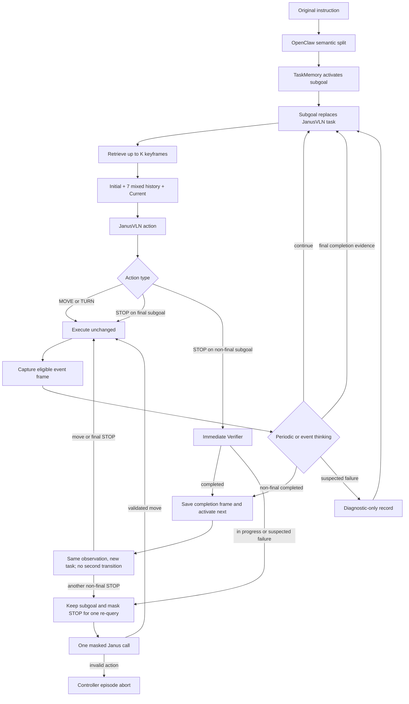
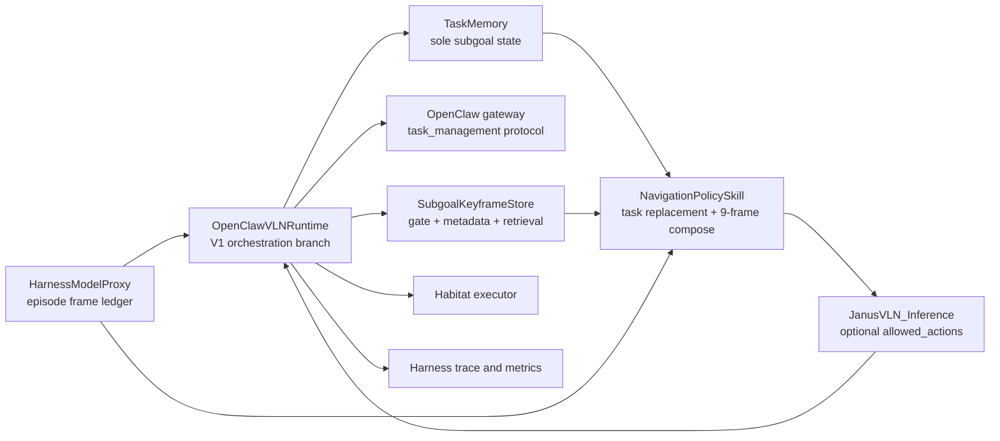
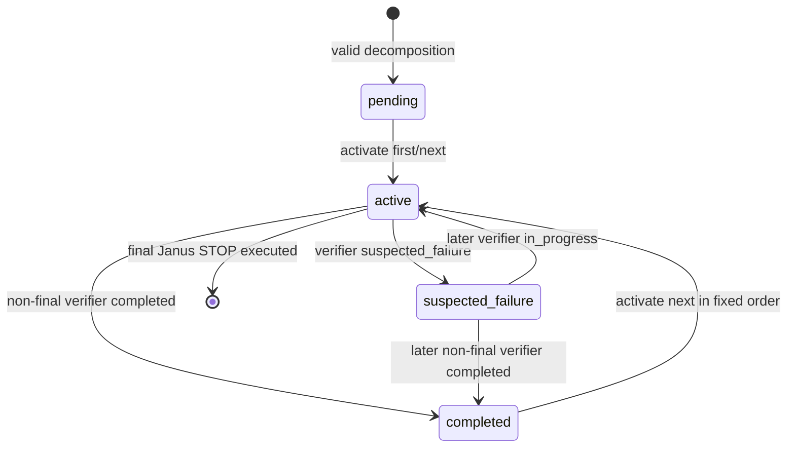

# Subgoal-Conditioned Keyframe Navigation - Plan

## Goal Capsule

- **Objective:** 在不训练、不修改 JanusVLN 权重且不由 OpenClaw 指定 primitive action 的前提下，用 OpenClaw 将 R2R 长指令切分成顺序 subgoals，并把当前 subgoal 与 episode 内相关关键帧注入 JanusVLN 的原有输入预算。
- **Product authority:** TaskMemory 管理阶段状态，Verifier 判断阶段是否完成，JanusVLN 决定 `MOVE_FORWARD`、`TURN_LEFT`、`TURN_RIGHT`；OpenClaw 只管理任务、记忆与阶段边界。
- **Open blockers:** 无。Verifier 协议、排序 tie-break、帧账本和 STOP 候选约束均已在 Implementation Plan 中收敛。

## Product Contract

### Summary

V1 提供一个 training-free 的分层导航控制器：OpenClaw 负责长指令切分、阶段状态和 episode-local 关键帧，JanusVLN 仍负责逐步动作。当前 subgoal 直接替换 JanusVLN task；相关关键帧默认 `K=2`、最多配置为 3，并替换原有 7 个中间历史槽位中的普通历史帧。

V2 才增加 subgoal 级 replanning；V1 发现异常时只记录，不重写任务。

### Problem Frame

JanusVLN 原始输入使用 1 张初始帧、7 张中间历史帧和 1 张当前帧。均匀历史采样能保持时间覆盖，但无法保证当前导航阶段的重要入口、转向点或 landmark 仍在 7 个中间槽位中。

把原始长指令、当前 subgoal、规划理由和额外图像全部追加到模型输入，会同时改变语言分布和视觉预算，不利于判断效果来自哪里。本方案因此采用两个窄接口：语言侧只替换 task，视觉侧只替换既有中间历史槽位。

R2R 指令通常由按顺序出现的 landmark、转向和区域切换构成。V1 只保存这些阶段事件，不建立地图，不使用跨 episode 记忆，也不把 OpenClaw 变成逐动作控制器。

### Key Decisions

- **V1 固定 subgoals，V2 才 replanning。** (session-settled: user-directed — chosen over V1 immediate replanning: first isolate the value of decomposition and keyframe memory) Governs R4.
- **当前 subgoal 直接替换 JanusVLN task。** (session-settled: user-directed — chosen over appending global instruction and memory prose: preserve the JanusVLN prompt distribution) Governs R5.
- **使用简单 episode-local metadata 检索。** (session-settled: user-approved — chosen over CLIP or vector retrieval: lower implementation cost and clearer R2R ablations) Governs R14-R18.
- **非最终 STOP 是阶段完成提议。** (session-settled: user-approved — chosen over sending every STOP to the environment: prevent an intermediate subgoal from terminating the episode) Governs R22-R24.
- **异常帧只做诊断。** (session-settled: user-approved — chosen over feeding failure evidence back to JanusVLN in V1: avoid reinforcing a wrong state) Governs R13.
- **关键帧上限 `K` 可配置且默认 2。** (session-settled: user-approved — chosen over treating two frames as a fixed truth: retain a simple default while enabling direct ablation) Governs R17, R31.

### Actors

- A1. **OpenClaw:** 在 episode 开始时生成 subgoals，周期性或事件触发地读取视觉状态，并更新 TaskMemory 和关键帧 metadata。
- A2. **TaskMemory:** 保存全局指令、全部 subgoals、当前阶段、完成历史和阶段状态，是 subgoal 顺序的唯一事实来源。
- A3. **JanusVLN:** 接收当前 subgoal 和固定预算的视觉输入，独立产生动作。
- A4. **Verifier:** 根据 success criteria 和可用视觉证据输出阶段状态，不生成导航动作。
- A5. **Environment:** 只接收最终获准执行的 JanusVLN 动作。

### Requirements

**Subgoal and TaskMemory**

- R1. Episode 开始时，OpenClaw 必须把原始长指令按顺序导航阶段切分为 subgoals，并一次性写入 TaskMemory。
- R2. 切分必须尽量保留原始措辞、landmark、左右方向和空间关系，不得改写成底层动作序列；非最终 subgoal 不主动添加 stop/wait，最终 subgoal 保留原指令中的停止语义。
- R3. 每个 subgoal 必须至少保存 `subgoal_id`、`subgoal_text`、`instruction_landmarks`、`success_criteria`、`is_final`、`start_step` 和 `status`；V1 状态仅为 `pending`、`active`、`completed`、`suspected_failure`。
- R4. V1 在 episode 内不得插入、删除、跳过、回退或重写 subgoal；`suspected_failure` 只改变诊断状态和 thinking 时机。
- R5. JanusVLN 的 task 必须严格等于当前 `subgoal_text`，形成 `Your task is to {subgoal_text}`；不得追加原始长指令、`Current subgoal:`、规划理由或 memory prose。
- R6. Verifier 确认非最终阶段完成后，TaskMemory 必须按原顺序激活下一个 subgoal。最终阶段的周期 Verifier 只记录完成证据，不改变 active 状态；只有 JanusVLN 的最终 `STOP` 实际结束 episode。

**Keyframe capture**

- R7. V1 正式关键帧只由以下事件触发：episode 初始帧、subgoal 入口、连续转向动作段的首帧、OpenClaw 视觉确认的当前 landmark、subgoal 完成，以及距离上次保存达到 20 steps 的 coverage 帧。
- R8. 转向关键帧必须保存 JanusVLN 执行首次 `TURN_LEFT` 或 `TURN_RIGHT` 之前看到的画面；连续同方向转向不得重复保存。
- R9. 普通候选关键帧必须满足有效图像、距上次正式关键帧至少 5 steps、非重复画面和 episode 最多 64 张；初始、subgoal 入口和 subgoal 完成事件可以绕过 5-step 间隔。
- R10. 上一 subgoal 完成帧与下一 subgoal 入口帧若来自同一 `step_id` 和同一图像，只保存一份图像记录，并同时保留两个事件角色。
- R11. 正式关键帧 metadata 必须至少包含 `scene_id`、`episode_id`、`step_id`、`subgoal_id`、`subgoal_text`、`instruction_landmarks`、`visible_landmarks`、保存事件和 `image_path`。
- R12. `instruction_landmarks` 只表示从 subgoal 文本提取的预期目标；`visible_landmarks` 只允许记录 OpenClaw 从该图像中实际确认的对象，未读图或不确定时必须为空。
- R13. `suspected_failure` 画面必须写入独立的 diagnostic-only 记录，不得进入正式关键帧候选、检索结果或 JanusVLN 图像输入。
- R14. 关键帧和诊断记录不得包含 `distance_to_goal`、成功标签、SPL、oracle shortest path、ground-truth goal position、未来 observation 或其他评测真值。

**Retrieval and visual composition**

- R15. 检索必须先限定当前 `scene_id` 和 `episode_id`，再限定 `step_id < current_step`；固定初始帧、当前帧、未来帧和跨 episode 帧不得成为关键帧候选。初始帧已经由首槽位固定提供，不再占用 K 个关键帧名额。
- R16. 候选排序必须依次考虑当前 `subgoal_id`、`visible_landmarks` 与当前 `instruction_landmarks` 的文字重合、保存事件优先级和时间新近性；当前阶段不足时才允许使用上一阶段完成帧。
- R17. 每步最多返回 `K` 张关键帧，默认 `K=2`，允许实验配置为 `0/1/2/3`；检索不到相关帧时不得使用无关关键帧凑数。
- R18. V1 检索必须是 metadata 的结构化文字匹配，不引入 CLIP、图像 embedding、向量数据库、DPP 或学习式排序。
- R19. JanusVLN 视觉输入必须保持最多 9 张：1 张初始帧、7 张混合中间帧、1 张当前帧；选出 `k` 张关键帧后，从普通过去帧中均匀采样 `7-k` 张，去重后按 `step_id` 排序组成中间槽位。
- R20. 初始帧固定在首位，当前帧固定在末位；同一 `step_id` 或 `image_path` 不得重复出现，关键帧不得增加图像总数。

**Action ownership and verification**

- R21. JanusVLN 输出的 `MOVE_FORWARD`、`TURN_LEFT`、`TURN_RIGHT` 必须原样发送给环境；OpenClaw 和 Verifier 不得推荐、替换或覆盖这些动作。
- R22. 当 `subgoal_stop_gate_enabled=true` 时，非最终 subgoal 下的 JanusVLN `STOP` 不得直接发送给环境，而必须解释为 `SUBGOAL_DONE` 提议并立即触发 Verifier。A1/A3 为测量 gate 贡献而显式关闭该开关，是此约束的消融例外。
- R23. 若 R22 的 Verifier 结果为 `completed`，系统必须保存完成帧、激活下一 subgoal，并在同一 observation 上使用新 task 重新调用 JanusVLN，不执行原 `STOP`。重新输出的动作必须再次经过动作类型检查；同一 observation 最多允许一次 subgoal 切换。
- R24. 若 R22 的 Verifier 结果为 `in_progress` 或 `suspected_failure`，或者阶段切换后的新 subgoal 在同一 observation 上再次输出非最终 `STOP`，系统必须保持当前 subgoal，并进行一次临时屏蔽 `STOP` 的 JanusVLN 调用；JanusVLN 从三个移动动作中自行选择，系统不得指定替代动作。
- R25. 最终 subgoal 的 `STOP` 保持 JanusVLN 原始终止语义并发送给环境；V1 不把阶段 Verifier 扩展为新的最终成功判定器。
- R26. OpenClaw thinking 必须同时支持周期和事件触发：稳定导航约 20 steps，默认约 15 steps，接近 landmark 或阶段边界约 10 steps；非最终 `STOP`、连续碰撞或重复画面等异常必须允许提前触发。
- R27. 周期 thinking 只允许输出 `subgoal_status`、完成置信度、视觉证据、实际确认的 `visible_landmarks`、是否保存当前关键帧、保存原因和下次间隔；不得输出 primitive action、replacement subgoal 或 recovery subgoal。
- R28. Verifier 只允许输出 `in_progress`、`completed`、`suspected_failure`；只有非最终 subgoal 的有效 `completed` 能推进 TaskMemory，`suspected_failure` 只能保存诊断证据并缩短下一次 thinking 间隔。最终 subgoal 的 `completed` 被规范化为 completion evidence，不触发状态迁移。

**Traceability and evaluation**

- R29. 每步 trace 必须记录当前 subgoal、实际 JanusVLN task、普通历史帧 step、检索关键帧及排序依据、最终 9 张图的 step 顺序、JanusVLN 原始动作、STOP gate 结果、Verifier 输出、OpenClaw 触发原因和 TaskMemory 状态迁移。
- R30. V1 必须提供固定 episode 集、相同 checkpoint、相同步数预算和相同随机设置下的消融：A0 原始 JanusVLN；A1 subgoal 与阶段 Verifier、原始历史；A2 全局指令与关键帧槽位；A3 subgoal、Verifier 与关键帧；A4 A3 加非最终 STOP gate。
- R31. A4 必须额外比较 `K=0/1/2/3`，以验证默认 `K=2` 是否合理，而不是把“每次两张”写成方法先验。
- R32. 评测必须报告 SR、SPL、NE、nDTW、平均步数和平均运行时间，并报告 subgoal 完成数、阶段切换数、非最终 STOP 次数、STOP gate 接受/拒绝数、OpenClaw 调用次数和关键帧命中率。
- R33. 研究结论必须区分工程正确性和导航增益；V1 完成不等于必然提升 SR，只有在固定集合消融中相对 A0/A1/A2 的结果才能支持效果声明。

### Key Flow



### Key Flows

- F1. **Episode initialization. Covers R1-R6, R7.** OpenClaw 切分指令，TaskMemory 保存全部阶段并激活第一个 subgoal，同时保存初始帧和首阶段入口角色。
- F2. **Normal navigation step. Covers R15-R21, R26-R29.** 系统检索过去的当前阶段关键帧，组成固定视觉预算，JanusVLN 输出并执行移动动作，然后进行事件保存和必要的 thinking。
- F3. **Stage transition. Covers R6, R10, R22-R24, R28.** Verifier 确认完成后复用当前完成画面作为下一阶段入口上下文，切换 task，并由 JanusVLN 重新决定动作。
- F4. **Failure observation. Covers R4, R13, R26-R28.** 异常只缩短 thinking 间隔并写入诊断记录，当前及后续 subgoals 均不重写。
- F5. **Final termination. Covers R25.** 最终阶段的 JanusVLN `STOP` 按原模型语义结束 episode。

### Acceptance Examples

- AE1. **Direct task replacement. Covers R2, R5.** 给定第二阶段文本 `Enter the kitchen and stop near the sink.`，JanusVLN prompt 中的 task 是且仅是 `Your task is to Enter the kitchen and stop near the sink.`。
- AE2. **Shared boundary frame. Covers R10.** step 42 同时是 subgoal 1 完成和 subgoal 2 入口时，磁盘只保留一张图，metadata 同时携带两个事件角色。
- AE3. **Honest landmark metadata. Covers R12.** `instruction_landmarks=["sofa","kitchen"]` 但 OpenClaw 未读取该帧时，`visible_landmarks=[]`，检索不得把它宣称为 sofa 命中帧。
- AE4. **Semantic retrieval. Covers R15-R18.** 当前阶段寻找 `kitchen` 时，当前阶段且 `visible_landmarks` 含 `kitchen` 的过去帧优先于只有 `instruction_landmarks` 含 `kitchen` 的帧；两者均不存在时回退到当前阶段入口或转向帧。
- AE5. **No forced fill. Covers R17, R19.** 只检索到 1 张相关关键帧时，中间槽位由 1 张关键帧和 6 张普通历史帧组成，不插入旧阶段无关帧。
- AE6. **Accepted intermediate STOP. Covers R22, R23.** 非最终阶段输出 `STOP` 且 Verifier 为 `completed` 时，环境不收到 `STOP`；系统切换下一阶段，并让 JanusVLN 在同一 observation 上重新输出动作。
- AE7. **Rejected intermediate STOP. Covers R22, R24.** 非最终阶段输出 `STOP` 但 Verifier 为 `in_progress` 时，系统保持当前阶段；下一次调用只屏蔽 `STOP`，最终执行的移动动作仍由 JanusVLN 选择。
- AE8. **Diagnostic isolation. Covers R13, R28.** 连续碰撞产生的异常画面可以出现在诊断 trace 中，但不得出现在任何后续 `selected_keyframes` 或 JanusVLN 图像输入中。
- AE9. **Final STOP compatibility. Covers R25.** 最终阶段输出 `STOP` 时保持原 JanusVLN 行为，不被改写为下一阶段提议。
- AE10. **No relevant keyframe. Covers R17, R19.** 当前阶段没有合格关键帧时，图像输入退化为原始的初始帧、均匀历史和当前帧组合。

### Success Criteria

- Covers R14-R15, R20. 所有 episode 均满足无跨 episode、无未来帧、无 oracle 字段和无重复图像的约束。
- Covers R19-R20. 每次 JanusVLN 调用最多 9 张图，且首尾槽位分别是初始帧和当前帧。
- Covers R21-R25. 主 V1 配置与 A4 中，非最终 `STOP` 到达环境的次数为 0；A1/A3 显式关闭 STOP gate 并单独报告非最终 STOP。所有配置下 `MOVE_FORWARD`、`TURN_LEFT`、`TURN_RIGHT` 的 action override 次数均为 0。
- Covers R13. diagnostic-only 帧进入 JanusVLN 输入的次数为 0。
- Covers R29. 每次 subgoal 切换均能由 trace 还原其 Verifier 证据、TaskMemory 迁移和完成/入口帧。
- Covers R30-R33. A0-A4 与 `K=0/1/2/3` 在同一评测条件下可复现，并能把 subgoal、关键帧和 STOP gate 的贡献分开报告。

### Scope Boundaries

**Included in V1**

- R2R 风格长指令的顺序语义切分。
- Episode-local TaskMemory 和阶段完成切换。
- 事件触发关键帧、metadata 文字匹配和固定视觉槽位替换。
- 周期 thinking、事件 Verifier、非最终 STOP 的层级语义。
- 诊断 trace、消融和效果评测。

**Deferred to V2**

- `failed` 状态和失败预算。
- `recovery_subgoal`、`replacement_subgoal` 和 pending subgoal 重写。
- `replanning_history` 和基于异常证据的 subgoal 级恢复。
- V2 仍只修改 TaskMemory 和 subgoal，不直接选择 primitive action。

**Outside V1 and V2 identity**

- OpenClaw 逐 step 推荐或覆盖 `MOVE_FORWARD`、`TURN_LEFT`、`TURN_RIGHT`。
- 训练或微调 JanusVLN。
- CLIP、向量数据库、学习式关键帧排序和复杂集合效用函数。
- 跨 episode 记忆、全局地图、oracle 路径或评测真值注入。

### Dependencies and Assumptions

- 当前 JanusVLN 能接受保持原始措辞的短阶段指令，而无需额外语法改写。
- OpenClaw 的视觉分析能够输出保守的 landmark 描述；无法确认时允许 `visible_landmarks` 为空。
- Verifier 的阶段边界判断是 V1 最大风险；错误切换会同时污染后续 task 和关键帧归属，因此必须通过 A1 与 trace 单独评估。
- 当前 event-gated keyframe、stage metadata 和 TaskMemory 基础可以复用，但现有 prompt 追加和 memory image 追加行为不代表本方案已经完成。
- R2R val_unseen 是主要验证集；若具备 R4R 或 R2R-LH 固定集合，应作为更长指令上的补充验证，而不能替代 R2R 主结果。

### Resolved Planning Questions

- **Verifier 协议：** 使用独立的 OpenClaw `task_management` 结构化输出，不复用会返回动作建议的 visual-readback prompt；状态迁移只认枚举值和协议校验通过的结果。
- **完成阈值：** 周期 thinking 只有 `status=completed` 且 `completion_confidence >= 0.70` 才推进阶段；非最终 STOP 触发的即时 Verifier 仍需满足同一阈值。阈值作为配置暴露，但 V1 实验固定为 `0.70`。
- **STOP 与阶段切换上限：** 每个 observation 最多推进一个 subgoal。拒绝非最终 STOP，或同一 observation 切换后再次出现非最终 STOP 时，只进行一次带三动作候选集的即时重询；若模型仍输出候选集外动作，触发可追踪的 episode-level controller abort，不使用控制器指定的兜底动作。
- **历史帧 tie-break：** 先去除初始帧、当前帧和已选关键帧，再从剩余过去帧按时间分桶均匀取样；舍入冲突时取较新的帧，最终统一按 `step_id` 升序排列。
- **Landmark 写入时机：** `visible_landmarks` 只从本次确实读取当前图像的 OpenClaw thinking/Verifier 响应同步写入；转向和 coverage 帧未被读图时保持空数组，不做异步猜测或回填。

### Sources and Grounding

- `docs/ideation/2026-07-25-v1-subgoal-keyframe-memory-ideation.html` — 简化的 R2R Stage-Keyframe 初稿。
- `src/harness/openclaw/keyframe_gate.py` — 已有初始、动作事件、coverage、最小间隔和 episode cap 基础。
- `src/harness/openclaw/runtime.py` — 已有 stage-aware keyframe metadata 和检索基础。
- `src/harness/memory/task_memory.py` — 已有 TaskMemory 生命周期基础。
- `src/harness/openclaw/visual_analyzer.py` — 已有图像 landmark 与对象描述输出。
- `src/harness/skills/navigation_policy.py` — 当前 JanusVLN task 与图像组装的集成边界。
- [Sub-Instruction Aware Vision-and-Language Navigation](https://arxiv.org/abs/2004.02707) — R2R 指令阶段切分及阶段切换风险的外部依据。

---

## Planning Contract

### Delivery Shape

- 新增显式配置 `subgoal_controller_mode=openclaw_v1`；默认关闭，不改变当前 visual-readback、action override、stage-aware retrieval 或普通 JanusVLN 路径。
- 在该模式内，`TaskMemory` 是唯一的 subgoal 状态源。现有 `OpenClawVLNRuntime.instruction_stages/current_stage_id` 不参与 V1 状态读取或写入。
- OpenClaw 只通过结构化 `task_management` 协议完成两类工作：episode 首次调用时的 `decompose`，以及周期/事件触发的 `verify`。
- JanusVLN 的语言输入和视觉输入只在 `NavigationPolicySkill` 边界组装；OpenClaw runtime 不拼接 prompt 文本，也不把视觉分析文字追加到 task。
- V1 复用现有 current-frame、keyframe 和 trace 根目录，但使用独立 metadata namespace，避免与旧 readback keyframe 记录混淆。

### Compatibility Rules

- `subgoal_controller_mode=off` 时，`NavigationPolicySkill.run()`、`JanusVLN_Inference.call_model()` 和 `OpenClawVLNRuntime.step()` 的既有调用结果保持不变。
- `allowed_actions` 是 JanusVLN 调用的可选参数；省略时仍展示并接受四个原始动作。
- 新模式必须拒绝与 `openclaw_allow_planner_action_override=true` 同时启用，防止 V1 的动作所有权被旧路径破坏。
- V1 不删除或改写现有 `_split_instruction_stages()`、`_apply_stage_progress_from_readback()` 和 readback replanning 逻辑；只通过顶层模式分支隔离。
- `MemoryWriteSkill` 和旧 event-gated keyframe 索引保持不变。V1 使用独立的 episode-local coordinator 索引，不迁移、不双写、也不从旧 memory backend 检索。

### Configuration Contract

在 `HarnessConfig` 和 `evaluation_harness.py` 参数/env 映射中新增：

| Field | Default | Valid values | Purpose |
|---|---:|---|---|
| `subgoal_controller_mode` | `off` | `off`, `keyframe_only`, `openclaw_v1` | 总开关与 A2 单阶段关键帧模式 |
| `subgoal_keyframe_top_k` | `2` | `0..3` | 中间槽位最多注入的关键帧数 |
| `subgoal_stop_gate_enabled` | `true` | boolean | 主 V1 是否拦截非最终 STOP；A1/A3 显式覆盖为 false |
| `subgoal_completion_threshold` | `0.70` | `0..1` | 阶段推进最低置信度 |
| `subgoal_thinking_interval_steps` | `15` | `10..20` | 默认周期 thinking 间隔 |

V1 直接复用已有 `keyframe_min_gap_steps=5`、`keyframe_coverage_gap_steps=20` 和 `keyframe_episode_cap=64`，不增加同义配置。配置校验必须保证 `top_k <= 3`、thinking interval 在 10–20 范围内，并拒绝 `openclaw_v1 + planner action override`。Ablation runner 必须将最终解析后的配置写入每个结果目录。

## High-Level Technical Design

### Component Topology



`HarnessModelProxy` 在每次调用开始时把当前 observation 注册为 `FrameRef(scene_id, episode_id, step_id, image_path)`，从而建立完整且可审计的 episode 帧账本。V1 不再依赖传入的已采样 PIL 列表猜测历史 step；普通历史和关键帧都从同一个账本按明确 step 组合。

### Episode and Step Protocol

```mermaid
sequenceDiagram
    participant E as Evaluation loop
    participant P as HarnessModelProxy
    participant R as V1 Runtime
    participant O as OpenClaw
    participant M as TaskMemory
    participant K as KeyframeStore
    participant J as JanusVLN
    participant H as Habitat

    E->>P: call_model(images, global_instruction, step)
    P->>P: persist current frame and update FrameRef ledger
    alt first call in episode
        P->>R: initialize(global_instruction, current frame)
        R->>O: task_management.decompose
        O-->>R: ordered subgoals or invalid response
        R->>M: reset(valid subgoals or one global fallback)
        R->>K: save initial + first entry roles
    end
    R->>K: retrieve(active subgoal, current step, K)
    R->>J: active text + fixed 9-frame input
    J-->>R: primitive action
    alt MOVE or TURN
        R->>K: gate pre-action turn frame when eligible
        R->>H: execute unchanged
    else final STOP
        R->>H: execute STOP unchanged
    else non-final STOP and gate enabled
        R->>O: task_management.verify(reason=non_final_stop)
        alt completed and confidence >= threshold
            R->>K: merge completion/next-entry roles
            R->>M: complete current and activate next
            R->>J: same observation, new task
            J-->>R: next-stage action
            R->>R: route through action-type gate
            alt next action is a move
                R->>H: execute unchanged
            else next action is final STOP
                R->>H: execute STOP unchanged
            else next action is another non-final STOP
                R->>J: one masked call with three moves
                J-->>R: validated move or invalid action
                alt validated move
                    R->>H: execute validated Janus move
                else invalid action
                    R-->>E: controller abort; do not execute an action
                end
            end
        else rejected
            R->>J: same task, allowed_actions=three moves
            J-->>R: Janus-selected move or invalid action
            alt validated move
                R->>H: execute validated move unchanged
            else invalid action
                R-->>E: controller abort; do not execute an action
            end
        end
    end
```

### TaskMemory State Machine



`suspected_failure` 是当前阶段的可恢复诊断状态，不创建新节点、不改变 pending 列表。实现中推进操作必须由 TaskMemory 的单个原子方法完成，避免 runtime 先修改索引、memory 后修改状态造成分叉。

## Key Technical Decisions

### KTD-1: First-call Initialization Instead of Changing the Evaluator Episode API

`HarnessModelProxy.start_episode()` 目前只有 scene/episode，没有 instruction。V1 保持该接口，在 episode 第一次 `call_model(images, task, step_id)` 时把 `task` 视为 `global_instruction`，强制执行一次 decomposition。成功响应写入完整 subgoal 列表；超时、JSON/schema 错误、空列表或非法顺序时，使用原始 instruction 创建一个 `is_final=true` 的单 subgoal。不得回退到 regex stage split。

### KTD-2: Dedicated Task-Management Response Namespace

扩展 gateway request/response 的 `runtime_metadata.task_management`，而不是复用 visual-readback 的 action-verifier payload。响应分为：

- `decompose`: `subgoals[{subgoal_id, subgoal_text, instruction_landmarks, success_criteria, is_final}]`
- `verify`: `status`, `completion_confidence`, `visual_evidence`, `visible_landmarks`, `save_current_keyframe`, `save_reason`, `next_thinking_interval`

Normalizer 必须丢弃额外的 primitive-action、action-override、replacement/recovery subgoal 字段，并验证 subgoal ID 连续、仅最后一项 `is_final=true`、文本非空。运行时只消费 allowlist 字段。

### KTD-3: File-Backed Frame Ledger as the Shared Timeline

每步 current frame 先写入 `openclaw_current_frames/<scene>/<episode>/step_XXXXXX.png`，并在 proxy 内登记 `FrameRef`。正式关键帧提升到 `keyframes/...`；`SubgoalKeyframeCoordinator` 同时维护内存索引并追加持久化到 `keyframes/<scene>/<episode>/index.jsonl`。V1 检索只读取该 coordinator 索引。所有检索条件和 9 帧组合使用 `FrameRef.step_id`，不能从文件名以外的模糊列表位置推断时间。

Episode 开始时必须清空内存账本、TaskMemory、keyframe store、turn-segment 状态和 one-shot STOP mask。路径仍按 scene/episode 隔离；若目标图损坏或不可读，composer 跳过该帧并用普通历史补位，同时记录 `frame_load_error`。

### KTD-4: Simple Deterministic Keyframe Gate and Rank

新增纯逻辑的 V1 keyframe coordinator，复用现有 `keyframe_min_gap_steps`、`keyframe_coverage_gap_steps` 和 `keyframe_episode_cap` 配置，但不修改旧 gate 或 `MemoryWriteSkill`：

1. 事件生成：`initial`、`subgoal_entry`、`turn_decision`、`landmark_observed`、`subgoal_completed`、`coverage_gap`。
2. 去重：相同 `(episode_id, step_id, image_path)` 合并 `event_roles`；完成/入口共帧只存一份。
3. 保存 gate：普通事件检查 5-step 间隔、感知哈希/完全路径重复和 64 cap；initial/entry/completed 绕过间隔但不绕过图像有效性与去重。
4. 检索过滤：同 scene/episode、严格过去帧、非 diagnostic，并排除已经固定占据首槽位的 initial frame。
5. 排序 tuple：`current_subgoal_match`、`visible_landmark_overlap_count`、事件优先级、`step_id`；各项降序，最终选出后按 step 升序返回。
6. 事件优先级：`landmark_observed > subgoal_entry > turn_decision > previous_subgoal_completed > coverage_gap`。

只有 OpenClaw 本次实际接收并分析了图像，`visible_landmarks` 才可非空。`instruction_landmarks` 不参与“看见了什么”的断言。

### KTD-5: Fixed-Budget Visual Composer

新增纯函数 composer，输入完整 episode `FrameRef` 账本、当前 step、初始帧和最多 K 个检索结果：

1. 固定保留初始帧与当前帧。
2. 从普通候选中移除这两帧、关键帧、未来帧和重复 path/step。
3. 对剩余过去帧按时间跨度均匀采样 `7-k` 张；取整冲突选择较新的尚未使用帧。
4. 将普通帧和关键帧合并，按 step 升序放入 7 个中间槽位。
5. 历史不足时允许少于 9 张，不复制图像凑数；任何时候不得超过 9 张。

composer 同时返回 `VisualInputManifest`，包含每个槽位的 `step_id`、`role`、`image_path` 和关键帧 rank reason，供 trace 与单元测试使用。

### KTD-6: STOP Mask Is a Janus Candidate Constraint

为 `NavigationPolicySkill.run()` 和 `JanusVLN_Inference.call_model()` 增加可选 `allowed_actions`。默认是四个动作；STOP gate 拒绝后的一次即时重询传入三个移动动作。`call_model()` 仅改变候选动作段，不改变 `Your task is to {subgoal_text}`。

模型输出在返回 runtime 前必须通过 allowlist 校验。若 masked call 仍生成 `STOP` 或未知文本，抛出 `ControllerEpisodeAbort`。V1 proxy 必须把该异常继续交给 evaluation loop，不能沿用 legacy 的 runtime-error-to-STOP fallback。evaluation loop 记录 `controller_error` 后结束当前 episode 的 step loop，不向环境发送替代动作，并在结果中强制 `success=0`、`spl=0`；后续 episode 继续评测。这保证“屏蔽 STOP”不会退化为隐藏 action override，也不会让单个异常中断整批实验。

### KTD-7: Periodic Thinking and Event Verification Share One Validator

runtime 保存 `next_thinking_step`，默认当前 step + 15；OpenClaw 可返回 10–20 的下次间隔，超界值 clamp 并记录。evaluation loop 在调用 proxy 前通过 `set_step_context()` 写入当步可在线获得的 collision metric；proxy 用连续帧感知哈希计算重复画面，并把两者写入 `VLNState.diagnostics`。以下事件立即 verify：非最终 STOP、连续碰撞、重复画面和当前 subgoal 超过诊断预算。不得把 distance-to-goal、success、SPL 或其他 oracle 字段传入该接口。

`completed` 只有在置信度达到阈值且当前 subgoal 非最终阶段时才能推进；低于阈值按 `in_progress` 处理并记录 `completion_below_threshold`。最终阶段的 `completed` 记录为 `final_completion_evidence`，active 状态保持不变。`suspected_failure` 写入 diagnostic-only 索引、缩短 thinking 间隔，但不进入关键帧检索。

### KTD-8: Verifier Visual Contract and Keyframe-only Ablation

`decompose` 是 text-only 请求。`verify` 固定附带当前帧，以及最多 2 张由当前 subgoal 检索得到的关键帧；历史关键帧按 step 排序，当前帧始终最后，并在 trace 中保存输入路径清单。

`keyframe_only` 用原始长指令创建一个 synthetic final subgoal，不调用 decomposition、不根据 Verifier 状态切换阶段，也不启用 STOP gate。它仍按与 A3 相同的周期读取当前帧和关键帧，消费 `visible_landmarks`、`save_current_keyframe` 与 thinking interval，但忽略 completion status；因此 A2 只移除 subgoal 分解/切换，不移除关键帧视觉标注和检索能力。

## Implementation Plan

### U1: V1 Configuration and TaskMemory Authority

**Files**

- Modify `src/harness/config.py`
- Modify `src/harness/types.py`
- Modify `src/harness/memory/task_memory.py`
- Modify `src/evaluation_harness.py`
- Modify `tests/test_task_memory.py`
- Modify `tests/test_visual_readback_config.py`
- Modify `tests/test_evaluation_harness_openclaw_runtime.py`

**Changes**

- 添加 Planning Contract 中的 V1 配置、CLI/env 映射及互斥校验。
- 扩展 `SubgoalState` 的强类型字段，同时保留 `metadata` 兼容现有测试和调用者。
- 为 TaskMemory 增加 `initialize_from_decomposition()`、`initialize_single_fallback()`、`active_subgoal()`、`apply_verifier_result()` 和原子 `complete_and_activate_next(step_id)`。
- 将 `task_memory` 注入 `OpenClawVLNRuntime`；V1 分支不得读取 runtime 自己的 `instruction_stages`。
- 在 `HarnessModelProxy.start_episode()` 清理所有 V1 episode-local 状态。

**Covers:** R1-R6, R26-R28; F1, F3, F4; AE1.

**Verification**

- 非法/空 decomposition 使用单全局 subgoal。
- `suspected_failure` 不改变 pending 顺序。
- 同一次 transition 同时完成旧阶段并激活下一阶段。
- 最终 subgoal 的周期 `completed` 不清空 active 状态，最终 STOP 才结束。
- V1 与 action override 配置冲突时启动失败；默认 off 配置保持兼容。

### U2: OpenClaw Decomposition and Verifier Protocol

**Files**

- Add `src/harness/openclaw/task_management.py`
- Modify `src/harness/openclaw/gateway.py`
- Modify `src/harness/openclaw/openclaw_cli_plan_gateway.py`
- Modify `src/harness/openclaw/runtime.py`
- Modify `tests/test_openclaw_gateway.py`
- Modify `tests/test_openclaw_cli_plan_gateway.py`
- Modify `tests/test_openclaw_runtime_bridge.py`

**Changes**

- 定义 decomposition/verifier request、response dataclass 和单一 schema normalizer。
- 在 CLI gateway prompt 中要求保留原指令措辞、顺序 landmark 和方向，不生成底层动作，不对非最终阶段增加停止语义。
- 允许 gateway 透传 allowlisted `runtime_metadata.task_management`；继续丢弃未知顶层控制字段。
- 在 V1 首次 step 强制 decomposition；实现超时/invalid schema 的单 subgoal fallback。
- 实现周期和事件 verify，统一置信度阈值、字段过滤和 thinking interval clamp。
- 明确请求图像：decompose 不附图；verify 附最多 2 张相关关键帧和最后一张当前帧，并 trace 实际路径。

**Covers:** R1-R6, R12, R22-R28; F1, F3-F5; AE3, AE6-AE9.

**Verification**

- Prompt/response golden tests 覆盖两类 operation。
- 带 `recommended_action`、`replacement_subgoal` 的响应被剥离且不能影响 runtime。
- 低置信度 completed 不推进阶段。
- 最终阶段 completed 只产生 completion evidence，不推进或结束。
- 首次 decomposition 每个 episode 只发生一次。

### U3: V1 Keyframe Lifecycle and Metadata Retrieval

**Files**

- Add `src/harness/openclaw/subgoal_keyframes.py`
- Modify `src/evaluation_harness.py`
- Add `tests/test_subgoal_keyframes.py`

**Changes**

- 新建与 legacy gate 隔离的 `SubgoalKeyframeCoordinator`，负责事件角色、保存 gate、turn segment、coverage、episode cap 和唯一 V1 检索索引。
- 由 proxy 为每步生成明确 FrameRef；正式提升时复制/保存到 keyframes 目录，并把 V1 metadata 追加到 episode 的 `index.jsonl`。
- 实现完成/下一入口同帧的角色合并；重复 turn segment 只保留第一帧。
- 实现 episode-local filter、landmark 文字 overlap、确定性事件排序和 K 限制。
- 将 suspected-failure 写入独立 diagnostic index，并在正式检索入口硬过滤。
- 复用已有 keyframe gap/coverage/cap 配置；不修改、不双写 legacy gate、MemoryWriteSkill 或 memory backend。

**Covers:** R7-R18; F1-F4; AE2-AE5, AE8.

**Verification**

- 保存事件、5/20 step、64 cap、绕过规则和共帧合并均有边界测试。
- 固定初始帧、当前帧、未来帧、跨 episode、diagnostic 和重复 path 永不作为 selected keyframe 返回。
- 相同输入始终得到相同 rank；K=0/1/2/3 精确生效。
- 没有 OpenClaw 视觉证据时 `visible_landmarks=[]`。
- V1 检索不读取 legacy memory backend；旧 keyframe 与 memory skill 回归测试保持通过。

### U4: Direct Task Replacement, Visual Slots, and Allowed Actions

**Files**

- Modify `src/harness/skills/navigation_policy.py`
- Modify `src/evaluation.py`
- Modify `src/evaluation_harness.py`
- Modify `tests/test_navigation_policy_skill.py`
- Add `tests/test_subgoal_visual_composer.py`
- Add `tests/test_janus_allowed_actions.py`

**Changes**

- 为 policy skill 增加显式 `task_override`、`frame_manifest`、`selected_keyframes` 和 `allowed_actions` 参数；V1 禁用 `_augment_instruction()`。
- 从 proxy 的全量 FrameRef 账本组合固定视觉预算，不再把 memory images 追加到已有列表尾部。
- 加载关键帧/普通帧失败时确定性回退并写 trace，不重复帧凑数。
- 在 Janus `call_model()` 中由 allowlist生成候选段，并对解码结果执行同一 allowlist 校验；默认调用签名保持四动作行为。
- 保证 `images_vggt` 仍只取最终列表末尾的当前帧，关键帧不会被误当作当前 VGGT frame。

**Covers:** R5, R17-R25, R29; F2, F3, F5; AE1, AE5-AE10.

**Verification**

- Prompt 中只有当前 subgoal，不含 global instruction、memory prose 或 `Current subgoal:`。
- 0/1/2/3 个关键帧均满足首尾固定、step 有序、无重复且最多 9 张。
- 默认四动作输出兼容；三动作 mask 的 prompt 无 STOP，返回 STOP 时触发 contract error。
- 非 STOP 动作文本从 Janus 到 executor 保持逐字一致。

### U5: Dedicated V1 Runtime Orchestration

**Files**

- Modify `src/harness/openclaw/runtime.py`
- Modify `src/evaluation.py`
- Modify `src/evaluation_harness.py`
- Modify `tests/test_openclaw_runtime_bridge.py`
- Add `tests/test_subgoal_v1_runtime.py`

**Changes**

- 在 `step()` 顶部加入显式 V1 路由到 `_step_subgoal_v1()`；legacy 路径主体不重构。
- 串联初始化、检索、policy、pre-action keyframe gate、executor、periodic thinking 和 TaskMemory transition。
- 实现非最终 STOP 的即时 verifier：接受时同 observation 最多切换一次 task；拒绝或切换后再次 STOP 时仅进行一次三动作 masked call。
- 最终 STOP 直接进入 executor；主 V1 默认开启 gate，只有 A1/A3 显式关闭并保持模型原始 STOP 行为。
- 在 evaluator 调用 proxy 前传入 online collision context，并由 proxy 计算重复画面 diagnostics。
- V1 policy-contract 异常使用 `ControllerEpisodeAbort` 结束当前 episode、强制失败指标并继续批量评测；不得静默改写为 STOP。legacy mode 的原错误行为不在本单元重构。

**Covers:** R21-R29; F2-F5; AE6-AE9.

**Verification**

- MOVE/TURN 无 action override；turn 画面在执行前保存。
- 接受/拒绝非最终 STOP、最终 STOP 和 masked-call contract error 均有端到端 fake-model 测试。
- 同一 observation 最多发生一次阶段切换；切换后再次 STOP 不启动第二次 Verifier。
- collision/repeated-frame 会提前触发 thinking，且 diagnostics 不含 oracle 字段。
- controller abort 不向环境发送动作，不中断后续 episode，并把当前 episode 记为失败。
- legacy visual-readback/action-override 测试全部继续通过。
- episode reset 后无 subgoal、帧、turn segment 或 one-shot mask 泄漏。

### U6: Trace, Metrics, Ablation, and Evaluation Entry Point

**Files**

- Modify `src/harness/visual_readback/metrics.py`
- Modify `src/evaluation.py`
- Modify `src/evaluation_harness.py`
- Modify `src/evaluation_rxr_metrics.py`
- Add `scripts/run_subgoal_keyframe_v1.sh`
- Add `scripts/run_subgoal_keyframe_v1_ablation.py`
- Modify `tests/test_visual_readback_summary.py`
- Add `tests/test_subgoal_v1_ablation.py`
- Add `tests/test_subgoal_v1_metrics.py`

**Changes**

- 每步输出 `task_management`、`frame_manifest`、keyframe rank、Janus raw action、allowed actions、STOP gate、Verifier 和 TaskMemory transition 字段。
- 复用现有 RxR nDTW measurement helper，在 R2R harness 中显式注册并写入 episode result/summary；同时记录从 episode reset 到结束的 wall-clock runtime。
- 聚合 R32 的 subgoal/STOP/OpenClaw/keyframe 指标，并保留现有 SR/SPL/NE 兼容字段。
- 定义 `keyframe_hit_rate = 至少选中1张关键帧的检索step数 / K>0时的总检索step数`；同时报告 `keyframe_slot_fill_rate = 实际选中关键帧数 / (K × 总检索step数)`，零分母返回 0。
- 报告 `controller_error_episode_count/rate`；controller-error episode 的 SR/SPL 固定为 0，NE/nDTW 保留终止位置测量并带错误标记。
- 提供固定 manifest 驱动的 A0-A4 runner；所有 variant 继承同一 checkpoint、episode keys、max steps、seed 和 evaluator 参数。
- A4 展开 K=0/1/2/3；每个结果目录保存 effective config、episode manifest、summary 和 harness traces。
- 预先注册对比关系，避免跨 variant 误归因：`A1-A0` 估计 subgoal/Verifier 子系统贡献，`A2-A0` 估计无分解时的关键帧子系统贡献，`A3-A1` 估计 gate-off 条件下的关键帧贡献，`A4(K=2)-A4(K=0)` 估计 gate-on 条件下的关键帧贡献，`A4(K=2)-A3` 估计 STOP gate 贡献，`A4(K=2)-A0` 只表示完整系统的组合贡献。
- runner 只编排现有 evaluation 命令，不自动训练、不选择“最好结果”覆盖其他 variant。

**Covers:** R29-R33; all flows; Success Criteria.

**Verification**

- A0-A4 配置矩阵快照测试：
  - A0: controller off, K=0, STOP gate off。
  - A1: openclaw_v1, K=0, STOP gate off。
  - A2: keyframe_only synthetic 单全局阶段, K=2, STOP gate off；保留视觉标注、关键帧保存与检索，忽略 completion status。
  - A3: openclaw_v1, K=2, STOP gate off。
  - A4: openclaw_v1, K=2, STOP gate on。
- Summary 对零分母、部分 episode 和 contract-error episode 不产生误导性 NaN/成功计数。
- result/summary 包含 nDTW、episode runtime、keyframe hit/slot-fill 和 controller-error 指标。
- Trace 可从单个 stage transition 还原 task、帧、证据与状态变化。

## Verification Contract

### Automated Test Layers

1. **Pure contracts:** TaskMemory、schema normalizer、keyframe rank、visual composer、allowed-actions validator。
2. **Component integration:** gateway round-trip、proxy FrameRef ledger、policy prompt/images、coordinator index write/read。
3. **Runtime orchestration:** fake Janus + fake OpenClaw + fake executor 覆盖正常动作和 STOP 分支。
4. **Legacy regression:** 当前 task memory、navigation policy、event gate、runtime bridge、visual readback summary 测试。
5. **One-episode smoke:** 固定 R2R episode，检查 9 帧 manifest、关键帧磁盘记录、subgoal trace 和环境动作。
6. **Fixed-set ablation:** A0-A4 与 A4 K sweep；指标完成后再讨论提升。

### Test Commands

```bash
PYTHONPATH=src:. pytest tests/test_task_memory.py tests/test_visual_readback_config.py tests/test_subgoal_keyframes.py -q
PYTHONPATH=src:. pytest tests/test_navigation_policy_skill.py tests/test_subgoal_visual_composer.py tests/test_janus_allowed_actions.py -q
PYTHONPATH=src:. pytest tests/test_openclaw_gateway.py tests/test_openclaw_cli_plan_gateway.py tests/test_subgoal_v1_runtime.py -q
PYTHONPATH=src:. pytest tests/test_openclaw_runtime_bridge.py tests/test_event_gated_keyframe_gate.py tests/test_memory_skills.py tests/test_visual_readback_summary.py -q
PYTHONPATH=src:. pytest tests/test_subgoal_v1_ablation.py tests/test_subgoal_v1_metrics.py tests/test_evaluation_harness_openclaw_runtime.py -q
```

运行实现前应先记录上述既有测试的 baseline；实现完成后运行分组测试，再运行合并回归。GPU smoke 和固定集消融不作为单元测试替代品。

### Trace Assertions

- `janus_task == active_subgoal.subgoal_text`。
- `visual_input_manifest[0].role == initial`，最后一项为 current，长度 `<= 9`。
- 每个 keyframe 满足 episode 相同且 `step_id < current_step`。
- `diagnostic_only` 从未出现在 selected keyframes。
- `executed_action == janus_raw_action`，唯有被拦截的非最终 STOP 不进入 executor。
- 每个 TaskMemory transition 具有 verifier status、confidence、evidence 和 trigger reason。
- 每个 masked call 的 allowed actions 不含 STOP，且无 controller-supplied replacement action。
- 每个 observation 的 subgoal transition count `<= 1`。
- controller-error episode 没有新执行动作，且其 success/SPL 均为 0。

### Evaluation Gate

- **Engineering go/no-go:** 全部自动化测试通过，one-episode smoke 无跨 episode、未来帧、重复槽位或动作 override。
- **Experiment go/no-go:** A0-A4 使用完全相同的固定 episode manifest 和预算，所有 variant 完成率满足预先约定的最小覆盖。
- **Effect claim:** 研究结论必须使用 U6 预注册的成对对比，不得把完整系统差值归因给单一组件；若只有 keyframe hit rate 提升而 SR/SPL 不升，结论应限定为机制正确而非导航增益。

## Risks and Mitigations

| Risk | Impact | Mitigation |
|---|---|---|
| Verifier 过早完成阶段 | 后续 task 与关键帧全部错位 | 0.70 阈值、A1 单独评估、完整 evidence trace；V1 不自动回退 |
| Prompt 候选约束仍输出 STOP | 无合法环境动作 | allowlist 后校验并 fail closed；不隐藏替换动作 |
| 现有 runtime stage 状态与 TaskMemory 双写 | 状态分叉 | 独立 V1 顶层分支，TaskMemory 单一 authority |
| 输入 PIL 列表缺少 step 语义 | 未来帧/重复/错误排序 | proxy 建立 file-backed FrameRef ledger |
| `visible_landmarks` 被指令先验污染 | 虚假语义检索增益 | 只接受实际读图响应，未读图为空 |
| 保存全部 current frame 占用磁盘 | 长评测写盘增加 | episode 路径隔离，报告磁盘量；后续可增加运行后清理但不在 V1 热路径删除 |
| 新逻辑破坏旧 readback 实验 | 历史结果不可复现 | 默认 off、独立 mode、legacy regression suite |
| K=2 是偶然最优 | 方法论结论不稳 | A4 固定做 K=0/1/2/3 sweep |
| Collision/重复画面信号未接入 | 异常 thinking 永不触发 | evaluator 传 online collision，proxy 计算重复帧且禁止 oracle 字段 |
| Controller abort 污染成功率或中断批量评测 | 结果失真或实验不完整 | 当前 episode 强制失败、无替代动作、后续 episode 继续 |

## Definition of Done

- R1-R33 均能映射到至少一个实现单元和自动化/trace 验证。
- `subgoal_controller_mode=openclaw_v1` 在固定 episode 上完成 decomposition、阶段切换、关键帧检索和最终 STOP 全流程。
- TaskMemory 是 V1 唯一 subgoal authority，旧 runtime stage 字段不参与新模式。
- Janus task 为当前 subgoal 原文，视觉输入最多 9 张且关键帧只替换中间槽位。
- 非 STOP 原始动作不被覆盖；非最终 STOP gate 不执行 controller-supplied fallback。
- 主 V1/A4 的非最终 STOP 不进入环境；A1/A3 作为显式 gate-off 消融单独计数。
- 同一 observation 最多推进一个 subgoal；最终 subgoal 只由最终 STOP 结束。
- diagnostic-only 帧、oracle 字段、未来帧、跨 episode 帧和重复帧进入模型输入的次数均为 0。
- Collision/repeated-frame trigger、controller abort、Verifier 图像清单均可从 trace 审计。
- 旧模式回归测试通过；新模式默认关闭。
- A0-A4 与 K sweep 可从固定 manifest 一键运行；SR/SPL/NE/nDTW、runtime、keyframe hit/slot-fill、controller error、配置和 trace 均可审计。
- V2 replanning 未进入 V1 runtime、TaskMemory schema 或 prompt 输出范围。
